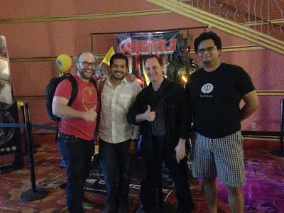
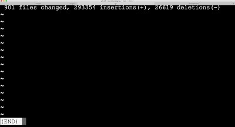
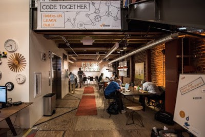
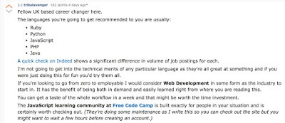
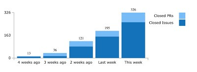

Berkeley Martinez was wearing suspenders and a bowtie. He looked up from his paperback copy of Dune. I was sweating from my morning run across San Francisco. “Quincy!” he exclaimed, and we initiated an elaborate, slippery handshake.  
   
Berkeley and I grabbed a conference room in the now-defunct Wix Lounge coworking space. We clinked mugs of Earl Grey, hot, and launched into a discussion about the future of pair programming on Free Code Camp.

Pair programming was central to our open source community of campers (people learning to code — mostly mid career professionals).  
   
The go-to pair programming tool, Screen Hero, had been acquired by Slack, and would soon cease to exist. We looked at Together.js, which seemed promising, but it had been abandoned when Mozilla Labs shut down. And we didn’t need half the features in its behemoth codebase, so maintain it ourselves wasn’t a good option.  
   
“The best interface would be right in the page,” Berkeley said. “Imagine voice chat, a Google Docs-style collaborative code editor, and the ability to pass links back and forth through instant messaging. That’s really all you’d need.”  
   
HTML5 and web sockets made such a user experience possible. But what happened when you completed a challenge and moved on to the next one? If your website was a traditional multi-page app, you’d need to re-establish a connection once the new page loaded. This would make for a choppy experience. Together.js solved this by allowing you to “follow” your pair from page to page. But getting suddenly jerked away from your current page was a jarring experience. We wanted it to be fluid.  
   
“Well, we’re in control of Free Code Camp’s architecture,” Berkeley said. “What if we make it so there are no page loads? What if we make Free Code Camp an isomorphic single-page app? Then we can embed the pair programming tools right into the page, and we won’t have to worry about page refreshes when campers move from challenge to challenge.”  
   
The plan called for adding Flux and React.js to our otherwise vanilla Node.js and Express.js app. “Right now, we’re making all these routes in Express.js,” Berkeley said, pulling his keyboard and trackpad out of a large leather briefcase. “But if we use Loopback, everything will be an easy API call away.”  
   
I grilled Berkeley on the risks and opportunities associated with implementing these new technologies. He’d built projects with Loopback and Flux/React.js before, and was confident we could make things work.  
   
So we pounded our now lukewarm tea and got to work.

#### Welding New Wings

Over the subsequent months, our codebases diverged into two distinct branches — the new one, powered by Loopback, and the old one, powered by Express.js and Mongoose. New improvements started piling up on both branches. Porting them back and forth proved painful. And every time we prepped for a merge and deploy, new features crept in:

-   “Let’s use Nginx and load balance across multiple PM2 instances.”
-   “IO.js is faster — might as well switch to it.”
-   “It’s embarassing that we don’t have SSL — let’s implement it!”

We implemented the first two. SSL broke our web workers, so we kicked it down the road. ([LetsEncrypt](https://letsencrypt.org/) is coming online in September anyway, and promises to make SSL free and trivial to configure.)

Over the next few months, we tried twice to deploy our new branch to production, only to flinch at the last minute after encountering fatal errors we couldn’t reproduce on our local computers.  
   
Finally, we knuckled down. “Code freeze on master!” someone smart shouted. Other than emergency maintenance, there would be no further changes to [Free Code Camp](http://freecodecamp.com/) for a month. Instead, we focused on merging all our feature branches into our staging branch, then stabilizing it.

We refined our migration scripts and made other tweaks that would be invisible to our campers. In the end, we changed more than 300,000 lines of code (though some of this involved swapping out libraries that were checked into version control).

We ran a beta branch for a couple weeks with a load of around 20 or 30 concurrent campers, and didn’t notice any performance problems.  
   
So finally we decided it was time to release it.

> _“The first 90 percent of the code accounts for the first 90 percent of the development time. The remaining 10 percent of the code accounts for the other 90 percent of the development time.”  
>  — Tom Cargill_

#### The Red Eye

Berkeley and I met again at Amazon Web Services Loft last Thursday morning. It’s rare for us to get together. In fact, most of Free Code Camp’s core team members have never met one another in person.  
   
I scarfed a bowl of cereal and Berkeley gulped down a jar of Soylent. We were going to ship tonight! I settled in for a long day of QA to finalize the branch for deployment.

As the hours passed, our eyes got bleary. By 4 a.m., Berkeley was literally falling asleep at his laptop. We still had bugs to fix. So I caught the early train home. After a few hours sleep, I climbed back to my desk, and we kicked off another 12 hour conference call, this time with core contributor Ben McMahon in Dublin, Ireland.  
   
There’s nothing worse than breaking production servers late at night when you’re too tired to think straight. As astronauts say, “There is no problem so bad you can’t make it worse.” Working with servers is the same way.  
   
So we called it a night early. We would do the deploy Saturday morning, which is a historically low period for Free Code Camp. (Apparently, people like farmers’ markets and Saturday morning cartoons, too.)  
   
When we were all set, we initiated a mongodump from MongoHub. We put up a warning on our site that during server maintenance any new progress campers made would be lost until we were done.  
   
Berkeley’s DSL was glacial. He lives in student apartments and students use a lot of bandwidth. Instead of aborting and trying it from my side, we let it run. I answered some questions on Quora and ran a 10k. Then I got the call. At 94%, Berkeley’s got an inexplicable duplicate key error.  
   
So we wrote in a try-catch block and attempted to migrate the database directly. Too slow. So we lifted all the restrictions on the number of simultaneous connections our script would try to make. The script made it about half way there, and then the connection broke again. I ran the same script from my end, and was surprised at how much faster it ran. Migration complete.  
   
By the time we switched traffic over to our new Nginx web server, it was already midnight and we were at low traffic loads. Production seemed stable. We breathed a sign of relief and agreed to go to sleep for 3 hours.  
   
But while we were asleep, word of the improvements spread through our chat room system and social media. Campers started coming to test out the new features.

#### Loss of Engine Power

By the time we were back at our desks, Free Code Camp was taking several seconds to respond to requests. We hadn’t done load testing, and the most concurrent campers our beta site ever had was twenty or thirty. Now three hundred campers were wading through the molasses that had become our site.  
   
Also, we had a mountain of tweets and emails complaining about our email authentication not working. Loopback uses its own version of Passport.js, and there were some unforeseen quirks. We made a prominent warning on each page that “Free Code Camp is slooooow today” and linked it to a [wiki article](https://github.com/FreeCodeCamp/FreeCodeCamp/wiki/August-2015-Improvements) we’d created about the migration.  
   
Was it Loopback? Nginx? One of the other things we’d changed? We jiggled the proverbial cables everywhere we could, using Key Metrics, Chrome DevTools, and PM2’s logging to try to diagnose the problem.  
   
Campers toiled on our horrifically slow site, but were curious enough about the curriculum improvements to press on. Despite the sluggishness, we maintained normal Sunday traffic levels.  
   
Someone commented about us on Reddit. This was just about the worst time imaginable for another Reddit spike, but, hey — Reddit chooses you, not the other way around.

We finally isolated the problem to our new Loopback code, which was apparently at least one order of magnitude less efficient than our old Express.js and Mongoose code. Sure enough, we were hammering MongoLab — our MongoDB-as-a-Service — and it couldn’t keep up.  
   
We did an emergency database dump. Berkeley raced to spin up a DigitalOcean instance that would serve as our new dedicated MongoDB server. We seeded our new database from the dump and pointed [Free Code Camp](http://freecodecamp.com/) to it. Remarkably, our average HTTP request dropped to 500 milliseconds.  
   
And that was that. Months of improvements were now live.  
   
We were too shell-shocked to celebrate. We had accumulated literally hundreds of GitHub issues over the weekend.  
   
I was fading fast. I told Berkeley that if he let me sleep for the next 3 hours, I’d watch the servers for the rest of the night until Ben woke up to take over.  
   
I spent the wee hours answering confused tweets and emails. We’d expanded our curriculum so dramatically that many campers thought we’d lost some of their progress data. Others were still locked out due to authentication issues. I went into support mode and solved as many problems as I could, all while keeping an eye on our server’s response time.

#### In the Event of a Loss of Cabin Pressure…

Ben jumped back on around 9 a.m., and so did another couple hundred campers. Ben and I started noticing our response time climbing, just like the day before. 1,000 milliseconds. 2,000 milliseconds. 3,000 milliseconds.  
   
We woke up Berkeley and the three of us started investigating. The culprit looked familiar enough — the database was overloaded. We doubled the size of our MongoDB server, and the response time fell back down to 500 milliseconds.  
   
At this point, everyone was wide awake. I was so wired that I had to run another 10k just to wear myself out enough to be able to sleep. Berkeley and Ben kept churning through our GitHub issues.  
   
I woke up fully recharged in time for dinner. All systems were a-OK. Ben signed off and Berkeley and I continued fixing things. It was starting to look like we were out of the woods.  
   
Then suddenly, around 10, our chat rooms blew up. “Is Free Code Camp is down?”  
   
Berkeley and I were incredulous.  
   
“What happened?” I asked Berkeley.  
   
“Nothing. We were at healthy levels. Then just nothing.”  
   
I was SSH’d in to the server, and killed all the processes, then restarted.  
   
“It’s not working, dude,” Berkeley exclaimed.  
   
“Then do a hard restart.”  
   
“It’s stuck. It says it’s powering down.”  
   
“What? How do we force restart it?”  
   
“That’s what I just did. It’s just not restarting.”  
   
“It’s got to be a hosting problem,” I said, navigating to Digital Ocean’s status page. There were no outage events reported. “Please don’t tell I have to call someone,” I bristled, before discovering that there wasn’t even a number to call — just one of those black hole contact forms.  
   
In my desperation, tweets flooding in, I rattled off a a message to support: “We can’t shut down this droplet please help ASAP!”  
   
I watched our Google analytics drop from 250 campers to 0 while we waited for our droplet to restart. I can’t begin to describe the feelings of sadness and powerlessness that overwhelm you when your site goes down and you have no idea why.

I tweet bewildered apologies back at campers who were just trying to get in some Tuesday night coding after putting the kids to bed.  
   
Over the next hour, I quickly went to work deploying Heroku instances and frantically configuring environment variables. “That’s it — we have to move back to Heroku. This ops stuff is killing me.” I stood up the server, then plunked down the money for MongoLab’s largest shared cluster.  
   
We were all set to retreat to our original Heroku infrastructure. We would throw high price-performance and granular control to the wind in exchange for the simplicity and reliability of having someone else manage our servers.

And just then, as abruptly and inexplicably as the outage had begun, service resumed. “We’re back up dude!” Berkeley shouted over the voice feed. “What the hell was that?”  
   
I looked at the logs. Our servers seemed to be running fine, with sub-500 millisecond response times. I was so uncertain that the server would actually remain up that I didn’t bother tweeting that we were back up. I didn’t want to get our campers’ hopes up only to crash again a few minutes later.  
   
I asked Berkeley to detail steps for reseting that server if it ever went down again, and told him I’d pull another all-nighter to server-sit until Ben woke up.  
   
The next morning, before going to sleep, I noticed that Digital Ocean had replied to my support ticket:

> _“After closer review, our network in the NYC3 region has received some maintenance which resulted in the intermittent loss of traffic on one of our core switches. The impact of the maintenance resulted in latency and intermittent connectivity loss. The maintenance was not listed on our status site (_ [_https://status.digitalocean.com/_](https://status.digitalocean.com/) _) however the reports for investigation was updated at this time and is now concluded.”_

So Digital Ocean had gone down, after all, and had failed to report it.

After a weekend of us crashing our servers, then frantically repairing them, Digital Ocean had managed to crash our servers for us. We’d been kicking ourselves, and in fact it had nothing to do with us at all. The outage was just a tragic coincidence.

#### Any Landing you can Walk Away From is a Good Landing

Our community is still dutifully reporting issues and submitting pull requests, and our core team is still crushing bugs.  
   
Now that our backend features are merged into production, we’ll be able to move more quickly toward our ideal of an isomorphic single page app that enables seamless pair programming. At least now we’re all branching off of the same master branch.  
   
Beyond invisible back end stuff, we pushed the following improvements that our campers might actually notice:

-   replaced our getting-started videos with a simple 10-minute process (using GIFs instead of videos)
-   doubled our number of HTML5 and Bootstrap challenges
-   replaced Codecademy’s JavaScript and jQuery challenges with our own challenges
-   added our own Object-oriented Programming and Functional Programming challenges
-   added two new Zipline front end challenges (Personal Portfolio and Simon game), and moved our Ziplines to much earlier in our curriculum
-   completely replaced our Field Guide with a searchable, and easily-editable open-source wiki
-   made it so your Bonfire code is stored in your browser, so if you leave the page, your code will be there when you come back
-   simplified our portfolio pages. You can now click a single button to mirror your Free Code Camp profile with your GitHub profile.
-   fixed some issues with Brownie Points and Streaks
-   improved our Camper News page by removing the (mostly unused) comments and adding one-click upvoting
-   added a Creative Commons license to literally all of our images and text

These improvements are the culmination of several months of hard work by our community. A huge thanks to all of you who contributed to these new features, and all of you who will contribute in the coming months.  
   
With your help, we’ll continue our effort to make Free Code Camp the best place to learn to code and get a coding job.

**I only write about programming and technology. If you** [**follow me on Twitter**](https://twitter.com/ossia) **I won’t waste your time. 👍**
