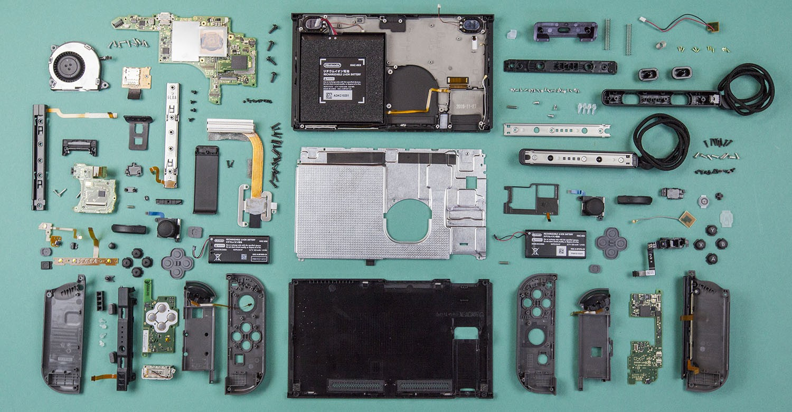
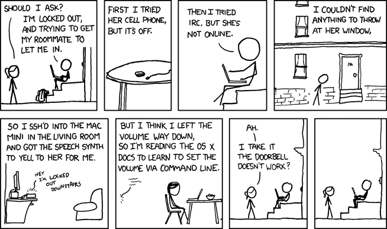
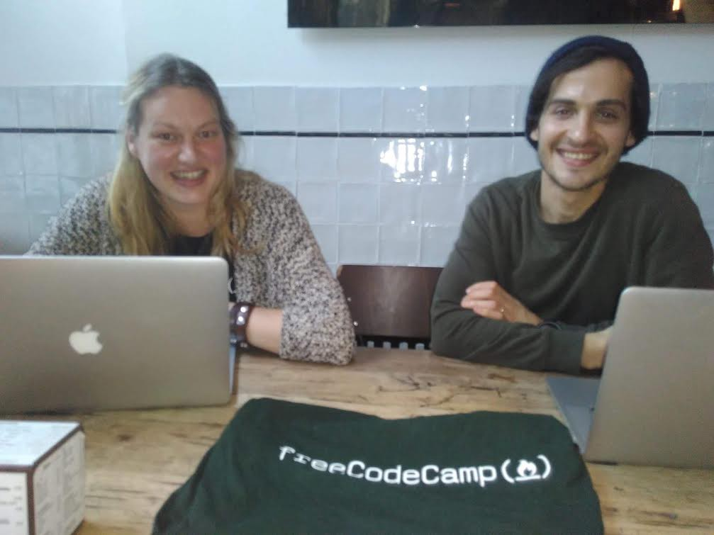

Here are three links worth your time:

1.  A detailed tear-down of the Nintendo Switch and hundreds of electronic components that make the game system run ([10 minute read](http://bit.ly/2lKyp5z))
2.  What do Uber, Volkswagen and Zenefits have in common? They all used hidden code to break the law. ([5 minute read](http://bit.ly/2lKAqie))
3.  How to choose and pair typefaces ([8 minute read](http://bit.ly/2m6fqnf))

### Thought of the day:

> “It should be noted that no ethically-trained software engineer would ever consent to write a DestroyBaghdad procedure. Basic professional ethics would instead require him to write a DestroyCity procedure, to which Baghdad could be given as a parameter.” — [Nathaniel Borenstein](http://bit.ly/2lKAqie)

### Funny of the day:

Webcomic by [XKCD](https://xkcd.com/530/)

### Study group of the day:

[freeCodeCamp Amsterdam](http://bit.ly/2lqleec)

Happy coding!

– Quincy Larson, teacher at [freeCodeCamp](http://bit.ly/2j7Q1dN)
