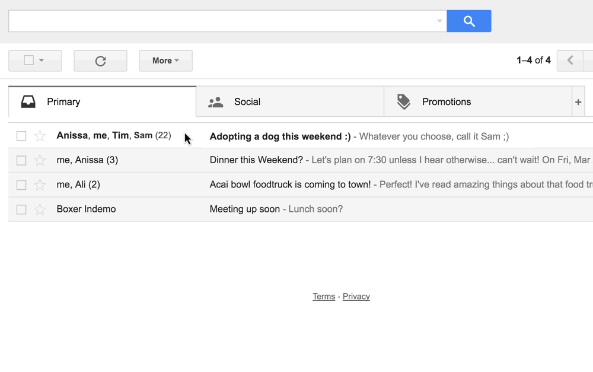

Our open source community tossed around some ideas for April Fool’s jokes. But after we consulted Elon Musk’s flow chart, we decided to leave it to the pros.

Fortunately, Google and friends did manage to serve up some absurdity, and in some cases quite literally break the forth wall:

<Embed src="https://www.youtube.com/embed/VkOuShXpoKc?feature=oembed" aspectRatio={undefined} caption="" />

They also introduced a useful new way to use Google Image Search:

<Embed src="https://www.youtube.com/embed/HQtGFBbwKEk?feature=oembed" aspectRatio={undefined} caption="" />

And — one of the biggest communication breakthroughs of all time — a new way to end the tyranny of indecisive group emails once and for all:

Remember the iPad scale app?

Well, you may not remember it actually working like in the image above, but surely you remember that conversation at the Genius Bar where you unsuccessfully argued for a refund.

Well it turns out that touch screen devices can do a lot more than measure your body weight and show you cat videos while you procrastinate on the toilet.

<Embed src="https://www.youtube.com/embed/5JV_hzOdoSU?feature=oembed" aspectRatio={undefined} caption="" />

Yuck. Don’t you know how many germs are on your touch screen? Oh, wait — you don’t know the exact number? Well, if you’re a curious cat, here’s a [13-step process for figuring this out](http://theoatmeal.com/quiz/phone_germs).

It will be a few years before self-driving cars are legally allowed on most roads, but you can use a “selfie-driving” car today.

<Embed src="https://www.youtube.com/embed/aPopTdDARgA?feature=oembed" aspectRatio={undefined} caption="" />

If it seems like Zipcar was trying too hard, trust me — you haven’t seen trying too hard until you’ve played this full length Donkey Kong-style browser game that Stack Overflow built as their April Fool’s joke.

That’s right — UniKong!

To win, you must avoid the mean unicorn, build up your Stack Overflow-style “rep”, and put the trolls out of their misery.

Yes, this is an actual game, and you yes, you should go play it right now.

What are you doing reading this article?

Click the green heart outline below, then head over and [play some Unikong](http://stackoverflow.com/seriously/unikong)!

_If you liked this, click the💚 below. Follow me and Free Code Camp for more articles on technology._

