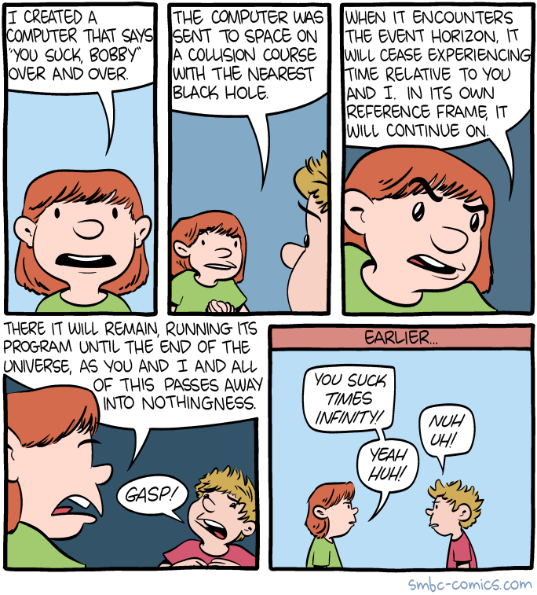

Here are three links worth your time:

1.  The 100% correct coding style guide ([4 minute read](http://bit.ly/2otwNBU))
2.  I wrote a programming language. Here’s how you can, too ([10 minute read](http://bit.ly/2o2bzKG))
3.  Yes, React is taking over front-end development. The question is why ([14 minute read](http://bit.ly/2n4g9J7))

Bonus: The “grammar vigilante” has been secretly correcting bad grammar on Bristol signs for the past 13 years ([2 minute watch](http://bbc.in/2oBvcav))

### Thought of the day:

> “Amateurs hack systems, professionals hack people.” — Bruce Schneier

### Funny of the day:

Webcomic by [Saturday Morning Breakfast Cereal](http://bit.ly/2nP6za7)

### Study group of the day:

[freeCodeCamp Johannesburg](http://bit.ly/2opU0Fy)

Happy coding!

– Quincy Larson, teacher at [freeCodeCamp](http://bit.ly/2j7Q1dN)

If you got value out of this email, consider [supporting our nonprofit](http://bit.ly/donate-to-fcc).
