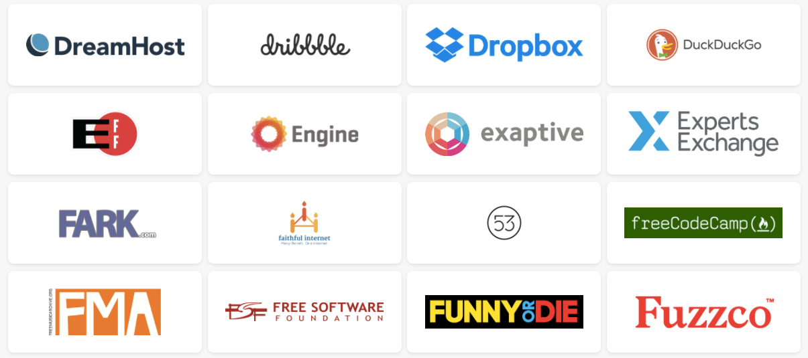

](./asset-1.jpeg)

This Wednesday, websites, online communities — and all the Americans who use them — will come together to sound the alarm about the Federal Communication Commission’s attack on net neutrality.

[Here’s how you can join the protest and spread the word](https://www.battleforthenet.com/july12/).

Right now, new FCC Chairman and former Verizon lawyer Ajit Pai has a plan to destroy net neutrality and give big cable companies immense control over what we see and do online. If they get their way, the FCC will give companies like Comcast, Verizon, and AT&T control over what we can see and do on the internet. They’ll be legally able to slow down websites who don’t pay them, or completely block websites they don’t like.

If we lose net neutrality, we could soon face an Internet where some of your favorite websites are forced into a slow lane online, while deep-pocketed companies who can afford expensive new “prioritization” fees have special fast lane access to Internet users — tilting the playing field in their favor.

But on July 12th, the [Internet will come together to stop them](https://www.battleforthenet.com/july12/). Websites, Internet users, and online communities will stand tall, and sound the alarm about the FCC’s attack on net neutrality.

The Battle for the Net campaign will provide tools for everyone to make it super easy for your friends, family, followers to take action.

From the [SOPA blackout](https://en.wikipedia.org/wiki/Protests_against_SOPA_and_PIPA) to the [Internet Slowdown](https://en.wikipedia.org/wiki/Internet_Slowdown_Day), we’ve shown time and time again that when the internet comes together, we can stop censorship and corruption. Now, we have to do it again.

[Learn more and join the action here](https://www.battleforthenet.com/july12).

And if you want to learn more about the history of the open internet — and why net neutrality is so important — [you can read all about it here](https://medium.freecodecamp.com/inside-the-invisible-war-for-the-open-internet-dd31a29a3f08).
