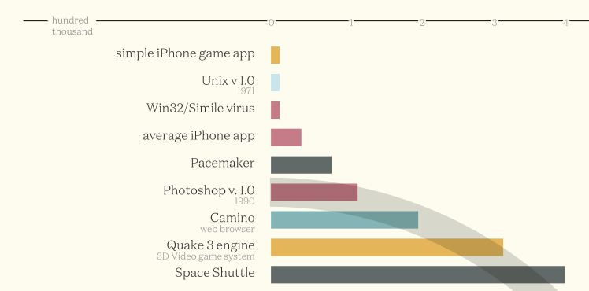
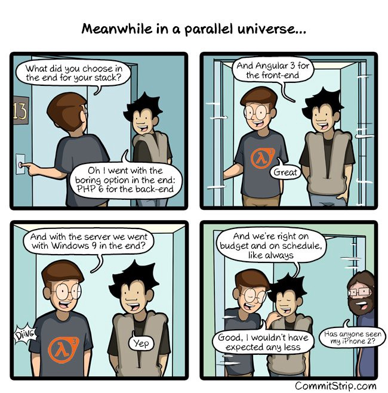

Here’s a diagram of the biggest codebases in history, as measured by lines of code:

](./asset-2.png)

As you can see, Google has by far the largest codebase of all. And all 2 billion lines of code fits into a single code repository.

But it isn’t a Git repository. Google [uses its own version control system](https://fcc.im/2rRzwDZ), which was designed specifically for its 62,000 employees (about 1/3 of whom are developers) to collaborate efficiently.

The distinction of “largest Git repository” goes to Microsoft, who announced today that their Windows Git repository has:

-   approximately 3.5M files that
-   results in a Git repo of about 300 gigabytes in size
-   with 4,000 engineers producing 1,760 daily “lab builds” across 440 branches, plus thousands of pull request validation builds.

You can read all about how the Windows team manages this complexity with Git here: ([11 minute read](https://fcc.im/2qdxiBT))

### Here are three other links worth your time:

1.  How Elise learned to code while working full-time and got her first web developer job — and things she learned along the way ([2 minute read](https://fcc.im/2qhH0yQ))
2.  How to dig yourself out of the coding tutorial rut ([5 minute read](https://fcc.im/2qlkJiY))
3.  The dark side of extreme productivity, and how to steer back toward the light ([8 minute read](https://fcc.im/2qXqwNr))

Bonus: How to use `setInterval` and `setTimeout` to create time-based events in JavaScript ([3 minute watch](https://www.youtube.com/watch?v=kOcFZV3c75I))

### Thought of the day:

> “Phishing is a major problem because there really is no patch for human stupidity.” — Mike Danseglio

### Funny of the day:

Webcomic by [Commit Strip](https://fcc.im/2qQKcUV)

### Study group of the day:

[freeCodeCamp Sao Paolo](https://fcc.im/2rB7yis)

Happy coding!

– Quincy Larson, teacher at [freeCodeCamp](http://bit.ly/2j7Q1dN)

If you get value out of these emails, please consider [supporting our nonprofit](http://bit.ly/donate-to-fcc).
