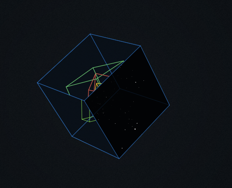
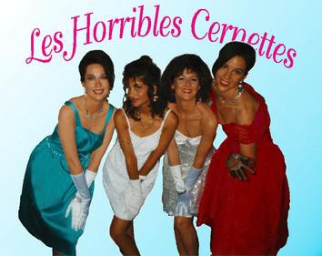
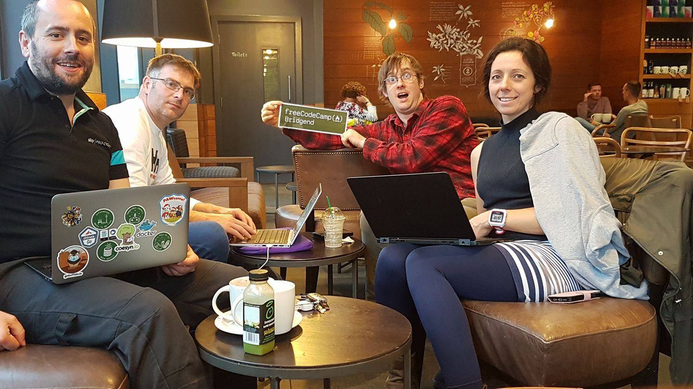

Today Bali Balo, a French designer and developer, [published a new piece](https://fcc.im/2t3kQ5x): a cube suspended in darkness that rotates on its own. As it does, it reveals different sides, each offering a glimpse into a different world:

-   a game of 3D pong
-   nested 3D shapes that slide around as the cube tilts
-   a field of stars whizzing past as if traveling at near light speed
-   a surreal humanoid figure that seems to tumble forever through space

[Bali Balo is famous on CodePen](https://fcc.im/2t2CGoV) not only for these explorations of geometry, but also for building a pure-CSS Minesweeper game.

That’s right — a fully functioning Minesweeper game — just like the one that has come pre-installed on Windows for decades.

You can [play it here](https://fcc.im/2rik9DY) and see that it is indeed running without the use of JavaScript.

And if you have time, I encourage you to read [Preethi Kasireddy](https://medium.com/@preethikasireddy)’s excellent interview with Chris Coyier, who helped create the CodePen platform itself: ([17 minute read](https://fcc.im/2s1LY6o))

### Here are three other links worth your time:

1.  A guide that the 500+ engineers at Asian ride-sharing startup Grab use to keep up with changes in front end development ([22 minute read](https://fcc.im/2spxFsP))
2.  Token Network Effects: a new business model for a decentralized web ([6 minute read](https://fcc.im/2sbfXHy))
3.  Yes — some Coursera courses are still free. You just need to know how to access them. Here’s how. ([6 minute read](https://fcc.im/2rwQ4zI))

### Thought of the day:

> “I’ve been fairly successful at what I call ‘Tom Sawyering’; it’s the idea that if you want to get your fence painted, you trade something of value with the people with whom you work. You have to be committed to their success as well as your own.” — Chuck Thacker

Chuck Thacker — who helped create technologies like the mouse, laser printer, and ethernet — died this week. The ACM published this obituary for him: ([6 minute read](https://fcc.im/2tnt5bY))

### Image of the day:

[“The Horrible CERN Girls”](https://fcc.im/2s1JiFK) was the first image ever published on the World Wide Web. The photo shows a pop quartet comprised entirely of CERN employees.

You can read about the history of images on the web, and how they were originally proposed, here: ([4 minute read](https://fcc.im/2spyZfo))

### Study group of the day:

[freeCodeCamp Bridgend, UK](https://fcc.im/2stFJcX)

Happy coding!

– Quincy Larson, teacher at [freeCodeCamp](http://bit.ly/2j7Q1dN)

If you get value out of these emails, please consider [supporting our nonprofit](http://bit.ly/donate-to-fcc).
