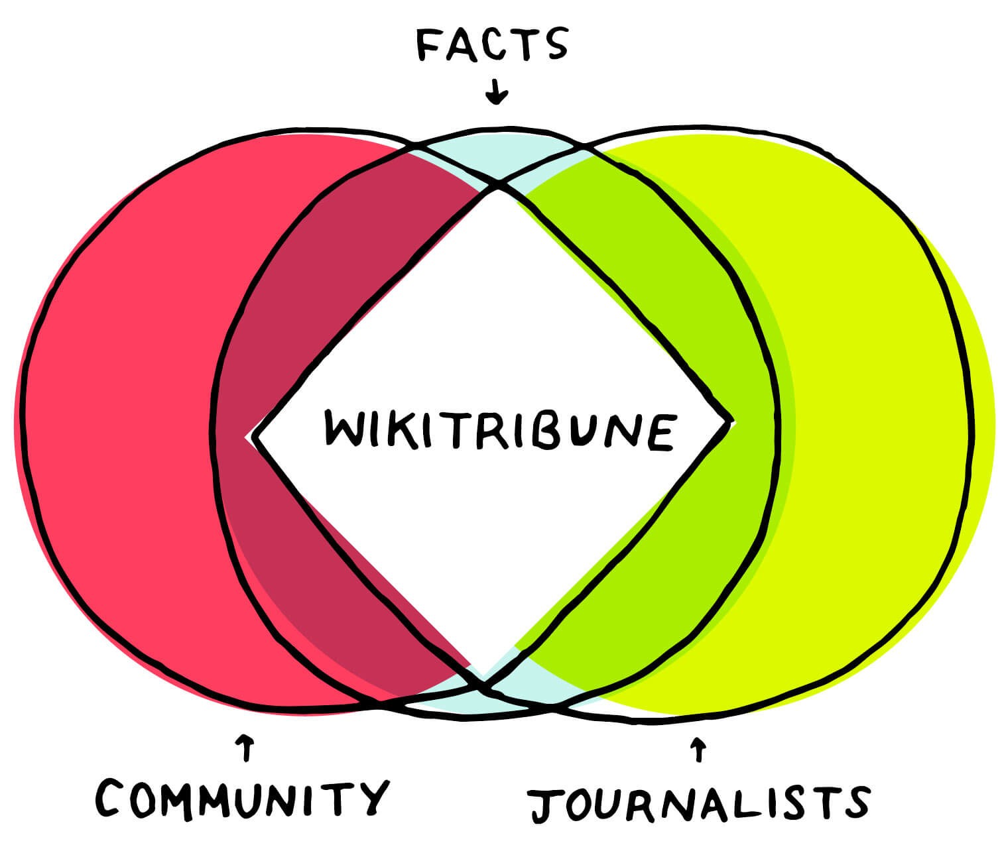
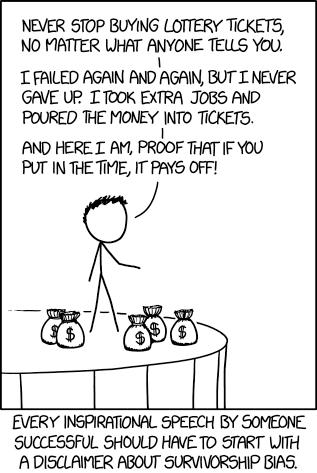
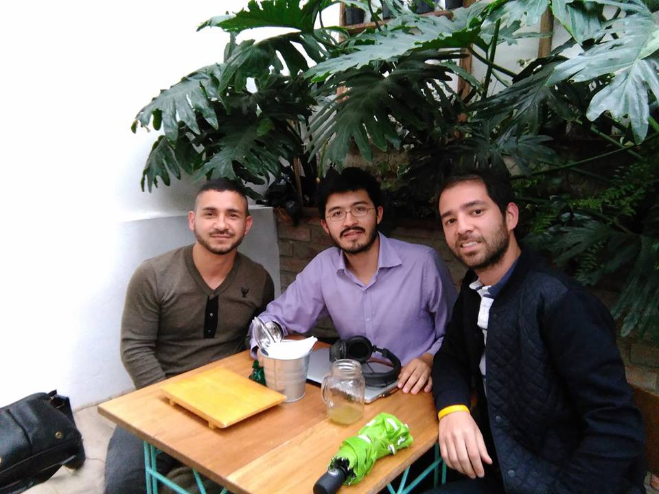

Back in 2001, Jimmy Wales co-founded Wikipedia with the mission of “empowering and engaging people around the world to collect and develop educational content under a free license or in the public domain.”

Today he announced he’s creating a news website called WikiTribune. The site says: “We want to make sure that you read fact-based articles that have a real impact in both local and global events. And that stories can be easily verified and improved.”

WikiTribune is a “living, breathing tool that’ll present accurate information with real evidence, so that you can confidently make up your own mind.”

The website heavily emphasizes the role of a community of peers, instead of the traditional separation between journalists and their readers. “Articles are authored, fact-checked, and verified by professional journalists and community members working side by side as equals, and supported not primarily by advertisers, but by readers who care about good journalism enough to become monthly supporters.”

Over the next 30 days, WikiTribune will try to raise enough donations to hire its initial team of 10 full-time journalists. You can check out their full WikiTribune website and contribute [here](https://fcc.im/2qbtlZQ).

Here are three other links worth your time:

1.  Massive Open Online Courses used to be 100% free. But they didn’t stay that way ([5 minute read](https://fcc.im/2pwEMiw))
2.  CSS in JavaScript: The future of component-based styling ([7 minute read](https://fcc.im/2pixyxI))
3.  An illustrated guide to setting up your website using GitHub and Cloudflare ([8 minute read](https://fcc.im/2p1sSLU))

Bonus: Game developer Jonathan Blow gave a great talk on “Making Game Programming Less Terrible” ([1 hour watch](https://www.youtube.com/watch?v=gWv_vUgbmug&t=64s))

### Thought of the day:

> “Testing has to be an integral part of developing software and not a separate phase. When this approach is taken, product quality is owned by everyone on the team. It is easy to state, but hard to put into practice because of long-standing preconceived notions that developers and testers are better kept apart.” — James Sivak

### Funny of the day:

Webcomic by [XKCD](https://fcc.im/2qbEo5j).

### Study group of the day:

[freeCodeCamp Bogotá](https://fcc.im/2oJ0jAC)

Happy coding!

– Quincy Larson, teacher at [freeCodeCamp](http://bit.ly/2j7Q1dN)

If you get value out of these emails, please consider [supporting our nonprofit](http://bit.ly/donate-to-fcc).
