. 2013. Wood.](./asset-1.jpeg)

There are a lot of scary things happening these days, but here’s what keeps me up late at night. A handful of corporations are turning our open internet into this:

These corporations want to lock down the internet and give us access to nothing more than a few walled gardens. They want to burn down the Library of Alexandria and replace it with a magazine rack.

Why? Because they’ll make more money that way.

This may sound like a conspiracy theory, but this process is moving forward at an alarming rate.

#### History is repeating itself.

So far, the story of the internet has followed the same tragic narrative that’s befallen other information technologies over the past 160 years:

-   the telegram
-   the telephone
-   cinema
-   radio
-   television

Each of these had roughly the same story arc:

1.  Inventors discovered the technology.
2.  Hobbyists pioneered the applications of that technology, and popularized it.
3.  Corporations took notice. They commercialized the technology, refined it, and scaled it.
4.  Once the corporations were powerful enough, they tricked the government into helping them lock the technology down. They installed themselves as “natural monopolies.”
5.  After a long period of stagnation, a new technology emerged to disrupt the old one. Sometimes this would dislodge the old monopoly. But sometimes it would only further solidify them.

This loop has repeated itself so many times that Tim Wu — the Harvard law professor who coined the term “Net Neutrality” — has a name for it: **The Cycle**.

> “History shows a typical progression of information technologies, from somebody’s hobby to somebody’s industry; from jury-rigged contraption to slick production marvel; from a freely accessible channel to one strictly controlled by a single corporation or cartel — from open to closed system.” — Tim Wu

And right now, we’re in step 4 the open internet’s narrative. We’re surrounded by monopolies.

The problem is that we’ve been in step 4 for decades now. And there’s no step 5 in sight. The creative destruction that the Economist Joseph Schumpeter first observed in the early 1900s has yet to materialize.

The internet, it seems, is special. It’s the ultimate information technology — capable of supplanting the telegram, telephone, radio, cinema, television, and much more — and there’s no clear way to disrupt it.

But the war for the commanding heights of the internet is far from over. There are many players on this global chess board. Governments. Telecom monopolies. Internet giants like Google and Facebook. NGOs. Startups. Hackers. And — most importantly — **you**.

The war for the open internet is the defining issue of our time. It’s a scramble for control of the very fabric of human communication. And human communication is all that separates us from the utopia that thousands of generations of our ancestors slowly marched us toward — or the Orwellian, Huxleyan, Kafkaesque dystopia that a locked-down internet would make possible.

By the end of this article, you’ll understand what’s happening, the market forces that are driving this, and how you can help stop it. We’ll talk about the brazen monopolies who maneuver to lock down the internet, the scrappy idealists who fight to keep it open, and the vast majority of people who are completely oblivious to this battle for the future.

**In Part 1, we’ll explore what the open internet is** and delve into the history of the technological revolutions that preceded it.

**In Part 2, we’ll talk about the atoms.** The physical infrastructure of the internet. The internet backbone. Communication satellites. The “last mile” of copper and fiber optic cables that provide broadband internet.

**In Part 3, we’ll talk about bits.** The open, distributed nature of the internet and how it’s being cordoned off into walled gardens by some of the largest multinational corporations in the world.

**In Part 4, we’ll explore the implications of all this** for consumers and for startups. You’ll see how you can help save the open internet.  I’ll share some practical steps you can take as a citizen of the internet to do your part and keep it open.

This is a long read. So grab a hot beverage and get ready to download a massive corpus of technology history into your brain.

### Part 1: What is the open internet?

There’s only one word to describe the open internet: **chaos**.

The open internet is a cacophony of 3 billion voices screaming over one another. It’s a dusty, sprawling bazaar. And it’s messy. But it has produced some of the greatest art and industry of our time.

The open internet is a Miltonian marketplace of ideas, guided by a Smithian invisible hand of free-market capitalism.

The open internet is distributed. It’s owned in part by everyone and in whole by no one. It exists largely outside of the boundaries of governments. And it’s this way by design.

This reflects the wisdom of Vint Cerf, Bob Khan, J. C. R. Licklider, and all the [wizards who stayed up late](http://amzn.to/2mSyqHN) and pioneered the internet. They had seen the anti-capitalist, corporatists fate that befell the telegram, the telephone, the radio, and the TV. They wanted no part of that for their invention.

The open internet is a [New Mexico Quilter’s Association](http://www.nmqa.org/). It’s a [Jeremy Renner fan club](http://www.jeremyleerenner.com/). It’s a North Carolina [poetry slam](https://www.poetryslamasheville.com/). It’s a Washington D.C. [hackerspace](http://www.hacdc.org/). It’s a [municipal website](http://www.townoftruckee.com/) for Truckee, California. It’s a [Babylon 5 fan fiction website](http://www.b5-dark-mirror.co.uk/).

The open internet is a general purpose tool where anyone can publish content, and anyone can then consume that content. It is a Cambrian Explosion of ideas and of execution.

Can these websites survive in a top-down, command-and-control closed internet? Will they pay for “shelf space” on a cable TV-like list of packages? Will they pay for a slice of attention in crowded walled gardens?

#### We’re all trapped in The Cycle

Here’s a brief history of the information technologies that came before the internet, and how quickly corporations and governments consolidated them.

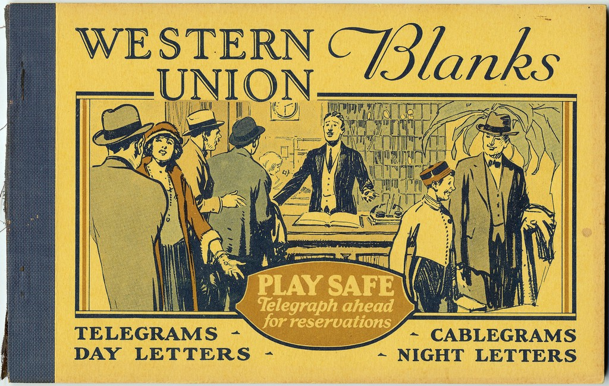

Originally anyone could string up some cable, then start tapping out Morse Code messages to their friends. The telegram was a fun tool that had some practical applications, too. Local businesses emerged around it.

That changed in 1851 when Western Union strung up transcontinental lines and built relay stations between them.

If small telegraph companies wanted to be able to compete, they needed access to Western Union’s network. Soon, they were squeezed out entirely.

At one point Western Union was so powerful that it was able to single-handedly install a US President. If you grew up in America, you may have memorized this president’s name as a child: Rutherford B. Hayes.

Not only did Western Union back Hayes’ campaign financially, it also used its unique position as the information backbone for espionage purposes. It was able to read telegrams from Hayes’ political opponents and make sure Hayes was always one step ahead.

Western Union’s dominance — and monopoly pricing — would last for decades until Alexander Graham Bell disrupted its business with his newly-invented telephone.

#### How the telephone fell victim to The Cycle

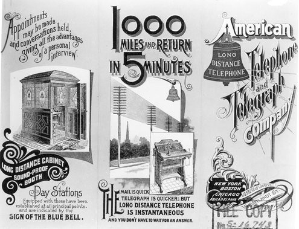

After a period of party lines and local telephone companies, AT&T — backed by JP Morgan — built a network of long-distance lines throughout America.

In order for the customers of local phone companies to be able to call people in other cities, those companies had to pay AT&T for the privilege of using its long-distance network.

Theodore Vail — a benevolent monopolist if there ever was one — thought that full control of America’s phone systems was the best way to avoid messy, wasteful capitalistic competition. He argued that his way was better for consumers. And to be fair, it was. At least in the short run.

Vail was able to use AT&T’s monopoly profits to subsidize the development of rural phone lines. This helped him rapidly connect all of America and unify it under a single standardized system.

But the problem with benevolent monopolists is they don’t live forever. Sooner or later, they are replaced by second-generation CEOs, who often lack any of their predecessors’ idealism. They are only after one thing — the capitalist’s prerogative — maximizing shareholder value. That means making a profit, dispersing dividends, and beating quarterly earnings projections. Which means extracting as much money from customers as possible.

AT&T eventually squeezed out their competitors completely. And once AT&T’s monopoly became apparent, the US Government took action to regulate it. But AT&T was much smarter than its regulators, and jumped on an opportunity to become a state-sponsored “natural monopoly.”

AT&T would enjoy monopoly profits for decades before being broken up by the FCC in 1982.

But the “baby bells” wouldn’t stay divided for long. In 1997, they were able to start [merging back together](http://money.cnn.com/2014/05/20/technology/att-merger-history/) into a corporation even bigger than before the break-up.

The end result is one of the most powerful corporations on the planet — strong enough to expand its monopoly from the land-line telephone industry to the emerging wireless telecom industry.

AT&T functioned like a branch of government and had extensive research labs, but with one major exception — it could keep secret any inventions that it perceived as a threat to its core business.

Voicemail — and digital tape, which was later used as a critical data storage medium for computers — was actually invented within one of AT&T’s labs in 1934. But they buried it. It was only re-invented decades later.

Imagine how much progress the field of information technology could have made during that length of time with such a reliable and high-volume data storage medium at its disposal.

To give you some idea of how much just this one AT&T decision may have cost humanity, imagine that a corporation purposefully delayed the introduction of email by a decade. What would be the total impact on the productivity of society? How many trillions of dollars in lost economic activity would such an action cost us? This is _the_ cautionary tale of what happens when you leave scientific research and development to private industry instead of public labs and universities.

You can still feel the legacy of AT&T’s monopoly when you call an older person from out of state. They will instinctively try to keep the call as short as possible, because they want to avoid the massive long distance fees historically associated with such calls, even though these no longer apply.

I thought this was just my grandmother, but it’s everyone’s grandmother. Entire generations have been traumatized by AT&T’s monopolistic pricing.

#### How cinema fell victim of The Cycle

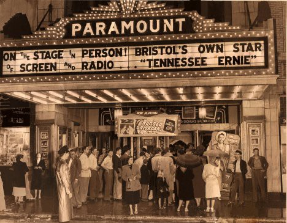

Shortly after the invention of cinema, we had thousands of movie theaters around the US showing a wide variety of independently-produced films on all manner of topics. Anyone could produce a film, then screen it at their local theater.

That changed when Adolf Zukor founded Paramount Pictures. He pioneered the practice of “block booking.” If small independent theaters wanted to screen, say, the newest Mae West film, they would also need to purchase and screen a bunch of other lessor films.

This took away theater owners’ status as local tastemakers, and removed their ability to cater to their own local demographics. The result was the commoditization of movie theaters, and ultimately the rise of blockbuster cinema.

#### How radio fell victim to The Cycle

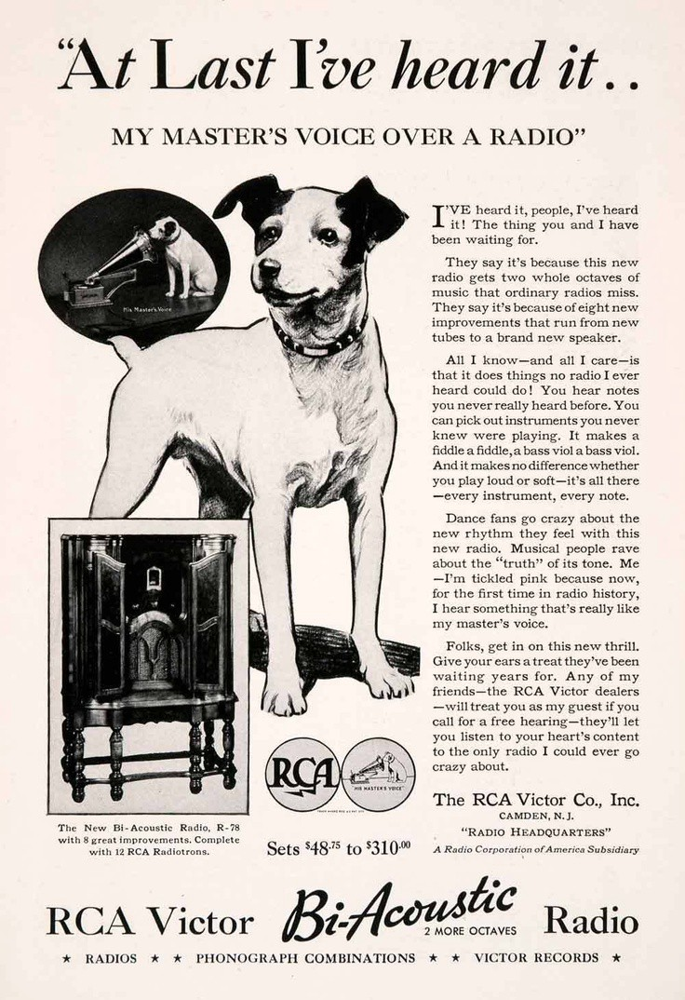

Shortly after Marconi — [or Tesla](http://science.howstuffworks.com/innovation/inventions/who-invented-the-radio.htm) — invented the radio, a massive hobbyist movement sprung up around it. There were thousands of local radio stations playing amateur programs.

In stepped David Sarnoff as the head of the Radio Corporation of America (RCA). He was perhaps the most Machiavellian CEO of the 20th century.

At the time, RCA was making parts for radio. Conventional thinking at the time was that RCA should focus on hardware, and getting as many radio stations running and as many radios into homes as possible. But Sarnoff realized that the real money was in content. He helped popularize the National Broadcast Corporation (NBC) and focused instead on making money through advertisements.

Then Sarnoff approached the Federal Radio Commission — now the Federal Communications Commission (FCC) — and convinced them that since the radio spectrum was a scarce commodity, they should carve it up and issue licenses.

Soon, NBC was available in every home, and the local hobbyist radio stations were squeezed off the air. RCA was now vertically integrated — from the parts in the radio stations, to the parts in consumer radios, to the content being broadcast itself.

Sarnoff had talked with the inventors of TV, and knew that it would eventually disrupt radio. But he had a plan. To claim the invention of television for himself.

#### How TV fell victim to The Cycle

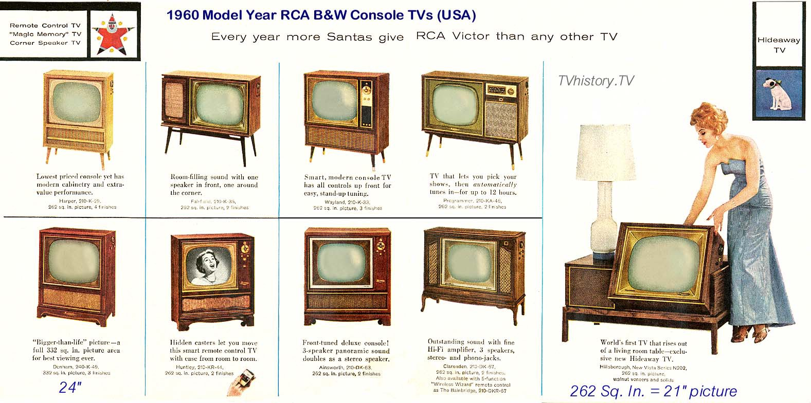

TV is different from other forms of technology here, in that it didn’t enjoy a hobbyist stage. With the help of the FCC, Sarnoff and RCA immediately locked TV down. The result was several decades where Americans had just three channels to choose from — NBC, CBS, and ABC.

This was the height of mass culture — half of all Americans watching the same episode of I Love Lucy at the same time. The popularity of television — combined with the lack of diversity in programming caused by this monopoly — had social and political consequences that haunt us to this day.

#### Will the open internet fall victim to The Cycle?

We’ve gone through the invention step. The infrastructure came out of DARPA and the World Wide Web itself came out of CERN.

We’ve gone through the hobbyist step. Everyone now knows what the internet is, and some of the amazing things it’s capable of.

We’ve gone through the commercialization step. Monopolies have emerged, refined, and scaled the internet.

But the question remains: can we break with the tragic history that has befallen all prior information empires? Can this time be different?

### Part 2: The War for Atoms

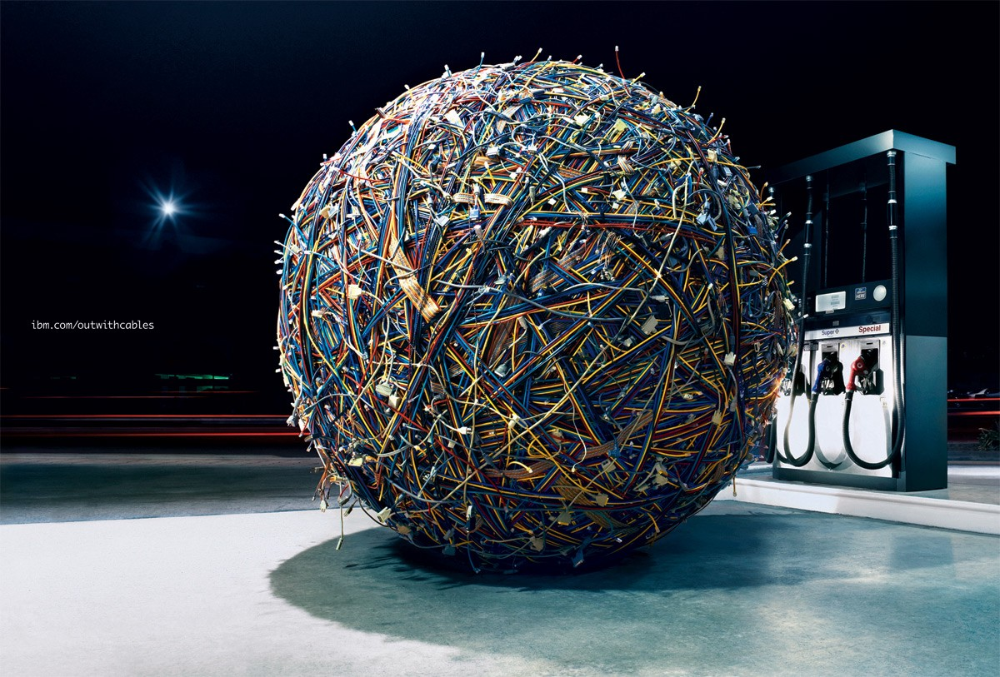

> “Any sufficiently advanced technology is indistinguishable from magic.” — Arthur C. Clarke’s Third Law

As much as we may think of the internet as a placeless realm of pure abstractions, it has a physical structure. It’s not magic. And more people are waking up to this reality each day.

The internet is a series of copper and fiber optic cables that burrow through the ground and tunnel under oceans. We call this the Internet Backbone. Here’s what it looks like:

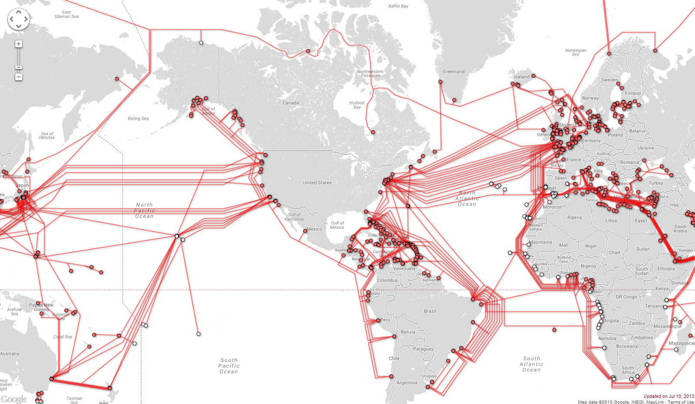

The internet is then further distributed through regional backbones. Here’s all the fiber that carries internet data around the United States. Red squares represent the junctions between “long haul” fibers.

#### The invisible workhorses of the internet: backbone providers

Six major companies control the backbone, and they “hand off” traffic from one another without any money exchanging hands:

-   Level 3 Communications
-   Telia Carrier
-   NTT
-   Cogent
-   GTT
-   Tata Communications.

Within the US, the backbone is mostly controlled by old long distance carriers, including Verizon and AT&T — who also control a two thirds of America’s $200 billion wireless industry.

These companies “peer” traffic through backbone connections controlled by other companies, or pay each other through “transit agreements.”

Despite the involvement of these huge telecoms, the internet backbone represents a fairly healthy market. [About 40%](http://www.stern.nyu.edu/networks/Economides_ECONOMICS_OF_THE_INTERNET_BACKBONE.pdf) of the internet’s backbone is controlled by smaller networks you’ve never heard of.

#### The mafia of the internet: the ISPs

The broadband internet market, on the other hand, isn’t healthy at all. This is the “last mile” of cables that plug into the internet backbone. And it’s full of ugly tollbooths, guarded by thick benches of lawyers and lobbyists.

This broadband internet market is controlled by just three extremely powerful — and widely hated — internet service providers (ISPs):

-   Cox
-   Charter (which recently acquired another ISP, Time Warner)
-   and [the most hated corporation in America](http://finance.yahoo.com/news/america-most-hated-companies-110032495.html), Comcast, which [controls 56%](https://arstechnica.com/business/2015/01/comcast-now-has-more-than-half-of-all-us-broadband-customers/) of America’s broadband

Another form of ISPs are the wireless providers:

-   AT&T
-   Verizon (formerly part of AT&T)

These two providers control 2/3rd of the wireless market. If you have a mobile phone, there’s a good chance you pay one of these companies every month for your data plan.

These ISPs control millions of miles of copper cables that they buried in the ground back in the 1970s, and satellites they shot up into orbit in the 1990s. They constantly [break](http://www.theverge.com/2014/10/29/7090107/comcast-settles-lawsuit-will-pay-50-million-settlement) [the](http://money.cnn.com/2016/10/11/news/companies/comcast-fine-fcc/) [law](http://www.fiercecable.com/cable/cox-ordered-to-pay-6-31m-for-tying-set-top-fees-to-premium-video-services), tie up regulators in lengthy court battles, and make it practically impossible for anyone — even Google — to enter their markets.

The ISPs do all this for one reason and one reason alone: so they can avoid free market competition — and the expensive technology upgrades it would require — while they continue raking in their [monopoly rents](https://en.wikipedia.org/wiki/Economic_rent) from the 2/3 of Americans who only have one choice in their neighborhood for broadband internet.

For the past two years, the public had a weapon against these ISPs. It’s not one that can mortally wound them , but it has helped beat back their monopolistic tendencies. It’s called Net Neutrality.

#### How Net Neutrality works

The story of ISPs basically comes down to this: They used to make a ton of money off of cable packages. But people discovered that once they had the internet, they didn’t care about cable TV any more — they just wanted data plans and so they could watch YouTube, Netflix, or whatever shows they wanted — and they could also consume a lot of non-video content, too.

The ISPs don’t make nearly as much selling you a data plan as they used to make selling you a cable plan, though. So their goal is to return to the “good old days” by locking down the internet into “channels” and “bundles” then forcing you to buy those.

How do we prevent this? The good news is that we already have. In 2015, the FCC passed a law that regulated ISPs as utilities. This is based on the principle of “Net Neutrality” which basically states that all information passing through a network should be treated equally.

As part of its 2015 decision on Net Neutrality, the FCC asked for public comment on this topic. 3 million Americans wrote to the FCC. [Less than 1% of those people](https://techcrunch.com/2014/09/02/less-than-1-of-comments-sent-to-the-fcc-opposed-net-neutrality/) were opposed to Net Neutrality.

After a hard fought battle against telecoms, we convinced the FCC to enshrine Net Neutrality into law.

The FCC’s Title II regulation created three “bright lines” that prevent ISPs from doing the following:

1.  Blocking content from websites
2.  Slowing down content from websites
3.  Accepting money from websites to speed up their content

These rules made it so that no matter how rich and powerful a corporation is — and Apple and Google are the biggest corporations on Earth, and Microsoft and Facebook aren’t far behind — they can’t buy priority access to the internet.

Everyone has to compete on a level playing field. These tech conglomerates have to compete with the scrappy startups, the mom-and-pop businesses, and even independent bloggers who are running WordPress on their own domain.

Nobody is above Net Neutrality. It’s as simple a tool as possible for protecting the capitalist free market internet from monopolies who would otherwise abuse their power.

Now ISPs are treated like a utility. How are the packets being routed through a network different from the water being piped through the ground, or the electricity flowing through a power grid?

The water company shouldn’t care whether you’re turning on a tap to wash dishes or to take a shower.

The power company shouldn’t care whether you’re plugging in a TV or a toaster.

The ISPs shouldn’t care what data you want or what you use it for.

The reason ISPs want to get rid of Net Neutrality is simple: if we stop treating them like the utility that they are, they can find ways to charge a lot more money.

Here’s the former CEO of AT&T laying out his evil plan:

> “Now what they would like to do is use my pipes free, but I ain’t going to let them do that because we have spent this capital and we have to have a return on it. So there’s going to have to be some mechanism for these people who use these pipes to pay for the portion they’re using. Why should they be allowed to use my pipes? The Internet can’t be free in that sense, because we and the cable companies have made an investment and for a Google or Yahoo! or Vonage or anybody to expect to use these pipes \[for\] free is nuts!” — Edward Whitacre, AT&T CEO

What he should certainly realize is that everyone is already paying for internet access. You’re paying to be able to access this article. I’m paying to push this article up onto the internet. This website is paying to send the traffic from its servers over to your computer.

We have all already paid to use these ISP’s last mile of cables. No one is using these pipes for free.

But the ISPs see an opportunity to double dip. They want to charge for bandwidth, and also charge websites what the Mafia calls “protection money.” They essentially want to be able to say to website owners: “Those are some lovely data packets you’ve got there. It sure would be a shame if they got lost on their way to your users.”

Of course, most of the open internet couldn’t afford to pay this “protection money” to ISPs, so the ISPs would block traffic to their websites, cutting consumers off from most of the open internet. But the ISPs wouldn’t need to block these websites. All the ISPs would need to do is introduce a slight latency.

Both Google and Microsoft have done research that shows that if you slow down a website by even 250 milliseconds — about how long it takes to blink your eyes — most people will abandon that website.

That’s right — speed isn’t a feature, it’s a basic prerequisite for attracting an audience. We humans are extremely impatient and becoming more so with each passing year.

This means that in practice, **if an ISP artificially slows down a website, it’s practically as damaging as blocking the site entirely.** Both of these acts result in the same outcome — a severe loss of traffic.

Traffic is the lifeblood of websites. Without traffic, merchandise doesn’t get sold. Services don’t get subscribed to. Donations don’t get made.

Without traffic, the open web dies — whether ISPs block it or not.

#### The ISPs have launched an all-out assault on Net Neutrality

With January’s change in US administration and the election of our 45th president, the FCC has changed as well.

The FCC Chairman Ajit Pai — a former Verizon lawyer — is now in control of the only regulator that the ISPs answer to. And here’s a direct quote from him:

> “We need to fire up the weed whacker and remove those rules that are holding back investment, innovation and job creation.” — FCC Chairman Ajit Pai

The ISPs won’t reinvest their “protection money” in infrastructure. They already have incredible monopoly profits. Here’s their net income (after-tax profits) from 2016:

-   AT&T: $16 billion
-   Verizon: $13 billion
-   Comcast $8 billion
-   Charter $8 billion

They have plenty of profit they could claw back into improving infrastructure. They’re choosing instead to disperse this money to shareholders.

In just two months, Chairman Pai has already done incredible damage to Net Neutrality. He dropped [Zero Rating](https://en.wikipedia.org/wiki/Zero-rating) lawsuits against four monopolies who were in clear violation of Net Neutrality law. Now Comcast and AT&T can continue to stream their own video services without them counting toward customers’ data caps, and there’s nothing the FCC will do about it.

Former FCC Chairman Tom Wheeler did his best to reach out to Chairman Pai and convince him of the virtues of Net Neutrality. The two were scheduled to meet once every two weeks during Wheeler’s last 18 months in office. But Pai cancelled every single one of these meetings.

> “You have to have open networks — permissionless innovation. Period. End of discussion. They’re crucial to the future.” — Former FCC Chairman Tom Wheeler

### Part 3: The War for Bits

What does a post Net Neutrality internet look like? Look no further than the Apple App store.

There are two million apps in the app store, which shared a total of $28 billion in 2016. Apple takes a 30% commission on every sale, and made $8.4 billion from the app store alone.

Most of the remaining $20 billion goes to just a small handful of mobile gaming companies:

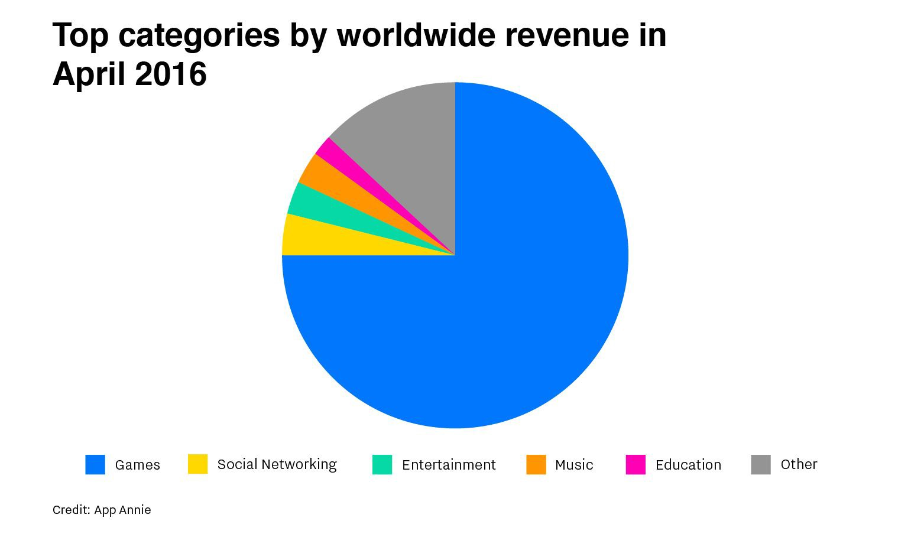

Most iPhone users download zero apps per month.

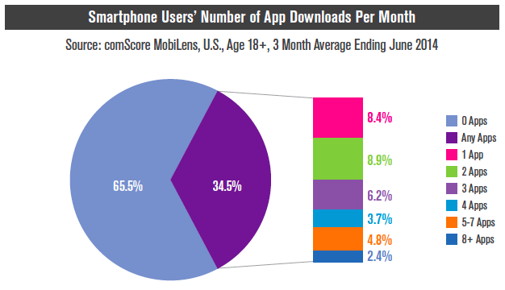

The minority who do bother to download new apps don’t end up downloading very many.

And all 8 of the top apps in the app store are [owned by just two corporations](https://medium.freecodecamp.com/all-of-2016s-top-mobile-apps-are-owned-by-either-google-or-facebook-a9c56d77a74b): Facebook and Google.

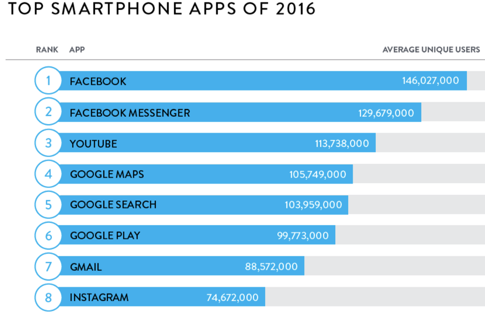

A vast majority of the remaining 2 million apps get very little traffic — and even less money.

The Apple App Store isn’t a level playing field. It doesn’t resemble the open internet it was built on top of. Instead, it’s an example of a walled garden.

Walled gardens look beautiful. They’re home to the most popular flora. But make no mistake, you won’t be able to venture very far in any one direction without encountering a wall.

And every walled garden has a gatekeeper, who uproots plants that look like weeds. If you want to plant something in a walled garden, you have to get approval from that gatekeeper. And Apple is one of the most aggressive gatekeepers of all. It keeps out [apps that compete with its own interests](http://www.recode.net/2016/6/30/12067578/spotify-apple-app-store-rejection), and [censors apps that don’t mesh with its corporate worldview](https://www.nytimes.com/2017/01/18/technology/clearing-out-the-app-stores-government-censorship-made-easier.html).

#### A brief history of walled gardens

First there was the original walled garden of the internet, AOL.

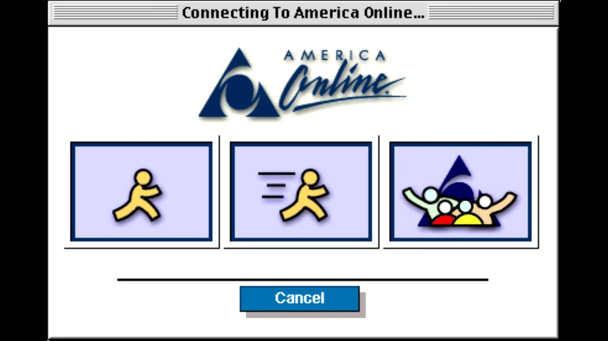

20 years later, AOL still has 2 million users paying them $20/month. There’s a lot of money to be made in building walled gardens and trapping users in them.

Then came Yahoo, which wasn’t a walled garden by design, but became one anyway because people were so new to the internet.

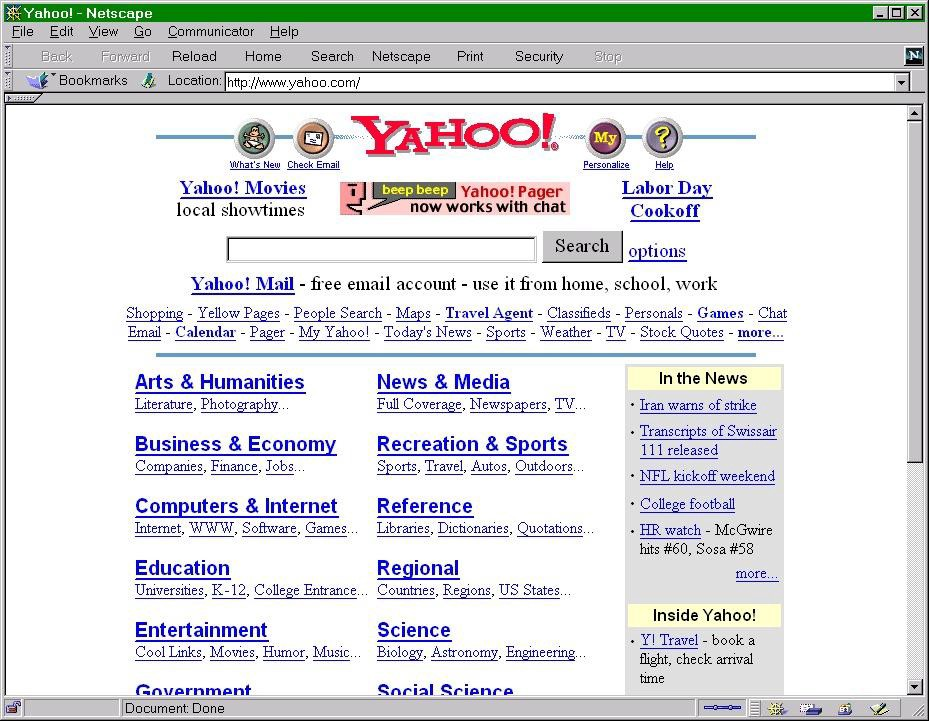

In the late 90s, startups raised money specifically so they could [buy banner ads on Yahoo](http://www.paulgraham.com/yahoo.html). It was the best way they could reach prospective users.

But Yahoo was a candle in the sun compared to the ultimate walled garden: Facebook.

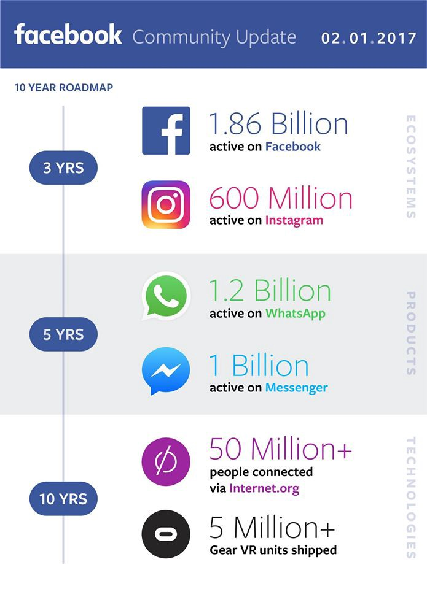

A quarter of the people on Earth use Facebook for an average of 50 minutes each day.

And those 50 million people connected to Internet.org that Mark Zuckerberg is bragging about? Those are people from extremely poor countries who were given a choice: they could either pay for the open internet or just get Facebook for free. They chose Facebook.

The insidiously-named Internet.org was famously [rejected in India](https://www.theguardian.com/technology/2016/feb/08/india-facebook-free-basics-net-neutrality-row) — among other countries — where activists were able to raise awareness about all the things Indians would give up by accepting Facebook instead of the open internet.

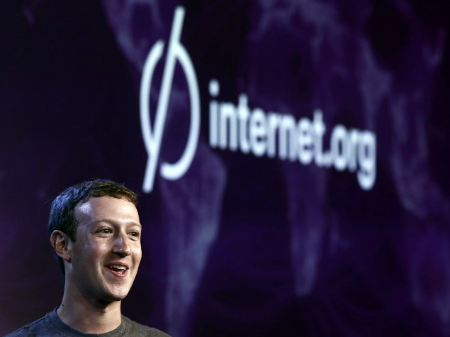

Mark Zuckerberg may mean well, but he’s rapidly [destroying the open internet](https://medium.freecodecamp.com/mark-zuckerberg-is-the-most-powerful-person-on-earth-but-is-he-responsible-5fbcaeb29ee1#.ka7h70619). In his ravenous quest to expand Facebook’s market share, he’s even gone so far as to build a [sophisticated censorship tool](https://www.nytimes.com/2016/11/22/technology/facebook-censorship-tool-china.html) so that Facebook can appease the governments of countries where it’s currently blocked, like China.

And Facebook is just one of several internet corporations who stand to profit from these sort of closed-source, closed-data walled garden platforms.

Here are the 10 largest corporations in the world by [market capitalization](https://en.wikipedia.org/wiki/Market_capitalization):

1.  Apple Inc
2.  Alphabet (Google)
3.  Microsoft
4.  Exxon Mobil
5.  Johnson & Johnson
6.  General Electric
7.  Amazon.com
8.  Facebook
9.  Wells Fargo
10.  AT&T

All of them are American-based multinationals. 5 out of 10 of them are internet companies, and one of them is an ISP.

Once you look past the last gasp of the banks and the oil companies, it becomes clear that these internet companies are the new order. They control information. They control the conversation. They control politics. [Facebook won the new president the election](https://www.wired.com/2016/11/facebook-won-trump-election-not-just-fake-news/) — [even the president and his advisors acknowledge this](http://www.theverge.com/2016/11/13/13619148/trump-facebook-twitter-helped-win).

So what makes you think they won’t come to control the very internet they dominate?

Even as the costs of launching a website fall, the costs of reaching an audience continue to rise.

**Facebook and Google account for** [**85% of all new dollars spent on online advertising**](https://www.nytimes.com/2016/04/18/business/media-websites-battle-falteringad-revenue-and-traffic.html). Everyone else — newspapers, blogs, video networks — is fighting for crumbs — the 15% that fell from Facebook’s and Google’s mouths.

[**Half of all internet traffic**](https://www.wired.com/2014/06/net_neutrality_missing/) **now flows to just 30 websites.** The remaining half is thinly spread across the 60 trillion unique webpages currently indexed by Google.

If you’re familiar with the concept of [a long tail distribution](http://amzn.to/2m5Y64H), you’ll recognize this phenomenon as an extremely fat head with an extremely long, skinny tail.

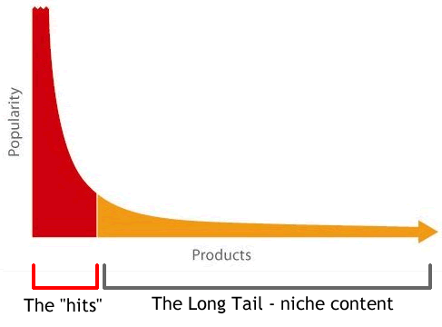

#### We blindly trust tech founders to be benevolent

You may think that the Mark Zuckerbergs and the Larry Pages of the world would know better than to abuse their power. But such scandals have happened in the past.

Reddit is one of the most popular websites on the internet. One of its founders recently put the company’s reputation in jeopardy. He admitted that he had [modified users’ comments in Reddit’s database](http://www.independent.co.uk/life-style/gadgets-and-tech/news/reddit-donald-trump-steve-huffman-spez-pizzagate-trolls-hillary-clinton-a7436406.html) — essentially putting words in the mouths of people who were critical of him.

We are not only placing faith in the temperament of the elite handful of tech company founders. We’re also trusting that other actors — who ultimately take over these organizations — will be benevolent. Even when we know that their shareholders — or governments — can force them to be malevolent and do things that go against their users’ interests.

However you may feel about Mark Zuckerberg and his intentions, know this: Just like the “benevolent monopolist” Theodore Vail, who championed rural access to AT&T in the early 20th century, Mark Zuckerberg will one day retire. And the person who takes over Facebook will not be nearly as forward thinking as he is. Most likely, it will be some finance guy or sales guy who will sell Facebook users — and their Exabytes of data — down the river.

#### By destroying Net Neutrality, the ISP monopolies are herding us all into walled gardens

If we lose net neutrality, websites that once freely operated on the open internet will face three choices:

1.  pay ISPs so that their customers can access their website
2.  don’t pay ISPs, and plummet into obscurity
3.  become part of a walled garden that is paying ISPs on their behalf

This last option will be the most appealing for most small businesses. They will choose the free option. And in doing so, they’ll hand over to the walled gardens some amount of control over their own websites.

A Google or a Facebook will step in to help ensure that your customers are able to access your business’s website. These walled gardens will pay ISPs on your behalf, and help serve your content on their own domains. But in return, the walled garden could:

-   inject ads into your website (probably ads for your competitors)
-   capture your data and sell it (probably to your competitors)
-   redirect your customers to the websites of competitors who are willing to pay for your audience

Just like with Google ads or Facebook ads, the internet will become a race to see who can pay walled gardens the most money so they can gain access to customers. And most of this will be completely invisible to consumers.

There are precedents for all of this.

Facebook convinced millions of businesses to setup Facebook pages. The companies then spent their own money publicizing their Facebook pages and getting their customers to “like” their pages. Then Facebook pulled a bait-and-switch, and made it so these businesses would have to advertise through Facebook if they wanted to reach their own customers who’d previously liked their pages.

And here’s what happens when a small nonprofit like [freeCodeCamp](https://www.freecodecamp.com) refuses to pay for Google ads:

Companies with lots of money like this one — which is a subsidiary of Kaplan, one of the largest for-profit education conglomerates on earth — can pay money to Google so they can intercept our users.

And these ads will gradually look less and less like ads. Here’s how Google ads have changed over time to look more and more like normal search results:

](./asset-22.png)

Now that tiny, green-bordered box with the word “ad” in it is all that distinguishes an advertisement from a legitimate search result. It is perhaps unsurprising that 55% of Google users [don’t even recognize the fact that these are ads](https://searchenginewatch.com/2016/08/11/55-dont-recognise-paid-ads-in-google-serps-stats/).

Eventually walled gardens may converge on something similar to Baidu, China’s largest search engine, which for a long time wasn’t labelling ads at all.

Baidu [got into trouble last year](https://www.nytimes.com/2016/05/04/world/asia/china-baidu-investigation-student-cancer.html) after a college student used their search engine to seek treatment for a commonly treatable form of cancer. The student went to a hospital he found at the top of Baidu’s search results.

What the student didn’t know was that that hospital had paid Baidu money to be put at the top of the search results, and that this was in fact an advertisement. But Baidu had deliberately obscured this fact from their users so they could charge more for the ad.

The hospital proceeded to recommend an expensive and unproven drug instead of the standard — and far cheaper — treatment of surgery and chemotherapy.

After exhausting his family’s savings of $30,o00 on the ineffective treatment, the 21-year-old student wrote one final essay about his situation and how Baidu had lead him right into the hands of fraudsters. Then he died.

This is just a glimpse into the human toll that these walled gardens can inflict upon society. In a walled garden environment where only those who pay money get seen, consumers will face more misinformation, more fraud, and more needless suffering.

Instead of the equalizing force that was the open internet, the rich will get richer and the poor will get poorer. The internet’s promise of economic democratization will fall by the wayside, and we’ll enter yet another age of peasants living under feudal lords.

#### In the future, our internet could become as locked-down as China’s

China has the most sophisticated censorship tools in the world. So much so that other authoritarian regimes license the use of these tools to control their own populations.

1.4 billion Chinese people are trapped in a closed internet, behind the [Great Firewall of China](https://en.wikipedia.org/wiki/Internet_censorship_in_China).

The anti-Net Neutrality agenda that the ISPs are pursuing would require them to use a technique called Deep Packet Inspection. Without looking inside the contents of every packet, it’s impossible for an ISP to decide which packets they want to selectively slow down.

This means that in addition to sending packets of data through their networks, ISPs would actually have to look inside each of these packets — and would quite likely record the contents of these packets. It would be expensive, but storing major chunks of the Zettabyte of information the internet generates each year is within the budgets of large corporations and governments.

There’s a precedent for this, too. [AT&T illegally monitored all of its traffic for years](https://www.nytimes.com/2015/08/16/us/politics/att-helped-nsa-spy-on-an-array-of-internet-traffic.html).

Monitoring internet traffic at this level of detail would make pervasive censorship possible. This is one of the techniques China uses to re-write its history. And it works. Despite the advances in information technology, to this day many Chinese still [don’t know that the Tiananmen Massacre happened](http://www.cnn.com/2013/09/15/world/asia/tiananmen-square-fast-facts/). And when they do learn of it, it’s ancient history — sapped of most of its perceived relevance.

> “Ideas are more powerful than guns. We would not let our enemies have guns, why should we let them have ideas.” — Joseph Stalin

If the ISPs succeed and the open internet falls, corporations and governments would have a mandate to censor the most powerful communication tool in human history — the internet — in its entirety.

### Part 4: Who controls the information? Who controls the future?

Whether these corporations are aggregating power through regulatory capture or by amassing exabytes of your data, they are steadily becoming more powerful. They are using their growing cashflow to buy up competitors.

This isn’t capitalism — it’s [corporatism](https://en.wikipedia.org/wiki/Corporatism#Fascist_corporatism). Capitalism is messy. It’s wasteful. But it’s much healthier in the long run for society than central planning and governments trying to pick the winners.

Capitalism allows for small businesses to enter the arena and actually stand a chance. Corporatism makes that unlikely.

If you’ve read this far, I hope you understand the gravity of this situation. This is not speculative. This is really happening. There are historical precedents. There are present-day examples.

If you do nothing, we will lose the war for the open internet. The greatest tool for communication and creativity in human history will fall into the hands of a few powerful corporations and governments.

Without your actions, corporations will continue to lock down the internet in ways that benefit them — not the public.

The good news is that our great grandparents reined in similar monopolies. At the beginning of the 20th century, Americans faced abusive oil, railroad, and meat industry monopolies. We prevailed over them by raising awareness through brave journalism, and by compelling the government to act.

Today, our most urgent task at hand is stopping FCC Chairman Ajit Pai from disassembling Net Neutrality.

Help us fight this war. Here’s what I’m asking you to do:

1.  If you can afford to, donate to nonprofits who are fighting for the open internet: [Free Press](http://act.freepress.net/sign/internet_NN_pai/?source=frontslider), the [ACLU](https://www.aclu.org/feature/what-net-neutrality), the [Electronic Frontier Foundation](https://www.eff.org/issues/net-neutrality), and [Public Knowledge](https://medium.freecodecamp.com/inside-the-invisible-war-for-the-open-internet-dd31a29a3f08#.j6dqute5o).
2.  Educate yourself about the importance of the open internet. Read Tim Wu’s “[The Master Switch: The Rise and Fall of Information Empires](http://amzn.to/2cjtFDH).” It is by far the best book on this topic.
3.  [Contact your representatives](http://www.whoismyrepresentative.com/) and ask them what they’re doing to defend Net Neutrality.
4.  Share this article with your friends and family. I realize the irony of asking you to use walled gardens to spread the word, but this late in the game, these are the best tools available. [Share this article on Facebook](https://www.facebook.com/sharer/sharer.php?u=https%3A//medium.freecodecamp.com/inside-the-invisible-war-for-the-open-internet-dd31a29a3f08) or [tweet this article](https://twitter.com/intent/tweet?text=The%20future%20of%20the%20open%20internet%20is%20in%20your%20hands.%20https://medium.freecodecamp.com/inside-the-invisible-war-for-the-open-internet-dd31a29a3f08).

Only we, the public, can end The Cycle of closed systems. Only we can save the open internet.

Thank you for reading this, and for caring about the fate of our open internet.

**I only write about programming and technology. If you** [**follow me on Twitter**](https://twitter.com/ossia) **I won’t waste your time. 👍**
