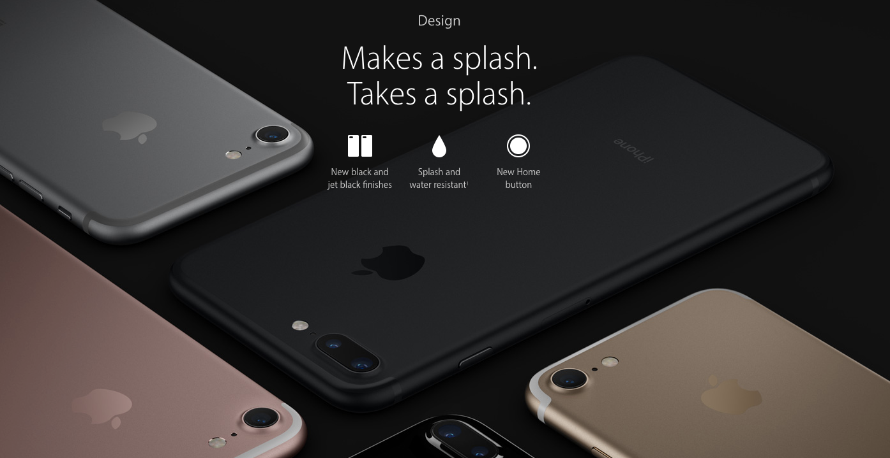
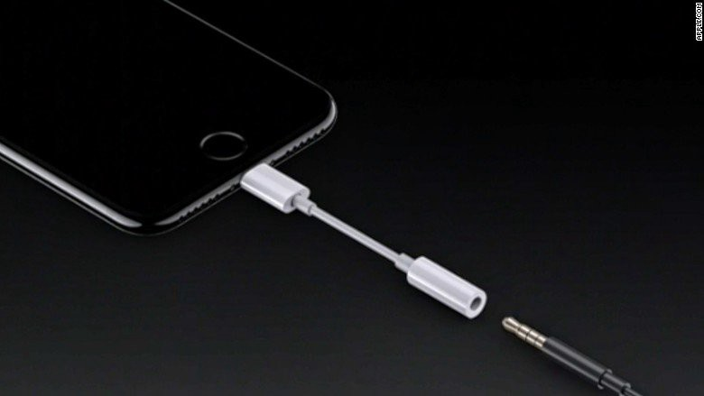
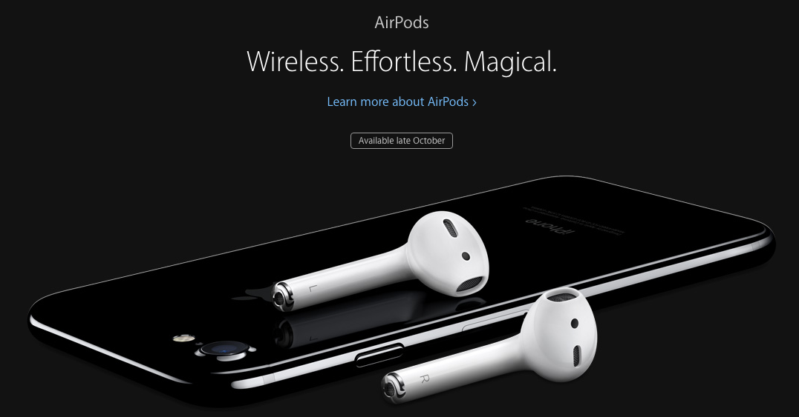
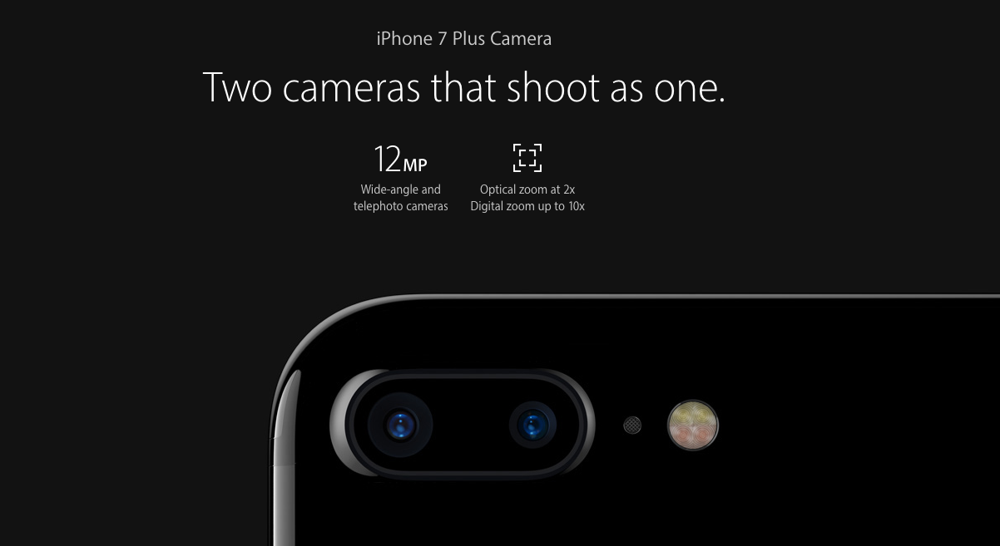
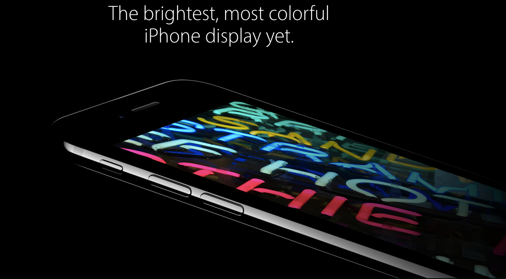

Apple just announced the new iPhone 7 this morning.

From a developer standpoint, it’s important to understand the feature set of the world’s most popular phone.

If you’re one of the 300,000 iOS developers out there — or thinking about getting this phone — here’s what we know so far:

-   It’s water resistant
-   It doesn’t have a headphone jack. That’s right. You’ll need an adapter to plug your headphones in. Here’s what this looks like:

-   It does have wireless headphones called AirPods.

-   These AirPods will not be included with the phone — you just get regular “lightning” ear buds. If you want the AirPods, you’ll have to spend $160. Then you’ll have to spend that again, once you inevitably misplace one.
-   It has two 12mp cameras that zoom up to 10x.

-   The processor — a a quad-core 64-bit A10 Fusion — is twice as fast as the iPhone 6’s.
-   It has speakers on both the top and bottom of the phone for stereo sound.
-   The battery lasts about 2 hours longer than that of the iPhone 6S.
-   The screen is 25% brighter than the iPhone 6's.

-   You can get the 32GB model for $649, the 128GB for $749, and the 256GB model for $849
-   It’s available for pre-order on September 9, and ships September 16

Apple’s official landing page for the iPhone 7 is [here](http://www.apple.com/iphone-7/).

In case you’re wondering, I recently made the leap from iOS to Android. I chose the inexpensive and ridiculously over-powered [One+ 3](https://www.amazon.com/gp/product/B01H3V07EW/ref=as_li_tl?ie=UTF8&camp=1789&creative=9325&creativeASIN=B01H3V07EW&linkCode=as2&tag=out0b4b-20&linkId=c0dc6b95a4227644e4332e7165dfcaba), so I’m not getting this new iPhone (though my wife might.) It does look pretty sweet.
