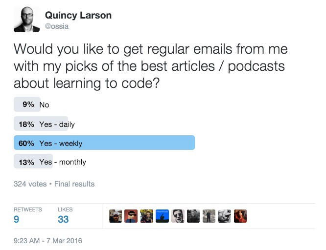

Like many of you, I’m a voracious consumer of media. I gorge myself. Technical books, blog posts, podcasts, documentaries — they’re all part of my apex predator information diet.

And like many of you, I’m too busy to make it to those barbecues, tech conferences, and week-long romps in the desert where people usually discuss all these ideas they’re exposed to.

Instead, these ideas mostly end up ricocheting around in my skull, occasionally pouring out when I’m live-stream coding, or pair-programming with someone on the other side of the globe.

But aside from soap-boxing whomever happens to be on the other side of a voice channel, how can I turn this surplus of insights into something useful for others?

I’m already working hard to spread knowledge of technology. Each month, our [open source community](http://www.freecodecamp.com) attracts more than 200,000 developers and developers-in-training. Aside from the laser-focused curriculum they work through together, our community generates an “expanded universe” of knowledge— here on our Medium publication, and on platforms like [Twitch.tv](http://twitch.tv/freecodecamp) and [Reddit](https://www.reddit.com/r/freecodecamp).

So why not leave it at that?

Well, as sophisticated as all these communication methods have gotten, there’s still one reliable tool that all of us use almost every day: email.

So I asked you (well, all 324 of you who happened to be on Twitter that day):

91% of you said you would like to get regular emails from me with my picks of the best articles and podcasts about learning to code.

So if it’s OK with you, I’m going to send you a brief plaintext email every Tuesday with some links. These links will take you to a few of the articles, videos, or podcasts that I think are worth your time.

If you don’t want them, you can one-click unsubscribe. It won’t hurt my feelings.

Or you can read them.

Or you simply ignore them, until one day you miraculously have enough time to read a few of them.

And if you feel so inclined, you can even reply to these emails. I do read and respond.

I’ll cross-post the links on [Reddit](https://www.reddit.com/r/freecodecamp), where we can discuss them as a community.

If you’ve [signed up with Free Code Camp](http://www.freecodecamp.com/signin) before, you’ll receive an email like this:

> _subject: AlphaGo a-go go_

> _This is the first edition of my new email aimed at expanding your understanding of programming and technology. Each week, I’ll send you three links that are worth your time._

> _You’re receiving this because you signed up for Free Code Camp at some point. If you don’t want this, you can one-click unsubscribe at the bottom of this email._

> _Here are this week’s three links that are worth your time:_

> _1\. Learn about the history of cryptography and its rocky relationships with national security:_ [_http://bit.ly/1pjvFNr_](http://bit.ly/1pjvFNr)

> _2\. DropBox moved petabytes of data off of Amazon’s cloud and into their own data centers. This article plumbs the cloud and the massive amounts of data involved:_ [_http://bit.ly/1LmC2tV_](http://bit.ly/1LmC2tV)

> _3\. Deep Learning’s warpath of destroying hard AI problems continues. Google’s AlphaGo has beaten the Go world champion in three out of four games, and the final game is Tuesday night. Here’s a segment where an engineer from AlphaGo’s team talks about how their AI approaches winning the game:_ [_http://bit.ly/1TIUT52_](http://bit.ly/1TIUT52)

> _Bonus: Inc Magazine published my “Why Talking to Machines is the Most Valuable Skill You Can Learn This Century”:_ [_http://bit.ly/22etFbp_](http://bit.ly/22etFbp)

> _Happy coding,_

> _\- Quincy Larson_

> _Teacher at_ [_http://www.FreeCodeCamp.com_](http://www.FreeCodeCamp.com)

I welcome any thoughts you might have about my new weekly email here in the comments section.

_If you liked this, click the💚 below. Follow me and Free Code Camp for more articles on technology._

