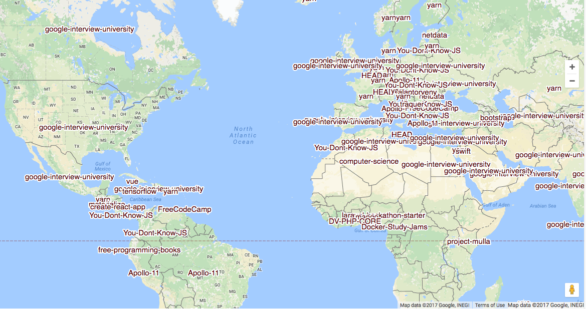

Here’s 2016’s most popular open source project on GitHub for each country:

And the second most popular project for each country:

Here are the top projects in each country, after removing the top 75 overall repositories:

These are based on a naive count of total GitHub stars earned in 2016. All of these images came from Google engineer Felipe Hoffa’s analysis, which you can read in full [here](https://medium.com/@hoffa/the-top-github-projects-per-country-92c275e19409).

Here are three other links worth your time:

1.  My giant JavaScript Basics course is now live on YouTube. And it’s 100% free ([5 minute read](http://bit.ly/2oRqCIp))
2.  How India saved its internet from greedy corporations ([5 minute read](http://bit.ly/2pm6jiE))
3.  Big Picture Machine Learning: Classifying Text with Neural Networks and TensorFlow ([12 minute read](http://bit.ly/2oqC2lt))

### Thought of the day:

> “A good programmer is someone who always looks both ways before crossing a one-way street.” — Doug Linder

### Funny of the day:

How to read an academic paper by [Academia Obscura](http://bit.ly/2nO0tGe)

### Study group of the day:

[freeCodeCamp Houston](http://bit.ly/2oNNY1L)

Happy coding!

– Quincy Larson, teacher at [freeCodeCamp](http://bit.ly/2j7Q1dN)

If you get value out of these emails, you should consider [supporting our nonprofit](http://bit.ly/donate-to-fcc) 😊
