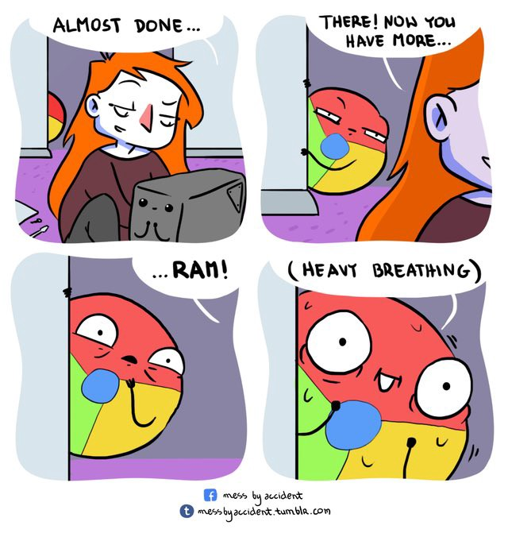

Today GitHub announced that the next version of their API will use a new technology developed by Facebook called GraphQL.

GraphQL may eventually come to replace the most common type of API today, the REST API.

In the documentation for [the new version of their API](https://fcc.im/2qOBK97), GitHub explained:

> “GitHub is moving to GraphQL for v4 of our API because it offers significantly more flexibility for our integrators. The ability to define precisely the data you want — and _only_ the data you want — is a powerful advantage over the REST API v3 endpoints.

> “GraphQL is a new way to think about building and querying APIs. Rather than construct several REST requests to fetch data that you’re interested in, you can often make _a single call_ to fetch the information you need.”

We’ve written a lot about GraphQL, and plan to create some GraphQL lessons in the near future.

In the meantime, if you want to learn more about GraphQL:

-   Read GitHub developer David Celis’s “Give it a REST: use GraphQL for your APIs” ([5 minute read](https://fcc.im/2rMtF22))
-   Read JavaScript extraordinaire Sacha Greif’s “So what’s this GraphQL thing I keep hearing about?” ([12 minute read](http://bit.ly/2pqamdH))

### Here are three links worth your time:

1.  How to go from hobbyist to professional developer ([14 minute read](https://fcc.im/2r03UPp))
2.  Between the Wires: An interview with data visualization scientist Irene Ros ([15 minute read](https://fcc.im/2q4pemM))
3.  Parsing math expressions with JavaScript ([11 minute read](https://fcc.im/2qaDIh4))

### Thought of the day:

> “The best thing about a boolean is even if you are wrong, you are only off by a bit.” — Anonymous

### Funny of the day:

[WebComic by Mess By Accident](https://fcc.im/2qISwpO)

### Study group of the day:

[freeCodeCamp Buenos Aires](http://bit.ly/2kKokrU)

Happy coding!

– Quincy Larson, teacher at [freeCodeCamp](http://bit.ly/2j7Q1dN)

If you get value out of these emails, please consider [supporting our nonprofit](http://bit.ly/donate-to-fcc).
