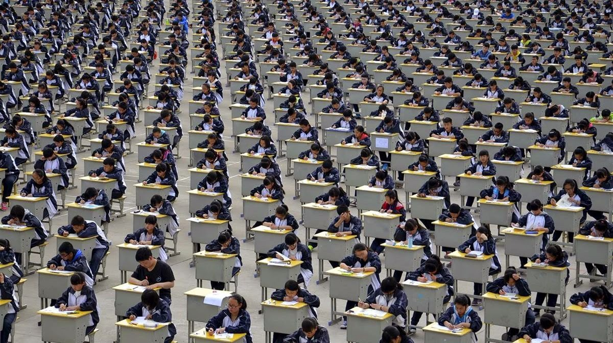

The fate of most Chinese people rests on their performance on a single test. Called the GaoKao (高考 — “high test”), These high school-aged kids 

This is competition. This is a zero-sum game where doing better on 

Just like half of the world’s food is wasted due to poor management, at least half of the world’s minds are wasted in clunky systems.

> “The future is already here. It’s just not evenly distributed.”

> — William Gibson
