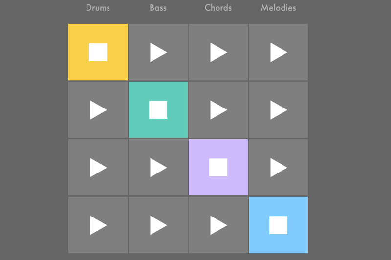
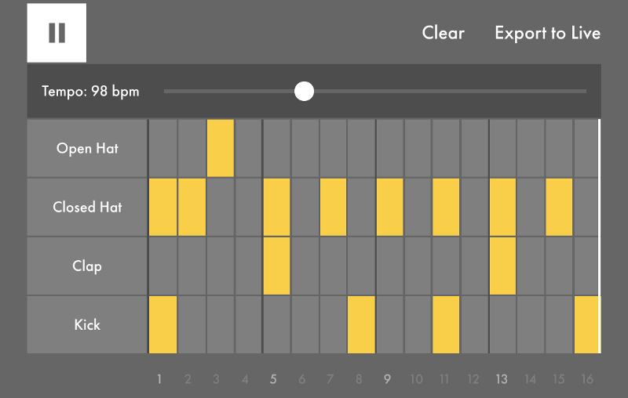
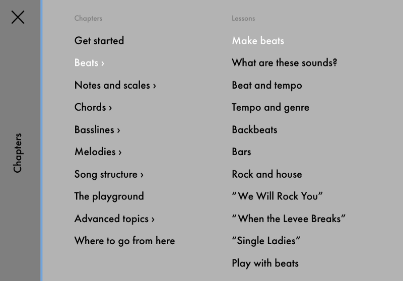
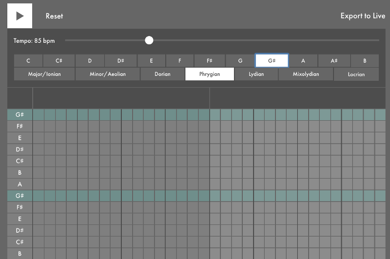

Ablesoft, A Berlin-based music software company, just released a free interactive music course that runs right in your browser.

One thing that immediately struck me about their web app was how well it was built. For example, if you change the tab, the music will fade out, then fade back in when you return. And if you start one sequencer, then scroll down and start another sequencer, it will automatically pause the first one.

It also has fun, easy to understand interfaces for programming music.

If you enjoy listening to music, but don’t know much about how it all works on a structural level, this course is for you.

It will teach you some of the principles at work in popular songs like Queen’s “We Will Rock You” and Björk’s “Army of Me”.

I particularly enjoyed the beat section. And it lightly touches on some advanced topics, too. 

If you’re already a musician, you can jump straight into their online playground and start composing loops.

