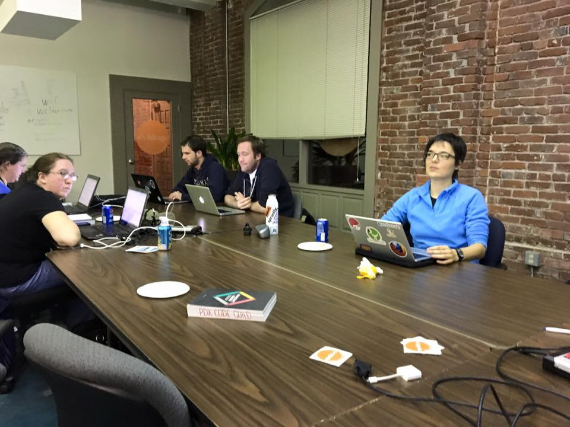

Here are three links worth your time:

1.  The open source cURL library just turned 19. It’s grown from a single developer to 1,500 contributors, 150,000 lines of code, and running on virtually every internet-connected device on Earth ([2 minute read](http://bit.ly/2ng6pr6))
2.  Nothing will change until you start building. ([5 minute read](http://bit.ly/2o35wpO))
3.  How Machines Make Sense of Big Data: an Introduction to Clustering Algorithms ([18 minute read](http://bit.ly/2odPyGE))

Bonus: Help us build a massive public dataset about people who are new to coding ([5 minute survey](http://bit.ly/2017-new-coder-survey))

### Thought of the day:

> “The user’s going to pick dancing pigs over security every time.” — Bruce Schneier

### Funny of the day:

Webcomic by [Pear Shaped Comics](http://bit.ly/2nJaQOk)

### Study group of the day:

[freeCodeCamp Portland](http://bit.ly/2odPTsU)

Happy coding!

– Quincy Larson, teacher at [freeCodeCamp](http://bit.ly/2j7Q1dN)

If you got value out of this email, consider [supporting our nonprofit](https://www.freecodecamp.com/donate/).
