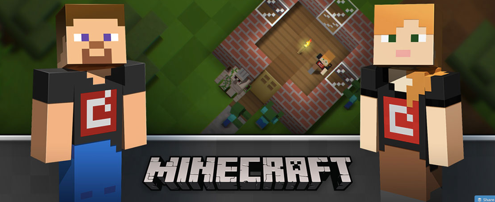

The Hour of Code started in 2013 with the goal of getting kids excited about programming and computer science.

This week-long event encourages teachers and parents to spend an hour coding with their kids.

It’s become a huge movement all over the world, with famous participants like Malala and even President Obama.

This year, the Hour of Code is from December 5–11.

How much can a kid learn about programming in a single hour? Not a whole lot. But the goal is to help them have fun and discover a desire within themselves to learn more.

To save you the trouble of piecing together your own kid-friendly curriculum, several organizations have designed special one-hour challenges. You and your kids can tackle one or more of these.

### Free Code Camp’s Front End Hour of Code Challenge

Our open source community is focused on helping adults learn to code so they can get developer jobs. But we also want to help kids get interested in coding at an early age. So we’ve also created a one-hour coding challenge.

Kids don’t need to create an account or do anything to prepare. They can just go to our [Hour of Code](http://freecodecamp.com/hour-of-code) page and get started.

These special coding challenges focus on front-end development with JavaScript. They’re [fully open source](https://github.com/FreeCodeCamp/hour-of-code).

Last week, two campers who had recently finished the first 1,200 hours of Free Code Camp’s curriculum met to design and code these challenges:

-   Cindy Hsu is a first-year computer science student at the University of British Columbia. Aside from coding a lot, she enjoys video games and often [live-streams on Twitch](https://www.twitch.tv/princekun).
-   Danny Libin is a pharmacist who has long been interested in technology, and recently [got more serious about programming](https://github.com/Daynil).

Here’s [a link to this challenge](http://www.freecodecamp.com/hour-of-code) to get started.

### Khan Academy’s Hour of Drawing with Code

You can use JavaScript to do all kinds of graphics in your browser.

This Hour of Code challenge will walk your kids through using shapes to build a snowman.

Here’s [a link to this challenge](https://www.khanacademy.org/computing/hour-of-code/hour-of-drawing-code/v/welcome-hour-of-code) to get started.

### Khan Academy’s Hour of SQL

This more advanced challenge gives kids a chance to learn how relational databases work.

It offers several conceptual videos, along with instructions for creating simple SQL queries.

Here’s [a link to this challenge](https://www.khanacademy.org/computing/hour-of-code/hour-of-sql/v/welcome-to-sql) to get started.

### The Minecraft Puzzle Hour of Code Challenge

This is a fun coding challenge that use the Scratch programming language — a language designed specifically for kids to learn basic programming concepts.

Here’s [a link to this challenge](https://studio.code.org/s/minecraft/stage/1/puzzle/1) to get started.

Remember: the Hour of Code is from December 5–11, but you can sit down and code with your kids any time you want. 😃

Happy coding!

---

Thanks for taking time out of your busy day to read my article. If you liked it, click the 💚 below so other people will see this here on Medium.

