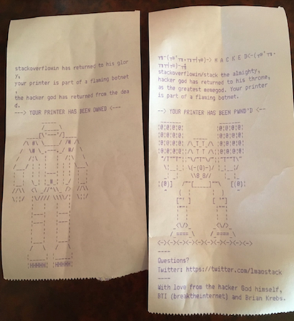
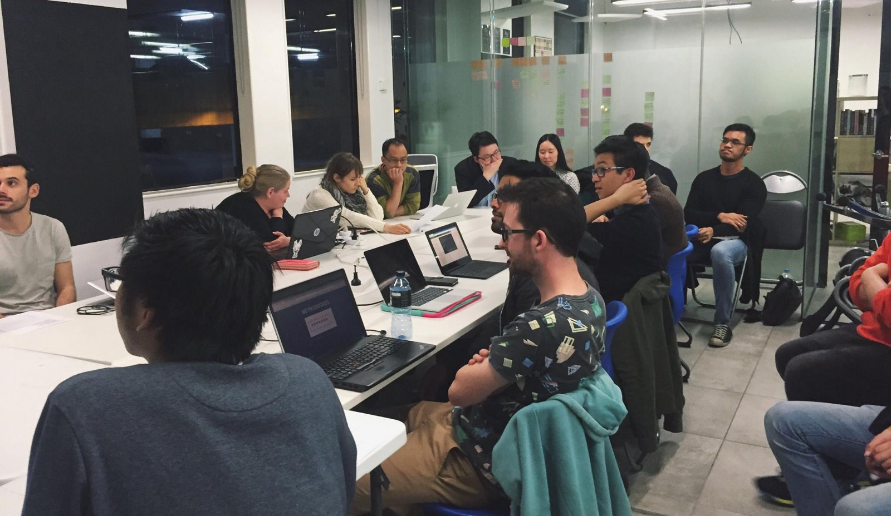

Here are three links worth your time:

1.  Those old jobs are gone forever. Let’s gear up for what’s next. ([7 minute read](http://bit.ly/2kHCY3x))
2.  A data scientist played 4,7000 game of Hearthstone, then built beautiful data visualizations of them. ([6 minute read](http://bit.ly/2kN6gNF))
3.  Mathematical genius is fragile. We need to stop destroying it. ([6 minute read](http://bit.ly/2liwfti))

Bonus: IMDb is shutting down its forums. Here’s how one developer designed them back in 2001. ([30 minute read](http://bit.ly/2jYWicW))

### Thought of the day:

> “I’ve finally learned what ‘upward compatible’ means. It means we get to keep all our old mistakes.” — Dennie van Tassel

### Image of the day:

A hacker [took over 150,000 printers](http://bit.ly/2kN1AHx) and started printing ASCII art with them.

### Study group of the day:

[freeCodeCamp Melbourne](http://bit.ly/2kC9Kk4)

Happy coding!

– Quincy Larson, teacher at [freeCodeCamp](http://bit.ly/2j7Q1dN)
