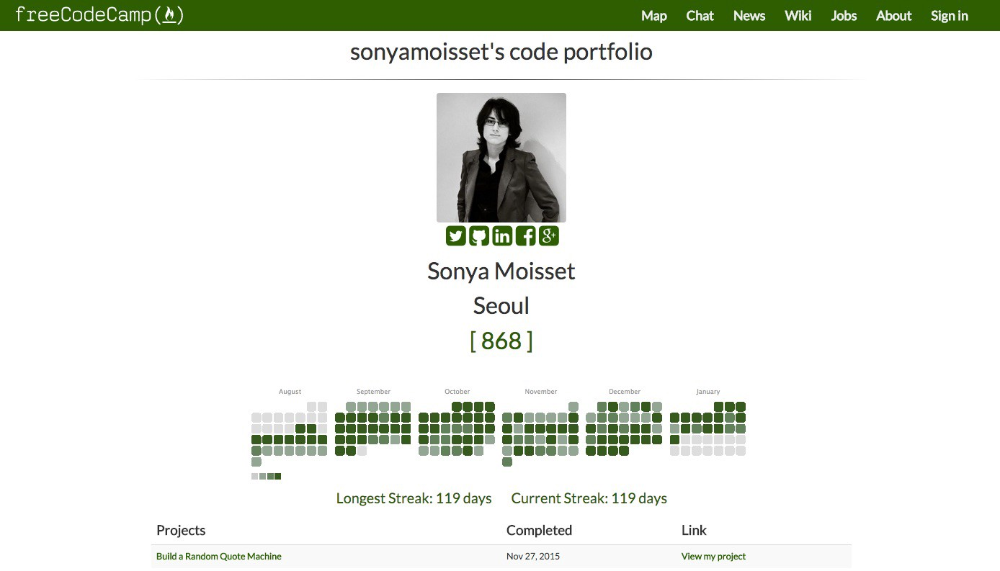
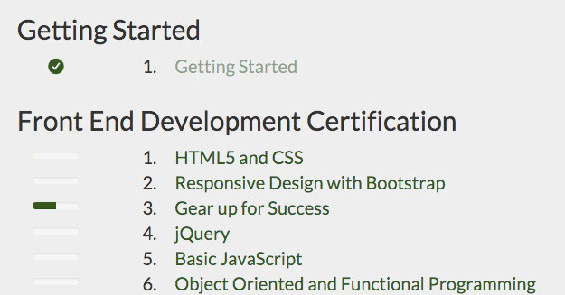
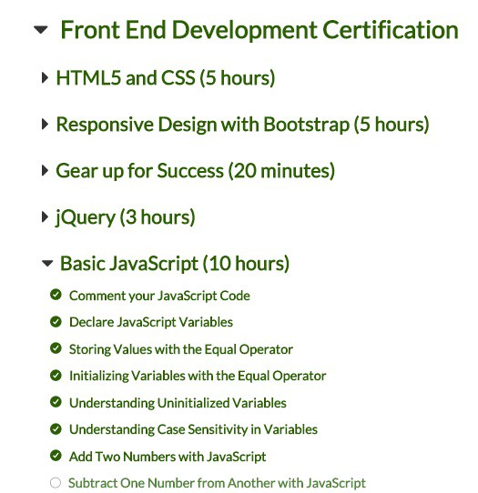
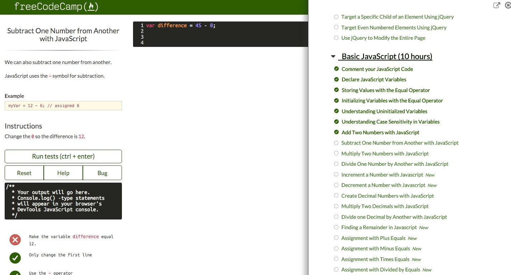
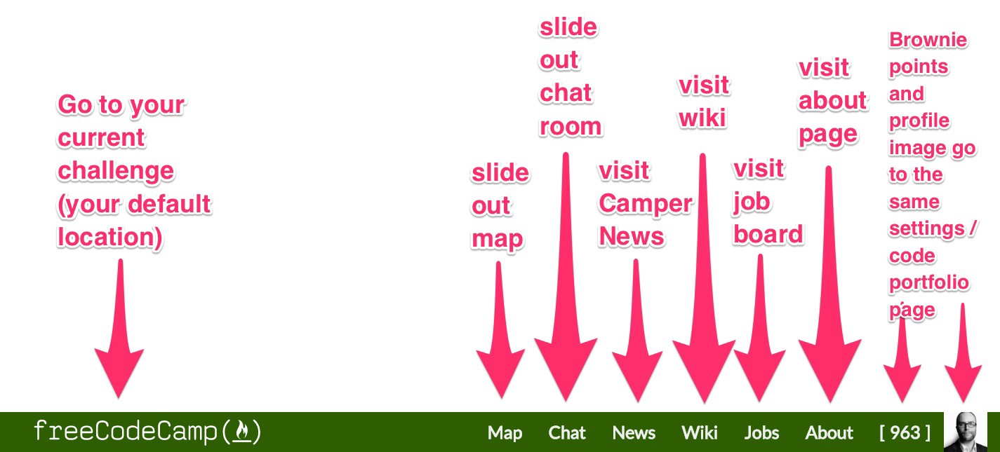
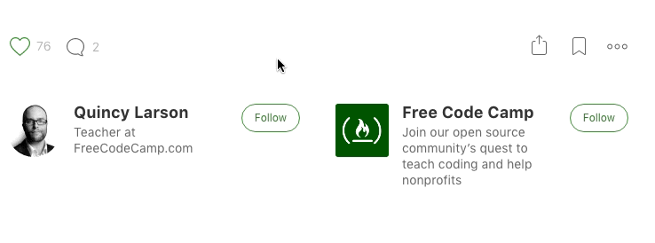

Free Code Camp has always aimed to be respectful of your time. Most recently we’ve done this by simplifying our open source community’s website to make things less confusing — especially for newcomers.

We understand that any time you change something, you run the risk of catching your regulars off-guard. So we spent a lot of time considering each of these changes and weighing their benefits against their costs.

#### Simplifying our Community’s Jargon

Our community has accumulated a variety of jargon to describe various types of coding challenges: Waypoints, Bonfires, Ziplines, Basejumps, Hikes. These jargon have grown on us as much as you, but there were several compelling reasons to drop them:

1.  These jargon don’t mean anything to developers outside of our community. Your new coworkers will understand that “Front End Development Project” you built much better than that “Zipline.”
2.  These jargon are confusing to newcomers, and especially non-native English speakers — who are now represent more than a fifth of our community — who don’t understand their camp-inspired etymology.
3.  These jargon don’t communicate much about our underlying coding challenges. “Algorithm challenges” are self-explanatory. “Bonfires” are not.

This said, there are a few terms we couldn’t bear to part with:

> **Camper**: a member of Free Code Camp’s open source community.

> **Campsite**: a group of campers located in the same city who get together to code.

> **Brownie points**: a camper’s score. You earn brownie points when you complete a challenges or help other campers in our chatrooms.

#### Simplifying our Challenge Map

Many of our help chat veterans asked that we stop numbering our challenges. Confused campers would ask for help on “number 45” — and it wasn’t clear which section that challenge was in.

Campers would often mistakenly say the number of brownie points they had. Others would even try to add up all the challenges from the sections they’d previously completed in order to “figure out” the number of the challenge they were on.

Our most helpful campers would have to start off each conversation trying to establish which challenge the camper even needed help with.

By removing these numbers, the only way you can refer to a challenge is by its name, which is unambiguous.

We also did away with progress bars on our challenge map because they were sending the wrong message: that one’s knowledge of a topic was somehow complete. In practice, there’s always more to learn, and our challenges will continue to expand accordingly.

#### Simplifying our User Interface

Free Code Camp’s goal has always been simple: to help you learn to code well enough to get a coding job. We wanted our web app to look equally simple.

Our old user interface was a jumble of Bootstrap panels and jumbotrons. These added hierarchy to our overall design, but at a cost of contrast and horizontal space.

We took inspiration from Quora and Digital Ocean — two well-designed web applications that manage to mask complexity behind clean, approachable user interfaces.

Everything you can do on Free Code Camp is now a click away.

#### Taking action on your Feedback

Feedback from our community — such as on our [subreddit](https://www.reddit.com/r/FreeCodeCamp) — has helped us make quick tweaks and fix some bugs in our new design.

One thing you all immediately pointed out was that using our new challenge map involved too much scrolling. Within less than a day, our contributors had a fix in production.

In the future, you’ll be able to give feedback on new features before we launch them by using [beta.freecodecamp.com](http://beta.freecodecamp.com).

#### The Path Forward

Learning to code is hard. The interface for learning to code should be easy.

We will continue to support power users, while keeping Free Code Camp simple for newcomers. We’ll do this by obscuring the complexity of these new features behind a simple user interface.

Be on the lookout for features like:

-   more hotkeys
-   APIs and webhooks integration options
-   more code portfolio data visualizations
-   offline mode
-   teacher mode
-   a collaborative CodePen-like sandbox editor
-   live pair programming on challenges
-   night mode

We invite you to [track these features on GitHub](https://github.com/FreeCodeCamp/freecodecamp/milestones), and even get in some open source contributions on them yourself.

_If you liked this, click the💚 below. Follow me and Free Code Camp for more articles on technology._

