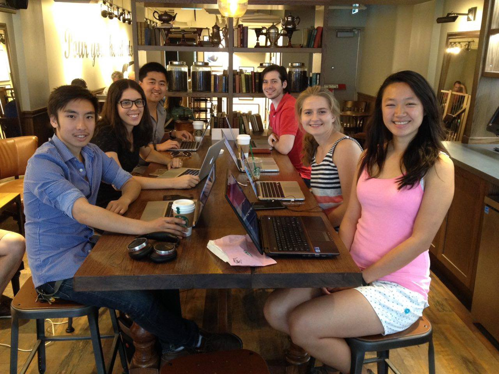
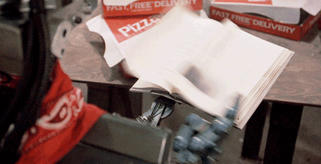
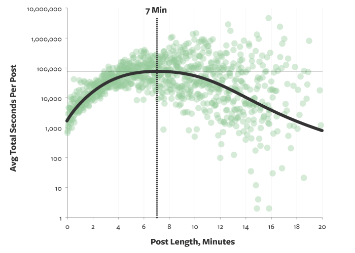
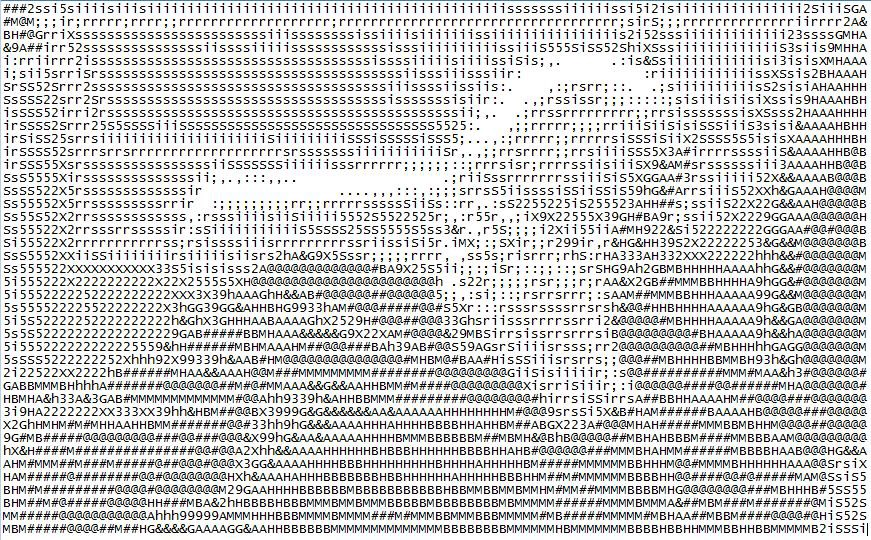

This weekend we launched our open source community’s [Medium publication](https://medium.freecodecamp.com/). More than 200 developers immediately signed up as writers. With a bit of elbow grease, they’ll be sharing their coding insights with thousands of their peers, and you can too.

We’ll publish as many of your high quality articles as we can.

Here are some tips for writing content that will resonate with other developers:

#### Read through articles that we’ve already published. Try to write about things that no one has covered yet.

#### [Seven minutes](https://medium.com/data-lab/the-optimal-post-is-7-minutes-74b9f41509b#.p8jwm4wpf) seems to be the optimal Medium post length. But don’t water-down your post to get there.

#### Good writing takes time. Keep rereading and reworking your post until you think it’s perfect. Always read it one last time before you publish.

#### Autobiographical posts are only interesting to other people if they offer useful, non-obvious takeaways. Try to teach your readers something.

#### When you write a technical article, your goal shouldn’t just be to look smart — it should be to inform and to be understood.

#### Avoid intimidating readers with a “wall of text”. Keep your paragraphs between 1–4 sentences, and break them up with headings and images.

#### Imagine that Lisa — the progressive, humanist, forever adolescent Simpsons character — will read everything you publish. Don’t publish anything that would make Lisa disappointed in you.

#### Share your Coding Insights

You most definitely should contribute to [Free Code Camp](http://www.freecodecamp.com)’s Medium publication. Here’s how to do so, in 3 easy steps (and one harder one):

1.  Create a Medium account.
2.  Add a headshot and bio.
3.  Send an email to [team@freecodecamp.com](mailto:team@freecodecamp.com) with your username, requesting to become a writer for our publication.
4.  Write awesome posts. Submit them to us. We’ll review them and potentially publish them.

We get a lot of submissions. If we don’t publish yours immediately, [message me in Gitter](https://gitter.im/quincylarson). I’ll give you the status of your submission and quick feedback.

Happy writing about coding!

_If you liked this, click the💚 below. Follow me and Free Code Camp for more articles on technology._

