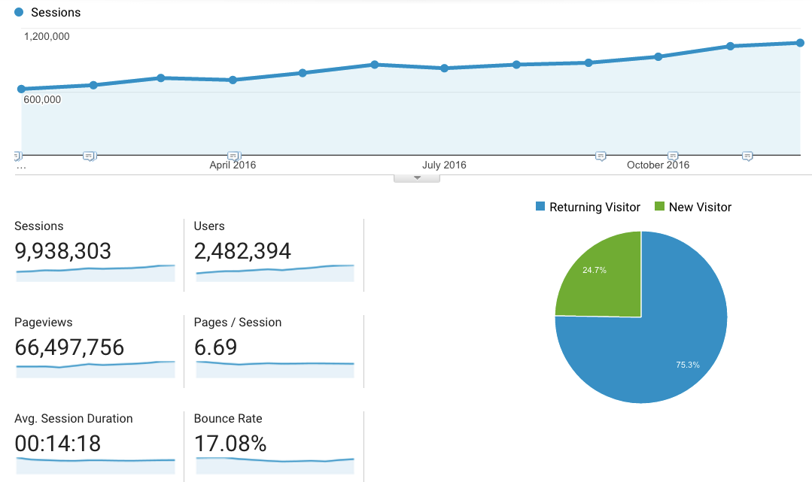
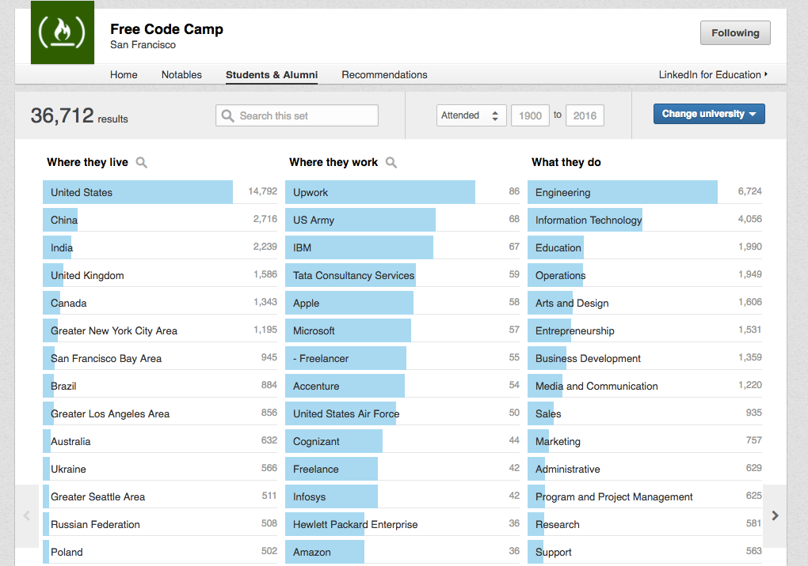

Our community has grown a lot over the past year.

Together, we completed millions of coding challenges, and created dozens of projects for nonprofits.

Thousands of us got developer jobs.

And more than 500 people have already committed to the [#100DaysOfCode challenge](https://medium.freecodecamp.com/start-2017-with-the-100daysofcode-improved-and-updated-18ce604b237b#.fr40is5ix) in 2017.

Join them, and join us tonight.

Starting at 11 pm EST, we’ll welcome guests like Stack Overflow creator Jeff Atwood to our interactive live stream.

Read about this event [here](https://medium.freecodecamp.com/announcing-open2017-the-online-new-years-eve-event-for-developers-cf7bf57e6ac9#.xct77aq4j), and view our full schedule [here](https://www.freecodecamp.com/open2017/).

Hope to see you there.

Here’s wishing you and your family a fun, prosperous 2017!
