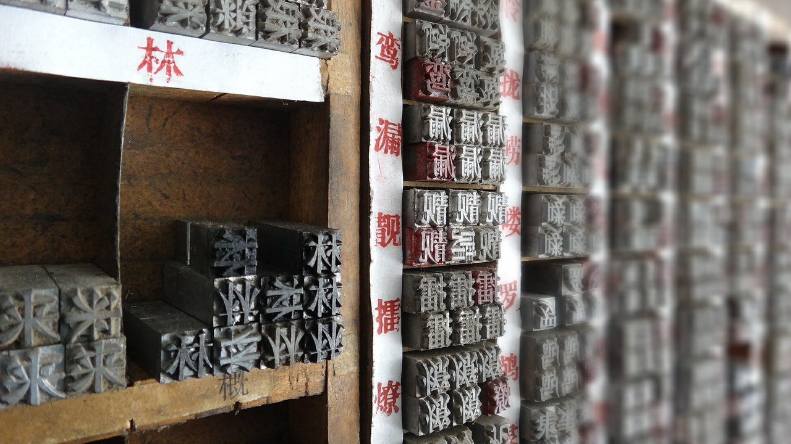
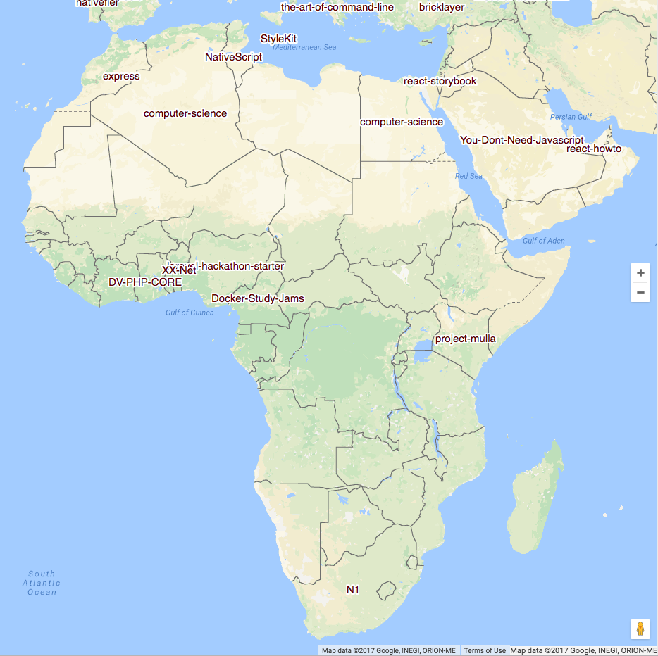
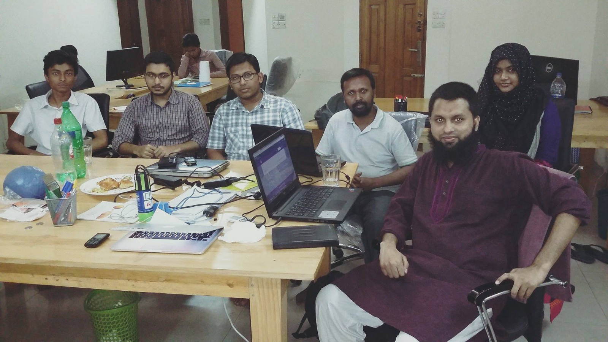

Here are three links worth your time:

1.  Typography can make your design… or it can break it ([7 minute read](http://bit.ly/2p1XVYU))
2.  So what’s this GraphQL thing I keep hearing about? ([12 minute read](http://bit.ly/2pqamdH))
3.  Whose movie ratings should you trust? IMDB, Rotten Tomatoes, Metacritic, or Fandango? A data scientist investigates ([12 minute read](http://bit.ly/2ovNhZI))

Bonus: Breaking Into Startups interviewed me about the origins of freeCodeCamp, and why everyone should learn to code if they want to fully participate in the 21st century economy ([56 minute listen](http://bit.ly/2omyw9z))

### Thought of the day:

> “Program. Or be programmed.” — [Douglas Rushkoff](http://amzn.to/2omKO1z)

### Image of the day:

In addition to [yesterday’s analysis](http://bit.ly/2ovFxa6), Google engineer Felipe Hoffa [wrote a follow-up article](http://bit.ly/2oUYpQO) with additional information about the most popular open source projects in Africa.

After controlling for the top 75 projects overall, here are the most popular open source projects in each African country that had at least 500 developers on GitHub:

### Study group of the day:

[freeCodeCamp Dhaka](http://bit.ly/2oUMFy2)

Happy coding!

– Quincy Larson, teacher at [freeCodeCamp](http://bit.ly/2j7Q1dN)

If you get value out of these emails, please consider [supporting our nonprofit](http://bit.ly/donate-to-fcc).
