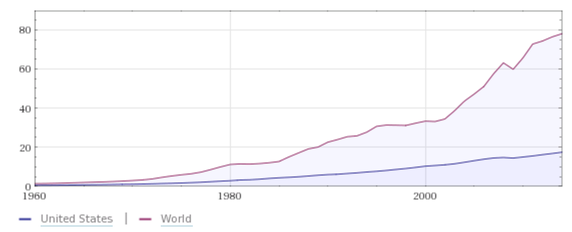

My parents raised me to be a southern gentleman — to address my elders as “sir” and “ma’am”, to hold the door for people, and to _never_ talk about politics or religion in polite company.

So when Trump started proposing isolationist anti-immigrant policies, I kept my opinions to myself. I responded the same way a majority of 138,000,000 Americans who voted did: by voting against him. 

And when Trump became president anyway, I assumed his anti-immigrant proposals were just rhetoric and that his economic advisors would point out how devastating they would be for our economy. And I assumed that even if he tried to go forward with these proposals, the legislative and judicial branches of our government would quickly move to stop him.

Well, he’s done it. 

  

  

  

  

The most costly mistake in history was America’s Chinese Exclusion Act of 1882, which ultimately lead to the closing of US borders.

Before we get to the numbers, let’s review some history:

Up until the mid 1800s, a vast majority of US immigrants were from Europe or Africa. Very few Easterners crossed the Pacific ocean to settle in the US.

That changed in the late 1840s, when Chinese learned of a gold rush near a tiny town called San Francisco.

The Taiping Rebellion — the bloodiest civil war in human history, all started by a guy who thought he was Jesus’s younger brother — had left more than 20 million people dead, and wrecked China’s economy. Many Chinese — who had little left to lose — boarded ships and set sail for the American West.

Over the next few years, around 150,000 Chinese immigrated to the US — mostly to California. America’s economy benefitted greatly:

-   Chinese prospectors mined around $2 billion worth of gold out of the ground. As a result, San Francisco grew from a settlement of 200 people to a boomtown of 36,000 people, complete with schools, hospitals, and other infrastructure to support the mining industry.
-   Once the easy-to-reach gold dried up, locals became hostile toward the immigrant miners whose taxes had built their cities. They imposed a steep foreign miner tax that made mining cost-prohibitive for the Chinese. So the Chinese took up work building major infrastructural projects, such as the first transcontinental railroad. It was dangerous, back-breaking work that most Americans weren’t willing to do themselves.
-   Chinese took their earnings and started small businesses. They became butchers, barbers, and tailors.

Despite everything the Chinese were doing for the local economy, resentment by European Americans grew. In 1882, California lobbyists traveled to Washington, D.C. to convince the federal government to take action against them.

In an unprecedented decision, Chester A. Arthur — the 21st President of the United States — signed the [Chinese Exclusion Act](https://en.wikipedia.org/wiki/Chinese_Exclusion_Act) into law. It immediately banned all new immigration from a China.

This was the first time America would ever turn people away at the border. And it all started with targeting a small, poor minority on the other side of the country.

This legislative success emboldened US nativists. They continued to push for laws that locked down America’s borders. First they targeted people who couldn’t pass a basic literacy test. Then they started targeting everyone. They pushed through a [quota system](https://en.wikipedia.org/wiki/Emergency_Quota_Act) in 1921, which heavily favored immigrants from western Europe. The US completed its transition to a close-bordered nation with its [Immigration Act of 1924](https://en.wikipedia.org/wiki/Immigration_Act_of_1924).

Citing the US example, Canada introduced similar immigration laws, and other rich countries followed suit.

By the time World War II started, almost no new immigrants were being allowed into the US. America turned away not only Asians, but also countless Europeans fleeing Nazism and Stalinism, including thousands of jews fleeing The Holocaust.

The US gradually increased its quotas, but at a rate well below world population growth.

How many people would like to move to America today? Every year, the US gives out 50,000 immigration permits through a [lottery system](https://en.wikipedia.org/wiki/Diversity_Immigrant_Visa). Less than 1% of the people who enter win one. And people from several countries — such as India and China — aren’t even allowed to enter this lottery.

We’ve talked about the role that large numbers of Chinese immigrants played in growing the US economy in the 19th century. Let’s talk about the contributions of individual US immigrant inventors.

Here are some things that would not have been invented in America — if at all — if the US government hadn’t happened to let their inventors in:

-   telephones
-   bicycles
-   hot dogs
-   basketball
-   Google
-   bluejeans
-   Siri
-   ATMs
-   rechargeable batteries
-   video game consoles
-   Positron Emissions Tomography (PET) scanners
-   remote controls
-   antidepressants
-   LASIK eye surgery
-   Youtube
-   automatic transmissions

These are just some of the many, many important inventions by people who immigrated to America after they were born.

These inventions have significantly impacted the US economy, and by extension, the global economy.

World Gross Domestic Product (GDP) is currently at about US $80 trillion annually. The US commands a large — but diminishing — proportion of that.

Economists estimate that [opening borders would double global GDP](http://pubs.aeaweb.org/doi/pdfplus/10.1257/jep.25.3.83). And the benefits would fall disproportionately on today’s economic winners — namely, the US.

Imagine a world where global GDP was $160 trillion, and more than half of that belonged to the US.

And that’s just if every country opened its borders today.

Let’s travel back to the end of World War II, when the US government completed the process it set in motion with the Chinese Exclusion Act, by completely closing its borders to virtually everyone.

What would have happened if instead, the US had just left their borders open, as it had done all throughout its history up to that point?

If the economists are right, and open borders would have indeed doubled GDP — and we compounded those gains for 70 years — global GDP would literally be hundreds of trillions of dollars.

Imagine a world where almost everyone overseas is middle class, and most Americans are millionaires.

That is the world that we could very well be living in today, if the US government had not decided to close its borders.

And if being rich wasn’t nice enough, there’d be a lot of side benefits, too:

-   The US probably wouldn’t have fought wars in Korea, Vietnam, Iraq, and Afghanistan. Instead of forcibly bringing democracy and capitalism to these countries, the locals who wanted that democracy and capitalism could have just moved to the US.
-   People wouldn’t tolerate dictatorships when they could just pack up and leave. If you’re a dictator, and all your key people start leaving, your regime will collapse in short order. This brain drain effect would have curbed dictators before they could sentence millions of people to death (see [the Gulags](https://en.wikipedia.org/wiki/Gulag)), or cause millions to die due to resource mismanagement (see the [Great Leap Forward](https://en.wikipedia.org/wiki/Great_Chinese_Famine)).
-   By present day, the US population would have expanded to more than 1 billion people. This may sound crowded, but the US has plenty of natural resources and empty space. Did you know that you can take all the buildings and roads in the country and fit them into a space the size of Ohio? We would have a lot more major cities, but we’d still have plenty of farm land to feed everyone. Even with several billion residents, the US wouldn’t come even close to the population density of places like Hong Kong.
-   Other countries would be forced to compete with America in terms of quality of life, and in doing so, would adopt and improve upon proven models like capitalism and democracy.

There you have it: **hundreds of trillions of dollars** in lost wealth, all because a few Californians got jealous of their hard-working Chinese neighbors.

That’s one hell of a mistake.

I’ll close with a poem written on the Statue of Liberty:

> _“Give me your tired, your poor,_

> _Your huddled masses yearning to breathe free,_

> _The wretched refuse of your teeming shore._

> _Send these, the homeless, tempest-tost to me,_

> _I lift my lamp beside the golden door!”_

>   

The US is a nation founded by immigrants. It is the wealthiest, most powerful country in the world. But it’s only a shadow of the nation it could have been if it had stood by its core value of welcoming people from foreign lands, and including them in the great American experiment.
