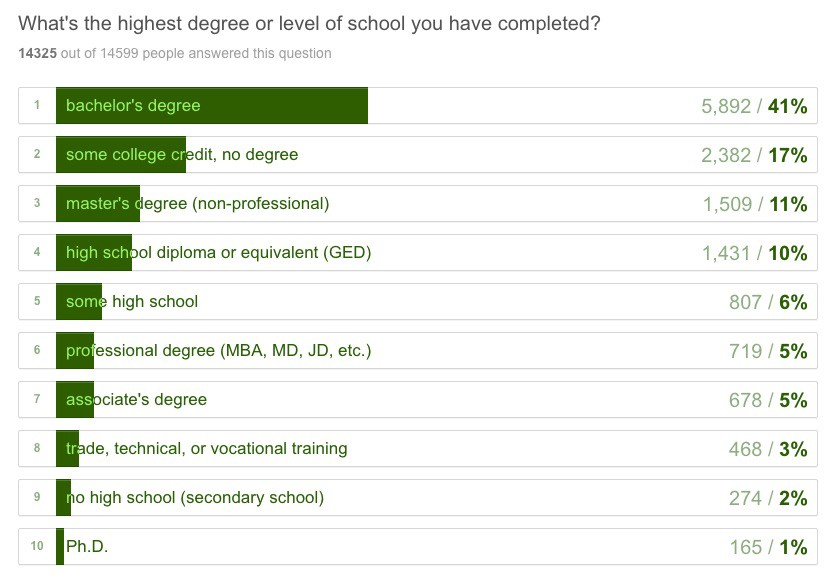

)](./asset-1.jpeg)

More than 15,000 people responded to the 2016 New Coder Survey, granting researchers an unprecedented glimpse into how adults are learning to code.

We’ve released the entire dataset of participants’ individual responses to all 48 questions — under the Open Data Common License — on a [public GitHub repository](https://github.com/FreeCodeCamp/2016-new-coder-survey).

In the coming weeks, we’ll publish a website filled with interactive visualizations of these data, answering dozens of questions like:

-   How does the population density of a city affect attendance of coding events?
-   How does desire to work remotely affect getting a first developer job?
-   How does prior military service affect salary at a first developer job, country-by-country?

In the meantime, here are a few high-level statistics from the 2016 New Coder Survey results to tide you over.

#### Who participated?

CodeNewbie and Free Code Camp [designed the survey](https://medium.freecodecamp.com/we-just-launched-the-biggest-ever-survey-of-people-learning-to-code-cac81dadf1ea#.chm9tyigi), and dozens of coding-related organizations publicized it to their members.

Of the **15,655** people who responded to the survey:

-   **21%** are women
-   their median age is **27** years old
-   they started programming an average of **11** months ago
-   **28%** have already landed their first developer job

### Learner goals and approaches

#### 40% want to either freelance or start their own business.

#### A vast majority are interested in working as web developers, as opposed to other developer roles.

#### Most of them are already applying for developer jobs, or will start applying within the next year.

#### Most of them want to work in an office, as opposed to remotely.

#### And a majority are willing to relocate.

#### Most of them have not yet attended any in-person coding events.

#### On average, they use at least three different resources for learning to code.

#### Only a quarter of them listen to coding-related podcasts.

### Coding Bootcamps

#### 954 respondents have attended one of more than 125 coding bootcamps.

#### Of those who’ve finished a bootcamp, more than half had been able to get a full-time developer job.

#### A third of them borrowed money to attend a bootcamp.

### Demographics and Socioeconomics

#### We had respondents from 169 countries.

#### Their cities span a wide range of urbanization levels.

#### A quarter of respondents are ethnic minorities in their country.

#### And nearly half are non-native English speakers. They grew up speaking one of 152 languages.

#### 58% have earned at least a bachelor’s degree.

#### They studied 430 different majors. Computer Science was the most popular major, and an additional 15% studied some form of engineering.

#### Two thirds are currently working.

#### Half are already in a technology-related field.

#### 8% have served in their country’s military.

#### 18% have children, and another 6% financially support an elderly or disabled relative. And a quarter of them are doing this without the help of a spouse.

#### 42% consider themselves under-employed (working a job that is below their education level).

#### If they have a home mortgage, they owe an average of $189k.

#### If they have student loans, they owe an average of $34k.

#### 12% don’t yet have high speed internet at home.

#### And 2% are currently receiving disability benefits from their government.

#### These are the people who are learning to code. You can see why free, self-paced learning resources are important.

---

### What’s next?

We’ve [cleaned and normalized](https://github.com/FreeCodeCamp/2016-new-coder-survey/tree/master/clean-data) all 15,655 records. Our community is using these to build data visualizations that answer a range of different questions.

If you have a question about people who are learning to code, [create a GitHub issue](https://github.com/FreeCodeCamp/2016-new-coder-survey/issues/new) and we’ll see if we can build an interactive visualization that answers it.

If you’re interested in analyzing these data and/or building some visualizations, [join our Data Science chat room](https://gitter.im/FreeCodeCamp/DataScience) and introduce yourself.

**I only write about programming and technology. If you** [**follow me on Twitter**](https://twitter.com/ossia) **I won’t waste your time. 👍**
