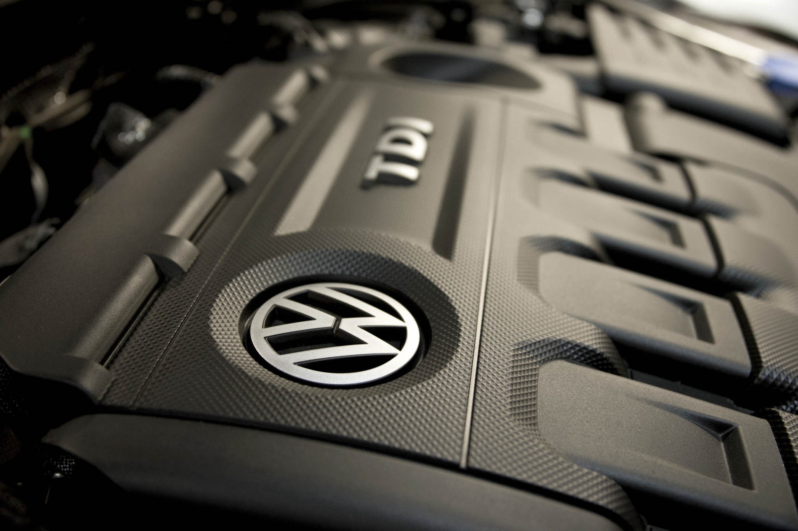

> “No ethically-trained software engineer would ever consent to write a DestroyBaghdad procedure. Basic professional ethics would instead require him to write a DestroyCity procedure, to which Baghdad could be given as a parameter.” — Nathaniel Borenstein

### Uber used software to illegally operate in hundreds of cities

Two hours ago, The New York Times broke the biggest story about Uber yet. Since 2013, Uber has used a sophisticated tool to undermine local law enforcement at every turn.

The program is called [Greyball](https://www.nytimes.com/2017/03/03/technology/uber-greyball-program-evade-authorities.html?_r=0) and it works like this:

1.  In cities where Uber is illegal — of which there are still many — Greyball can identify undercover police who are trying hail Uber drivers, bust their drivers, and impound their vehicles.
2.  When these police open up the Uber app and try to hail a ride, they see phantom Uber cars driving around the city, but they’re never actually able to get a ride.
3.  Since the cars that show up in the app aren’t real, and the police can’t get a driver to pick them up, they can’t bust anyone.

The end result is that Uber can basically ignore the fact that a city hasn’t yet approved ride sharing, and start operating there anyway.

Take a moment to let that sink in. Uber is — thanks to its superior software — essentially above the law.

The way they identify these riders is actually quite genius. Based on the credit cards the police use, Uber can cross-check merchant databases against public servant databases, and figure out who’s likely a cop, then “hell-ban” them from being able to use Uber.

The police officers are never able to successfully hail a ride, but as far as they know, they’re just stuck in the wrong place at the wrong time. That’s how Uber was able to perpetrate this scam for years, until a few Uber engineers with guilty consciences came forward to blow the whistle.

### Zenefits used software to fraudulently certify hundreds of insurance agents

Zenefits is a company that provides software to businesses, then tries to up-sell them on insurance packages.

In 2016, it was revealed that their CEO, Parker Conrad had developed a tool that helped Zenefits agents cheat their way through the licensing process.

With the help of their custom-built browser extension, Zenefits agents were able to skip most of a legally-required 52-hour online course.

Instead of having to pay new hires to spend a week and a half working through this course, they could start selling insurance much sooner.

Conrad resigned shortly after he was found out. The scandal cost the company half of its valuation — $2.5 billion — and resulted in hundreds of people losing their jobs.

### Volkswagen used software to sell 10,000,000 ultra-polluting cars

From 2008 to 2015, Volkswagen produced more than 10 million “clean diesel” cars. Many engineers were amazed that diesel engines could produce so much less emissions than standard unleaded cars, and still have such high mileage. Well, their doubts were vindicated in 2014, when researchers discovered that these cars were using “defeat devices.”

Executives at Volkswagen had ordered their software engineers to figure out a way to trick the Environmental Protection Agency during their emissions tests. They knew that during these tests, regulators would use specific parameters. So they wrote logic that — if those parameters were selected — the engine would run in a special mode.

This “defeat device” masked the fact that “clean diesel” Volkwagen engines were actually producing much greater nitrogen-oxide (NOx) emissions than were legally allowed. **Up to 40 times the federal limit.**

And this stuff causes lung cancer. [MIT scientists estimate](http://news.mit.edu/2015/volkswagen-emissions-cheat-cause-60-premature-deaths-1029) that these emissions will ultimately cause 60 people to die prematurely. And that’s just in America.

That’s right — the software these developers wrote kills innocent people.

Volkswagen ultimately paid out a $14.7 billion settlement in 2016.

This will remain one the greatest environmental tragedies of our time — all brought on by a few developers who were just following orders.

> “With great power comes great responsibility” — Uncle Ben

The world is increasingly dependent on the code that developers create. As such, developers are quickly becoming some of the most powerful people in the world.

Coding is a superpower. With it, you can bend reality to your will. You can make the world a better place. Or you can destroy it.

You may be able to fool the regulators, the police, the judges. You may be able to fool the general public. And you may be able to go on doing this indefinitely without being caught.

But that doesn’t make it right.

Developers have great power. And they must use this power responsibly.

If you’re a developer, or working toward becoming one, I strongly recommend you read [Bill Sourour](https://medium.com/@BillSourour)’s article “[The code I’m still ashamed of](https://medium.freecodecamp.com/the-code-im-still-ashamed-of-e4c021dff55e).”

And if someone asks you to build something that is clearly illegal — or downright evil — go to the press. The developers in all three of these cases could have done this and saved the world a lot of heart ache.

Remember: [only YOU can prevent evil code](https://twitter.com/intent/tweet?text=Remember:%20only%20YOU%20can%20prevent%20evil%20code.&url=https://medium.freecodecamp.com/dark-genius-how-programmers-at-uber-volkswagen-and-zenefits-helped-their-employers-break-the-law-b7a7939c6591).

**I only write about programming and technology. If you** [**follow me on Twitter**](https://twitter.com/ossia) **I won’t waste your time. 👍**
