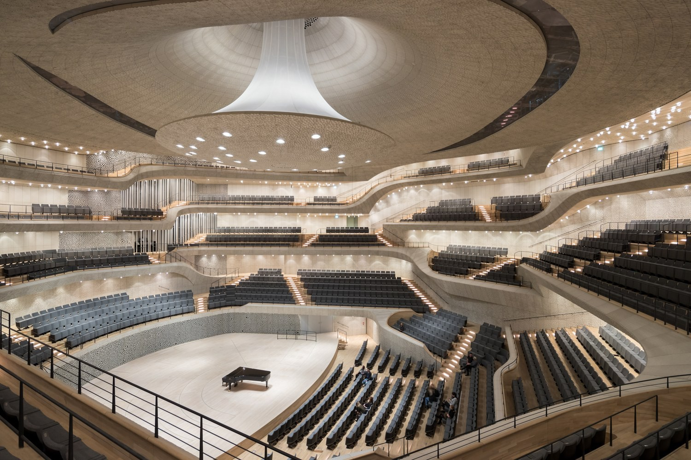

Here are three links worth your time:

1.  What happens when algorithms design a concert hall? ([3 minute read](http://bit.ly/2jIQ6F7))
2.  How to land a top-notch tech internship — and a tech job — while you’re still in school ([24 minute read](http://bit.ly/2kjTYZw))
3.  Styled Components are an new way to use CSS with React ([4 minute read](http://bit.ly/2jhYDhd))

Bonus: 2.1 million Americans are still paying 20 bucks a month for AOL’s 56kbps dial-up internet ([1 minute read](http://bit.ly/2k8RjTq))

### Thought of the day:

> “The question of whether computers can think is like the question of whether submarines can swim.” — Edsger W. Dijkstra

### Image of the day:

Samsung finished their investigation into exploding Galaxy Note7 phones, and released this diagram of how their batteries would catch fire:

Happy coding!

– Quincy Larson, teacher at [freeCodeCamp](http://bit.ly/2j7Q1dN)
