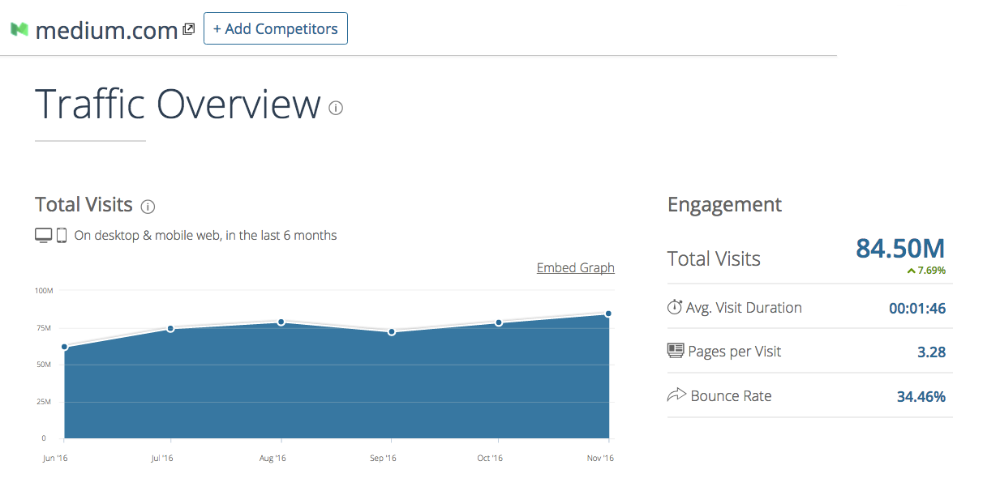
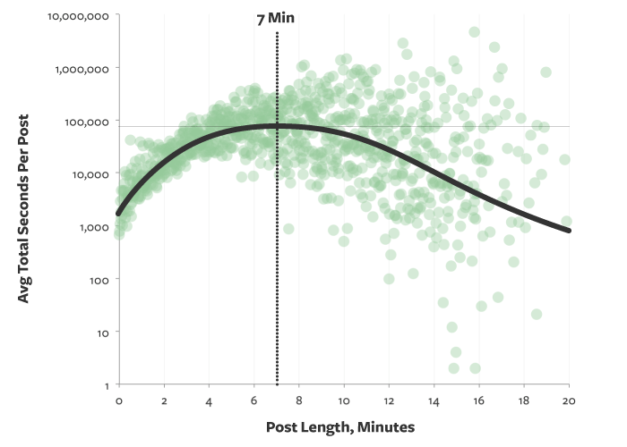

Medium may be struggling to find a sustainable business model, but they have years worth of funding left, and more readers than ever.



Medium isn’t going away any time soon. So instead, let’s focus on how you can write stories that readers will find helpful here in 2017.

I pulled down the top 252 stories of 2016 — all of which had at least 2,500 recommendations from Medium’s readers — and analyzed the dataset.

To put things in perspective, writers published 7,500,000 stories on Medium last year. So this dataset represents the most popular 0.00336% stories of 2016.

Together, these 252 stories racked up 1,033,961 recommendations. That’s a lot of green hearts.

Here are some things I learned from my time with this dataset that can help you reach a wider audience for your writing in 2017.

### Insight #1: You don’t have to be famous to do well on Medium

169 different writers published one of these top-252 stories. Some of those writers had multiple top stories.

Here are the people who wrote more than one top-252 story:

```
+----------------------+---------+---------------------+
|         Name         | Stories | Mostly writes about |
+----------------------+---------+---------------------+
| Benjamin Hardy       |      17 | Self Improvement    |
| Quincy Larson        |      16 | Technology          |
| Jon Westenberg       |      13 | Life                |
| Darius Foroux        |       7 | Life Lessons        |
| Julie Zhuo           |       4 | Design              |
| Sarah Cooper         |       4 | Satire              |
| Jonathan Z. White    |       3 | Design              |
| Bill Sourour         |       3 | Programming         |
| Jessica Semaan       |       3 | Life Lessons        |
| Jason Fried          |       3 | Business            |
| Thomas Oppong        |       3 | Life                |
| Larry Kim            |       3 | Productivity        |
| Gary Vaynerchuk      |       3 | Entrepreneurship    |
| Chris Dixon          |       3 | Technology          |
| Amanda Rosenberg     |       3 | Humor               |
| Andy Raskin          |       2 | Marketing           |
| Charles Scalfani     |       2 | Programming         |
| Chris Messina        |       2 | Design              |
| James Altucher       |       2 | Life                |
| John Fawkes          |       2 | Productivity        |
| John Saito           |       2 | Design              |
| Marc Cenedella       |       2 | Business            |
| Tobias Van Schneider |       2 | Design              |
+----------------------+---------+---------------------+
```

The only person on this list whom I’d heard of before reading their work here on Medium is Chris Dixon, a well-known tech blogger.

You may recognize some of these names if you’re in their field, but I doubt you’d recognize these people if you ran into them at the super market. They may be “internet famous” but they’re a far cry from household names.

If you can write consistently useful stories and gradually build a following, you can crack this list, too.

### Insight #2: Medium is a serious place

Here are the most common tags among these top 252 stories:

```
+------------------+-------------+------------+
|       Tag        |   Stories   | Percentage |
+------------------+-------------+------------+
| Startup          |          62 | 25%        |
| Tech             |          47 | 19%        |
| Life Lessons     |          45 | 18%        |
| Entrepreneurship |          37 | 15%        |
| Design           |          34 | 13%        |
| Self improvement |          31 | 12%        |
| Productivity     |          26 | 10%        |
| Politics         |          21 | 8%         |
| Programming      |          18 | 7%         |
| UX               |          18 | 7%         |
| JavaScript       |          10 | 4%         |
| Web Development  |          10 | 4%         |
+------------------+-------------+------------+
```

The following topics — which are the basis of most popular magazines — occurred zero times:

-   sports
-   fitness
-   cars
-   weddings
-   gaming
-   homes
-   food
-   celebrities
-   finance

“Humor” occurred 9 times, and “satire” 5 times. But that’s about it.

It seems that most people read Medium to:

-   get motivated
-   learn more about their field

Judging by this dataset, the stereotype of Medium’s readership as developer-designer-hustlers isn’t all that far from the truth.

### Insight #3: You should definitely try to get your story into a publication

```
+----------------------+---------+-----+----------------+
|      Publication     | Stories |  %  |     Topic      |
+----------------------+---------+-----+----------------+
| Not in a publication |      67 | 26% | n/a            |
| The Mission          |      52 | 21% | Productivity   |
| Free Code Camp       |      30 | 12% | Technology     |
| Signal VS Noise      |       7 | 3%  | Startups       |
| Hi My name is Jon    |       4 | 2%  | Jon Westenberg |
| Slackjaw             |       4 | 2%  | Humor          |
| Startup Grind        |       4 | 2%  | Startups       |
| Year of Looking Glass|       4 | 2%  | Julie Zhuo     |
| The Startup          |       4 | 2%  | Startups       |
| Be Yourself          |       3 | 1%  | Life           |
| Art of Practicality  |       3 | 1%  | Productivity   |
| Conquer Corp America |       3 | 1%  | Productivity   |
| Personal Growth      |       2 | 1%  | Productivity   |
| The Coffeelicious    |       2 | 1%  | Startups       |
| Development Set      |       2 | 1%  | Education      |
| UX Design            |       2 | 1%  | UX             |
+----------------------+---------+-----+----------------+
```

A vast majority of the top 252 stories were published in one of Medium’s publications.

If you think about this for a moment, it makes perfect sense. These stories showed up not only in the news feeds of the readers who followed their authors, but also readers who followed the publication.

And some of these publications have [a lot of followers](http://toppub.xyz/).

### Insight #4: Personal stories do better

Here’s a lexical analysis of the most common words in the titles of the top 252 stories. I’ve filtered out stop words like “the” and “of.”

```
+-------+-----------------+
| Count |      word       |
+-------+-----------------+
|    42 |  you            |
|    39 |  i              |
|    30 |  how            |
|    24 |  your           |
|    16 |  about          |
|    15 |  my             |
|    14 |  people         |
|    14 |  life           |
|    12 |  why            |
|    11 |  design         |
|    10 |  me             |
|     9 |  trump          |
|     9 |  read           |
|     9 |  learn          |
|     8 |  time           |
|     7 |  new            |
|     7 |  letter         |
|     6 |  yourself       |
|     6 |  live           |
|     6 |  job            |
|     6 |  better         |
|     5 |  year           |
|     5 |  white          |
|     5 |  silicon valley |
|     5 |  stop           |
|     5 |  never          |
|     5 |  most           |
|     5 |  f***           |
|     5 |  free           |
|     5 |  apps           |
|     4 |  world          |
|     4 |  work           |
|     4 |  websites       |
|     4 |  web            |
|     4 |  successful     |
|     4 |  smarter        |
|     4 |  open           |
|     4 |  javascript     |
|     4 |  hard           |
|     4 |  guide          |
|     4 |  f******        |
|     4 |  code           |
|     3 |  wish           |
|     3 |  technology     |
|     3 |  startup        |
|     3 |  secret         |
|     3 |  quit           |
|     3 |  productivity   |
|     3 |  programming    |
|     3 |  powerful       |
|     3 |  medium         |
|     3 |  love           |
|     3 |  future         |
|     3 |  development    |
|     3 |  developer      |
|     3 |  designer       |
|     3 |  career         |
|     3 |  business       |
+-------+-----------------+
```

The words “you” and “I” were by far the most common, which suggests that addressing the reader directly as an individual person is a better writing strategy than writing in third person.

The most common words that fell outside of the 100 [most common English language words](https://en.wikipedia.org/wiki/Most_common_words_in_English) were “life” and “design.”

Speaking of English, all but three of the top 252 stories were written in English.

### Insight #5: You don’t need to cuss to get people’s attention

Many people complain about the abundance of profanity in Medium headlines.

While it’s certainly present, the “F” word and its variants only occurred 13 times in top-252 headlines, and the “S” word only occurred 3 times.

### Insight #6: “Listacles” still exist, but they don’t dominate Medium

Only 23 of the top 252 stories were explicitly “listacles” — bullet-point-driven stories.

These stories have headlines that follow the pattern of “\[number\] things you should do before you \[time\].”

Full disclosure: one of these listacles is my story about [Linux turning 25](https://medium.freecodecamp.com/linux-is-25-yay-lets-celebrate-with-25-rad-facts-about-linux-c8d8ac30076d#.tzo9h78jr).

But overall, I’d say the decline of listacles is a good thing.

My personal advice to writers is to focus on stories that dive deep into a single topic.

### Insight #7: 7 minutes is still an ideal story length



The top 252 stories averaged 6.7 minutes in length — the same length that Medium’s data science team determined was optimal [back in 2014](https://medium.com/data-lab/the-optimal-post-is-7-minutes-74b9f41509b#.gjnp22pis).

### Insight #8: Include images.

Only 16 of the top stories didn’t have any images.

The median number of images a story included was 3.

Don’t worry about over-doing it with images, either. 11% of stories used 10 or more images, and two of them used more than 50 images.

### Insight #9: It definitely helps to have a lot of followers

The median number of followers these authors had as of year’s end was 6,809.

Even if you don’t yet have a lot of followers, there’s still hope of cracking 2017’s top stories. 29 of the authors had less than 2,000 followers, which you can reach in a matter of months if you manage to write a few popular stories.

The best way to get people to follow you is to remind them to follow you.

If someone reads all the way to the bottom of your article, it’s fair (and well within Medium’s terms of service) to remind them to follow you.

### Insight #10: Don’t disable responses.

Only 6 of the top stories had disabled responses.

Imagine someone’s reading your story and thinks of something insightful to add. They scroll to the bottom of your story only to discover that they can’t share their thoughts because you’ve disabled responses.

Are they going to recommend your story? I sure wouldn’t.

Don’t hinder the discourse around your story. Allow your readers to respond to you.

### Now let’s get back to writing

A huge thanks to [Levent Aşkan](https://medium.com/@leventask), who put in the time compiling these top 252 Medium stories. You can read his story about them [here](https://medium.com/startup-grind/mediums-most-recommended-stories-of-2016-171efdd705c5#.jlfo409vs).

Also, thanks to [Kande Bonfim](https://medium.com/@kandebonfim) for further expanding upon Levent’s dataset.

And if you’re interested in getting more readers in 2016, check out my [tips for writing stories on Medium that people will read](https://medium.freecodecamp.com/how-to-write-medium-stories-people-will-actually-read-92e58a27c8d8#.n4ps93qhe).

[**How to write Medium stories people will actually read**  
_More than 30 million people use Medium each month. They come here in search of something worth reading. Something…_medium.freecodecamp.com](https://medium.freecodecamp.com/how-to-write-medium-stories-people-will-actually-read-92e58a27c8d8 "https://medium.freecodecamp.com/how-to-write-medium-stories-people-will-actually-read-92e58a27c8d8")[](https://medium.freecodecamp.com/how-to-write-medium-stories-people-will-actually-read-92e58a27c8d8)

And my unofficial [style guide for Medium](https://medium.freecodecamp.com/a-style-guide-for-writing-on-medium-fcbad27492ea#.hxj5qm1vw):

[**A style guide for writing on Medium**  
_After spending more than 1,000 hours writing and editing stories for our Medium publication, I’ve decided to create…_medium.freecodecamp.com](https://medium.freecodecamp.com/a-style-guide-for-writing-on-medium-fcbad27492ea "https://medium.freecodecamp.com/a-style-guide-for-writing-on-medium-fcbad27492ea")[](https://medium.freecodecamp.com/a-style-guide-for-writing-on-medium-fcbad27492ea)

Cheers, and happy writing!

**I only write about programming and technology. If you** [**follow me on Twitter**](https://twitter.com/ossia) **I won’t waste your time. 👍**
