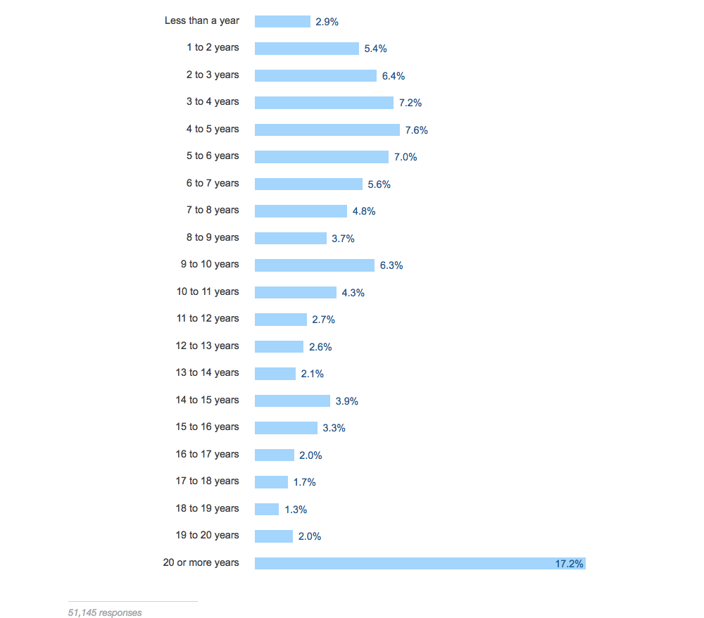
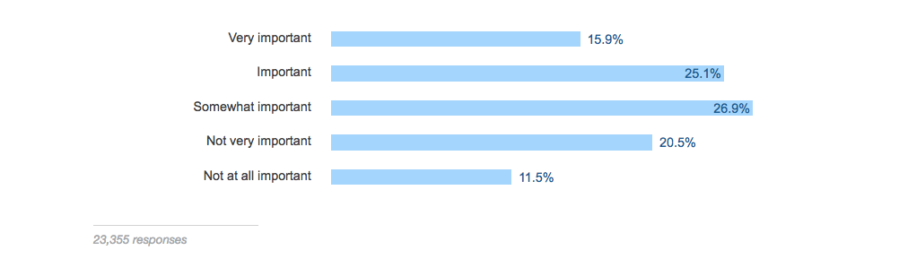

Today Stack Overflow released the results of their 2017 survey of more than 64,000 developers.

[Just like in 2016](https://medium.freecodecamp.com/2-out-of-3-developers-are-self-taught-and-other-insights-from-stack-overflow-s-2016-survey-of-50-8cf0ee5d4c21#.lkodanohw), I’ve combed through these results and summarized them for you.

Here’s a lightning-fast snapshot of what the software development profession looks like in 2017.

#### A vast majority of developers consider themselves “web developers.”

#### Most web developers consider themselves “full stack developers.”

#### JavaScript is by far the most popular tool programmers use today.

#### Developers work in a wide variety of industries — most of them outside of what we traditionally call “tech.”

#### Most of them work at companies with fewer than 500 employees.

#### But less than 1 in 5 of them work at a startup.

#### Most of them work as full-time employees.

#### Two-thirds of them got their current job through someone they already knew, or were approached by a recruiter.

#### Regardless of their specialization, developers make good money.

#### And if they happen to be in America, they make even more money.

#### This said, most of them feel underpaid for the caliber of work they do.

#### Two out of three developers work from home at least a few days a month.

#### And they prefer to listen to music while they work.

#### 30% of all developers have been coding for less than 5 years.

#### Most developers went to college, but nearly a quarter of working developers never finished a 4-year degree.

#### 80% of college-educated developers studied some kind of technology-related major.

#### Despite this, less than half of developers consider their formal education to be “important” or “very important” to their jobs.

#### Even though software development is dominated by men, it’s becoming more diverse. Just [one year ago](https://medium.freecodecamp.com/2-out-of-3-developers-are-self-taught-and-other-insights-from-stack-overflow-s-2016-survey-of-50-8cf0ee5d4c21#.lkodanohw), 93% of respondents were male. This time, only 89% were.

#### 1 in 100 developers are blind, and 1 in 200 developers are deaf.

freeCodeCamp contributor [Florian Beijers](https://medium.com/@zersiax) was born blind. You can read how he’s able to [program using a standard-issue laptop](https://medium.freecodecamp.com/looking-back-to-what-started-it-all-731ef5424aec#.1amcxxdrq).

Thanks for reading. If you have time, you can read through the [full survey results](https://stackoverflow.com/insights/survey/2017) and share your insights in the comments section below.

**I only write about programming and technology. If you** [**follow me on Twitter**](https://twitter.com/ossia) **I won’t waste your time. 👍**
