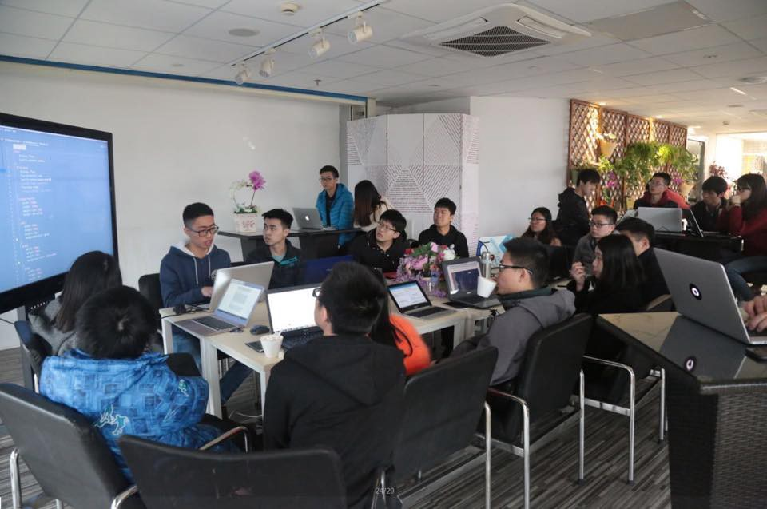

Here are three links worth your time:

1.  What it’s like to build and market a chatbot when you’re only 14 years old ([12 minute read](http://bit.ly/2mpO0eQ))
2.  Amazon S3 is down. It’s affecting freeCodeCamp, Medium, Quora, Imgur, and a ton of other websites ([1 minute read](http://tcrn.ch/2ll4gsy))
3.  Lessons learned from leading women in tech organizations ([7 minute read](http://bit.ly/2l8EJra))

### Thought of the day:

> “If you reveal your secrets to the wind, you should not blame the wind for revealing them to the trees.” — Kahlil Gibran

### Funny of the day:

### Study group of the day:

[freeCodeCamp Guangzhou](http://bit.ly/2mkYFrc)

Happy coding!

– Quincy Larson, teacher at [freeCodeCamp](http://bit.ly/2j7Q1dN)
