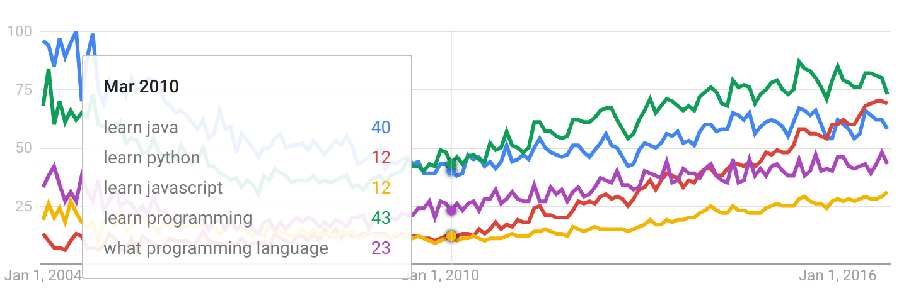
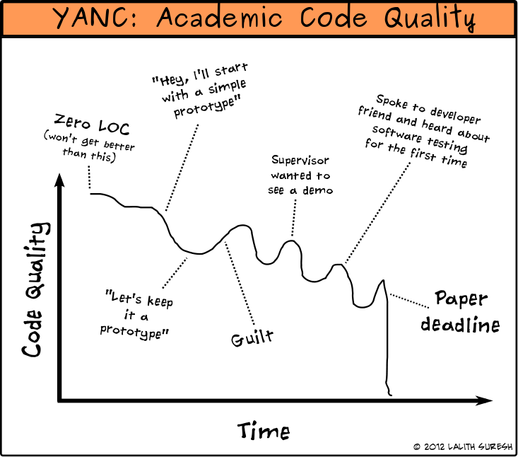
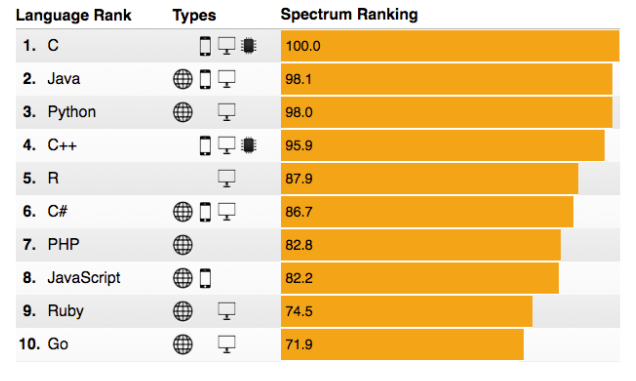

Most people’s journey toward learning to program starts with a single late-night Google search.

Usually it’s something like “Learn \_\_\_\_\_\_”

But how do they decide which language to search for?

> “They always joke about Java on Silicon Valley. I guess I should learn that.”

Or:

> “Haskell. So hot right now. Haskell.”

Or:

> “That Go gopher is just so gosh-darn cute.”


And then there’s the rest of us. We’ll probably search for something like:

> “Which programming language should I learn first?”

Few questions are so commonly asked that they get the full infographic treatment. But this is one of them:

](./asset-3.png)

Deciding on your first programming language can be a fun process — kind of like one of those “Which Quentin Tarantino character are you?” personality quizzes.

But before you run off to learn Ruby because you enjoyed playing with Play-Doh as a kid, let me remind you: the stakes are pretty high here.

It will take you hundreds of hours of practice to become even remotely competent with your first programming language.

So you should consider the following factors:

-   the job market for the language
-   the long term prospects for the language
-   how easy the language is to learn
-   what projects you can build while you’re learning (and share with friends so you can stay motivated)

Every year brings new programming languages, and with them, new academic papers. And new web comics.

Seriously. Check out this gem from last month:


When it comes to choosing a first programming language, there’s no shortage of options. To narrow it down a bit, here are the most common Google searches related to learning programming, over the past 12 years:



Java has had its ups and downs.

Python has gradually risen to become the most popular choice.

But tucked away below these is the Little Engine That Could, slowly choo-choo’ing up in popularity over the past few years. And that engine is JavaScript.

Before I talk about these programming languages, let me clarify:

-   I’m not arguing that any one language is objectively better than any other
-   I agree that developers should eventually learn more than one language
-   I’m arguing that first they should learn one language well. And — as you can probably guess from the upside down text in my headline — that language should be JavaScript.

Let’s kick things off by exploring how programming is currently taught in school.

### Computer Science 101



Universities have traditionally taught programming under the umbrella of computer science, which itself is often seen as an extension of mathematics, or tie-in to an electrical engineering degree.

Of course, as you may have heard by now:

> “Computer science education cannot make anybody an expert programmer any more than studying brushes and pigment can make somebody an expert painter.” — Eric S. Raymond

As of 2016, many universities still treat programming like it’s computer science, and computer science like it’s math.

As a result, many introductory programming courses focus on low-level-of-abstraction languages like C, or mathematically-focused languages like MATLAB.

And department chairs generally stay the course, pointing to annual programming language leaderboards like the [TIOBE Index](http://www.tiobe.com/tiobe-index/), or this one from the [IEEE](http://spectrum.ieee.org/computing/software/the-2016-top-programming-languages):



Most of these leaderboards look virtually identical to how they were 10 years ago.

But change does happen. Even in academia.

In 2014, Python [overtook Java](http://cacm.acm.org/blogs/blog-cacm/176450-python-is-now-the-most-popular-introductory-teaching-language-at-top-u-s-universities/fulltext) as a the most popular language of instruction at top US Computer Science programs.


And yet another change is bound to… eventually… happen.

Because if you look at the languages actually used by the workforce, it paints a very different picture:


More than half of all developers use JavaScript. It’s vital to front-end web development and increasingly relevant for back-end development. And it’s rapidly expanding into areas like game development and the Internet of Things.

Job postings also mention JavaScript more than any programming language other than Java:

](./asset-10.png)

It’s no accident that we built our [open source community](https://www.freecodecamp.com)’s curriculum around JavaScript. Over the past two years, more than 5,000 people have used Free Code Camp to get their first developer job.

I’m not advocating JavaScript because I teach it. I teach JavaScript because it’s the surest path to a first developer job.

But is JavaScript right for you? Is it worthy of being your first programming language? Let’s explore those factors I mentioned earlier.

### Factor #1: The job market

If you’re learning to program purely out of intellectual curiosity, feel free to skip this factor. But if you — like the [vast majority of people learning to program](https://medium.freecodecamp.com/we-asked-15-000-people-who-they-are-and-how-theyre-learning-to-code-4104e29b2781#.30hlfqj32) — want to use this skill to get a job, this is an important consideration.

As I mentioned earlier, Java is mentioned in more job postings than any other programming language. JavaScript is a close second.

But here’s the thing about JavaScript: even though it’s been around for 20 years, it only recently became a serious tool that companies like Netflix, Walmart, and PayPal would build entire applications around.

As a result, plenty of companies are hiring JavaScript developers, but there just aren’t that many on the job market.

](./asset-11.png)

There are 2.7 Java developers competing for every open Java position. Competition for PHP and iOS jobs is similarly fierce.

But for every open JavaScript position, there are only 0.6 JavaScript developers. It is very much a sellers’ market for developers with JavaScript skills.

### Factor #2: The long term prospects

The average JavaScript project receives twice as many pull requests as the average Java, Python, or Ruby project. And on top of this, JavaScript is growing faster than any other popular language.

](./asset-12.png)

JavaScript’s ecosystem also benefits from a heavy investment of money and engineering talent from companies like Google, Microsoft, Facebook, and Netflix.

For example, TypeScript (a statically-typed superset of JavaScript) has more than 100 open source contributors, many of whom are Microsoft and Google employees being paid to work on it.

This type of inter-company cooperation is harder to find with Java. Oracle — who effectively owns Java through its acquisition of Sun Microsystems — [often sues](https://medium.freecodecamp.com/why-todays-victory-over-oracle-matters-so-much-to-developers-4e24b4a368b5#.pk8efc9um) companies who try to expand upon it.

### Factor #3: Difficulty to learn

.](./asset-13.png)

Most programmers would agree that high-level scripting languages are relatively easy to learn. JavaScript falls into this category, along with Python and Ruby.

Even though universities still teach languages like Java and C++ as first languages, they’re considerably harder to learn.

### Factor #4: Projects you can build with it

This is where JavaScript really shines. JavaScript runs on any device that has a browser, right there in the browser. You can build basically anything with JavaScript, and share it anywhere.

Because of JavaScript’s ubiquity, Stack Overflow co-founder Jeff Atwood coined his now-famous law:

> “Any application that _can_ be written in JavaScript, _will_ eventually be written in JavaScript.”

And [with each passing month](https://www.reddit.com/r/atwoodslaw/), Atwood’s Law holds strong.

Java once promised to run everywhere, too. You may remember [Java Applets](http://motherboard.vice.com/read/a-brief-history-of-the-java-applet). Oracle officially killed them off earlier this year.

Python suffers from much the same problems:

> “How can I give this game I made to my friend? Even better, is there a way can I put this on my phone so I can show it to kids at school without them having to install it? Um.” — James Hague in [Retiring Python as a Teaching Language](http://prog21.dadgum.com/203.html)

By contrast, here are some apps that members of our open source community built in their browsers on CodePen. You can click through and use these right in your browser:

](./asset-14.png)](./asset-15.png)](./asset-16.png)](./asset-17.png)

### Learn one language well. Then learn a second one.

If you keep jumping from language to language, [you won’t get far](https://medium.freecodecamp.com/a-cautionary-tale-of-learning-to-code-my-own-eddb24d9d5a7).

In order to move beyond the basics, you need to learn your first language well. Then your second language will be much, much easier.

From there, you can branch out, and become a more well-rounded developer by learning lots of languages:

-   C is a great way to learn how computers actually work in terms of memory management, and is useful in high-performance computing
-   C++ is great for game development.
-   Python is awesome for science and statistics.
-   Java is important if you want to work at large tech companies.

**But learn JavaScript first.**

---

OK, now I’m going to attempt the impossible — I’m going to try and anticipate objections from the comments section.

### Objection #1: But isn’t JavaScript slow?

JavaScript is — for most practical purposes — as fast as high-performance languages.

JavaScript (Node.js) is orders of magnitude faster than Python, Ruby, and PHP.

It is also nearly as fast as high-performance languages like C++, Java, and Go.

Here are the results of the most comprehensive recent cross-language benchmark:


### Objection #2: But JavaScript isn’t statically typed

Like Python and Ruby, JavaScript is dynamically typed, which is convenient. But you can get into trouble. Here I intend for `exampleArray` to be an array. I set its values, then check its length — meaning the number of elements it contains.

```
exampleArray = [1, 2]
-> [1, 2]
exampleArray.length
-> 2
```

But then I accidentally assign it to be a string.

```
exampleArray = “text”
-> “text”
exampleArray.length
-> 4
```

These kinds of errors happen all the time in dynamically typed languages. Most developers just put checks in place to prevent them, and write tests accordingly.

If you absolutely must have static typing in your first programming language, then I still recommend you learn JavaScript first. Then you can quickly pick up TypeScript.

> “Typescript has a learning curve, but if you already know JavaScript, it will be a smooth one.” — [Alex Ewerlöf on TypeScript](https://medium.freecodecamp.com/when-should-i-use-typescript-311cb5fe801b#.j920zs7g2)

### Objection #3: But I really want to make a mobile app

I still recommend learning JavaScript first.

1.  JavaScript features several tools for making native mobile apps, such as [Angular Cordova](http://ngcordova.com/) and [React Native](https://facebook.github.io/react-native/).
2.  In order for your mobile app to actually do anything interesting, it will probably need a proper back end, which you’ll want to build with a proper web development framework, like Node.js + Express.js.

Also, it’s worth pointing out that the mobile app development’s best days may very well be behind it.

For starters, as much as people use mobile apps, nearly half of all developer jobs are web development. Compare this with a mere 8% of jobs that involve mobile app development.

 survey.](./asset-19.jpeg)

The grand vision of “there’s an app for that” has not come to pass. Instead, most smartphone owners have [stopped downloading new apps](http://www.recode.net/2016/9/16/12933780/average-app-downloads-per-month-comscore).

Sure — they still use apps. Mostly Facebook, Google Maps, and handful of others. As such, much of the demand for mobile app developers is concentrated in a few large employers.

The outlook for those mobile development jobs is hard to forecast. Many aspects of developing, maintaining, and distributing mobile apps are easier with JavaScript. So companies like Facebook and Google are investing heavily in better tools for building these using JavaScript.

As of 2016, pretty much all development is web development. Everything touches that big platform that is “the web.” And the next wave of devices that you’ll talk to around your home, and cars that pick your kids up from school — they’ll all be piped together using the web, too.

And that means JavaScript.

### Objection #4: Isn’t JavaScript a toy language that was written in 10 days?


JavaScript has a [quirky history](https://www.w3.org/community/webed/wiki/A_Short_History_of_JavaScript).

You will undoubtedly hear people crack jokes at its expense.


Well people love to hate on C++, too. And like JavaScript, C++ has succeeded despite this hate, and now it’s pretty much everywhere as well.

So if anybody ever gives you a hard time for learning JavaScript instead of elite-language-of-the-week, just remember the famous words of the guy who created C++:

> “There are only two kinds of programming languages: those people always bitch about and those nobody uses.” — Bjarne Stroustrup

**I only write about programming and technology. If you** [**follow me on Twitter**](https://twitter.com/ossia) **I won’t waste your time. 👍**

<Embed src="https://www.youtube.com/embed/VqiEhZYmvKk?feature=oembed" aspectRatio={undefined} caption="[Preethi Kasireddy](https://medium.com/@preethikasireddy) answers the question: which programming language should I learn first?" />
