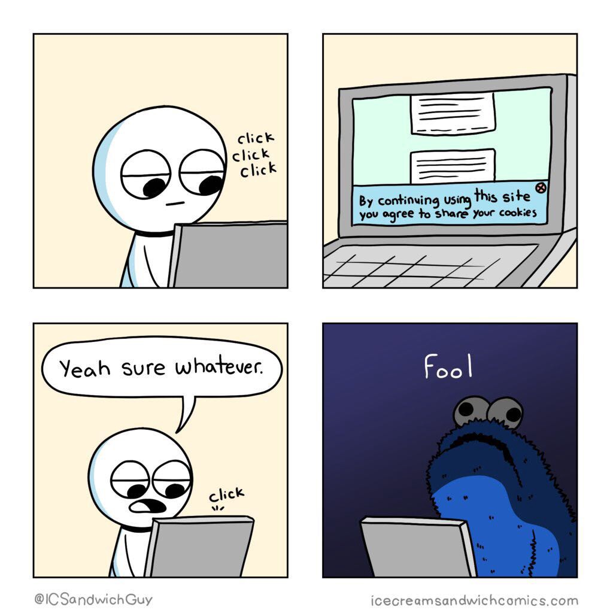
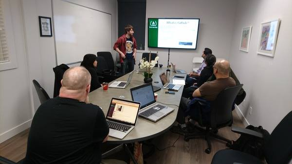

Here are three links worth your time:

1.  Why American farmers are hacking their tractors with Ukrainian firmware ([5 minute read](http://bit.ly/2nnz4xJ))
2.  How I got a second degree and earned 5 developer certifications in just one year, while working and raising two kids ([8 minute read](http://bit.ly/2mUB5hO))
3.  How my side project satisfied my curiosity — and made me $3,000 ([4 minute read](http://bit.ly/2o5cpTL))

Bonus: I live-interviewed Colm Tuite, a self-taught designer and developer from Ireland whose startup was recently acquired ([32 minute watch](http://bit.ly/2nSgjjI))

### Thought of the day:

> “In a relatively short time we’ve taken a system built to resist destruction by nuclear weapons and made it vulnerable to toasters.” — Jeff Jarmoc

### Funny of the day:

Webcomic by [icecreamsandwichcomics.com](http://icecreamsandwichcomics.com/)

### Study group of the day:

[freeCodeCamp Surrey, British Colombia](http://bit.ly/2nCmsD4)

**Show people how much you’re learning, and help our nonprofit community grow. Forward this to friends and family interested in technology.**

Happy coding!

– Quincy Larson, teacher at [freeCodeCamp](http://bit.ly/2j7Q1dN)
