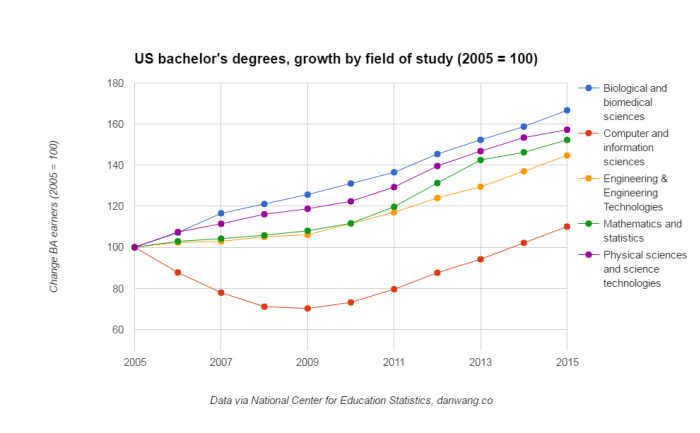

Hong Kong-based technology writer Dan Wang wrote [a blog post](https://fcc.im/2r84yZQ) exploring why so few people get degrees in computer science. And yes — it’s far fewer people than those who study other science and engineering fields.

Here are the most common explanations for this phenomenon, and why he finds them to be insufficient:

1.  **Computer science is hard.** But it isn’t necessarily harder than other science and engineering fields, many of which are surging in popularity.
2.  **You don’t need a CS degree to be a developer**. But it certainly helps you get your foot in the door at big tech companies — more so than other majors.
3.  **People aren’t so market-driven when they’re considering majors**. But there’s evidence that people increasingly go into fields that are growing, like healthcare. So this also doesn’t fully explain why more people aren’t majoring in CS.

He goes on to explore a total of 11 possible contributing factors. But no single one of these factors fully explains why so few people study computer science, even when there are so many high-paying, high-prestige developer jobs out there.

Anyway, if you’re currently in university, or planning to start soon, I [strongly recommend majoring in computer science](https://fcc.im/2qwDx3z).

Programming really is where most of the new jobs are, and [this trend will accelerate as more and more work is done by machines](https://fcc.im/2siS938).

**I only write about programming and technology. If you** [**follow me on Twitter**](https://twitter.com/ossia) **I won’t waste your time. 👍**
