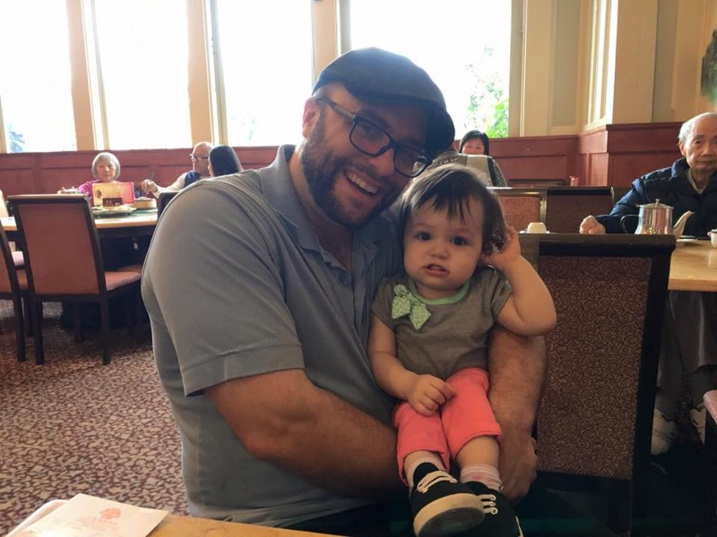
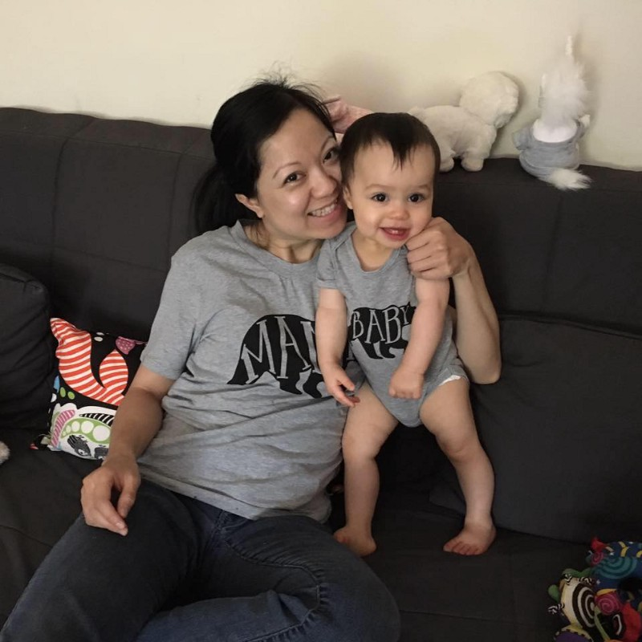

  

After 4 years of living in the bay area, my wife and I decided we’d had enough. We’d been living in an 800 square-foot apartment in a 100 year old building. We both worked from home while our 16-month old baby — Jocelyn “The Destroyer” Chen-Larson — ran around destroying things.

Every day was exactly the same. We’d wake up, work, and I’d take her for 10k run through the city since she could only nap when she was in motion.

  

  

  

  

  

 house looks like.](./asset-4.jpeg)

  

You might be thinking “all your issues seem to come down to economics. ” Well, you’re right.

In order to have the quality of life I want, I’d need at least $2 million for a house. And I suspect the my 2,200 square-foot house in Oklahoma City — with its large back yard — would cost significantly more than that if it were San Francisco.

I’d also need a house for my parents. Right now, they’re a 10 minute ride away from me. So that would be a second house, and for my brothers whom I get to hang out with several times a week. 

If my net worth were $10 million, I might be able to pull this off. But reaching that level of affluence can require decades of hard work dedicated specifically to making money. While I’m reasonably successful at running an open source nonprofit, there’s no guarantee that I could port those skills toward running, say, a successful for-profit enterprise software company. 

Soon, only multi-millionaire business leaders — and not even most of their employees — will be able to live in San Francisco.

Sure — if you are a bachelor, you can just get a room mate, use public transportation, and pour most of your waking life into your 6-figure job.

  

  

  

certainly argue this all comes down to economics. If I were to sideline and accept a highly-compensated developer job, I could

  

My wife can quit her job and focus on being a mom for a few years.

  

  

  

I’ll miss being able to go out and run in a t-shirt and shorts any month of the year.

  

Frankly, there’s something much more important than all that. 

I still plan to go to San Francisco as necessary. And when I do it won’t be as convenient as it used to. I’ll have to catch an early flight and stack up my face-to-face meetings, and maybe crash at a friend’s place. 

  

By the way, if you’re worried about the future of freeCodeCamp, don’t be. We’re doing fine.

  

  

Since I’ve moved back, I’ve gotten my fair share of “oh — why did you leave” and “Oklahoma City? Where’s that?”
