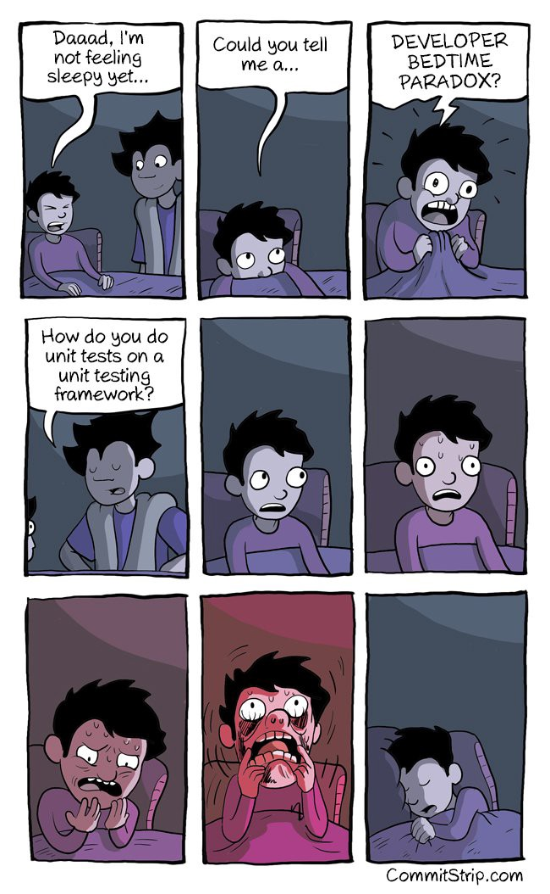

Here are three links worth your time:

1.  Why I told my friends to stop using WhatsApp and Telegram ([5 minute read](http://bit.ly/2iG5fTA))
2.  The creator of Unreal Engine describes his vision of world-changing VR that’s just 12 years away ([20 minute read](http://glix.ly/2igjIVb))
3.  Why some autonomous cars are going to avoid the internet ([2 minute read](http://bit.ly/2j1mujt))

Bonus: here’s a short introduction to React, which involves building things right on CodePen ([24 minute watch](http://bit.ly/2jvstMu))

### Thought of the day:

> “It would be really tragic if we let the future metaverse, that binds all humanity together into shared online environments, were a closed platform controlled by a giant corporation. As always, they’d use it to spam you with advertising, they’d use it to gather information about your private life and sell it to the highest bidder, and they’d act as the universal intermediary between all users, content creators, and transactions, ensuring that everything has to be approved by them.” — [Tim Sweeny](http://20%20minute%20read), creator of the Unreal Engine

### Funny of the day:

Happy coding!

– Quincy Larson, teacher at [freeCodeCamp](http://bit.ly/2j7Q1dN)
