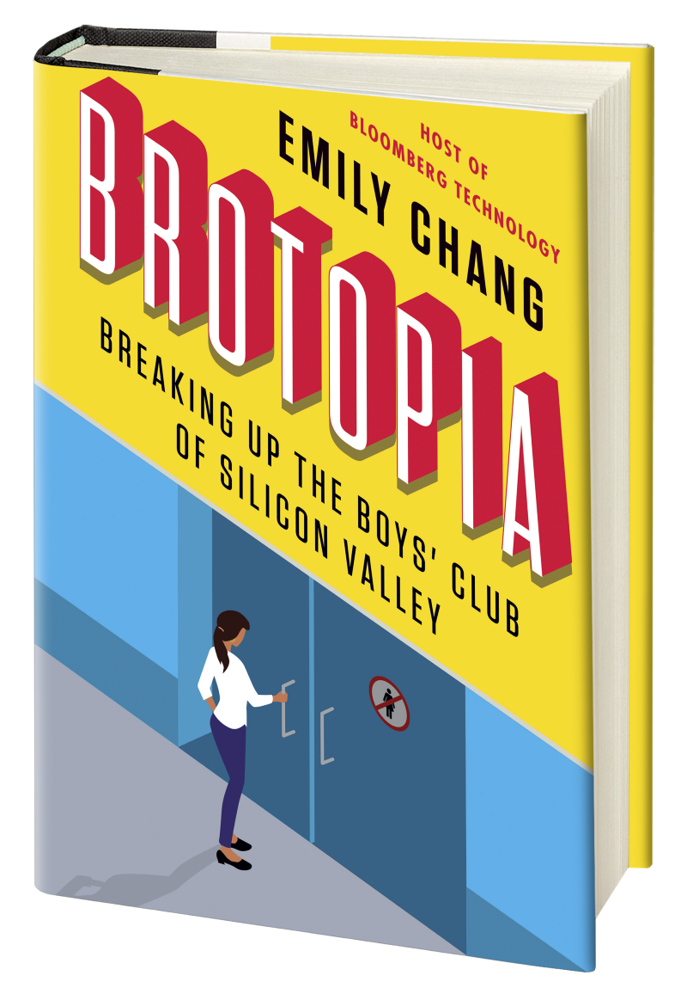
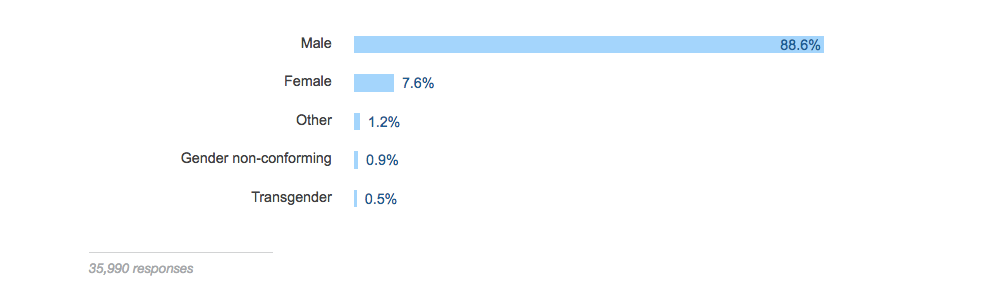

I just finished reading Brotopia, a book about how Silicon Valley is dominated by men — much more so than Hollywood or Wall Street — and how that came to be.

The author, Emily Chang, has hosted Bloomberg’s technology show for the past 7 years. In her role, she has interviewed many of people who pop up as characters in the book.

Emily Chang distills her knowledge of the Silicon Valley meta into this [jam-packed 320 page book](https://www.amazon.com/gp/product/B078SG9X3Q/ref=as_li_tl?ie=UTF8&camp=1789&creative=9325&creativeASIN=B078SG9X3Q&linkCode=as2&tag=out0b4b-20&linkId=7a740be78391e1f91909c497899562f2) (9 hours if you listen to the audiobook version, which she reads out loud herself).

Brotopia is one part history, one part exposé, and one part rallying cry for better leadership.

I have no doubt that many women in tech will read this book. But I think men in tech should read it, too. And I’ll explain why in a moment.

But first, for any women who are reading this: please don’t let any of this discourage you from pursuing a career in technology. All of the problems in tech’s culture are, in my humble opinion, fixable. And the first step toward fixing these problems is to raise awareness of them so we can recognize them. That’s why Emily Chang wrote this book, and it’s why I’m encouraging you to read it.

### Reason you should read Brotopia #1: it quickly recaps the past 60 years, giving you context into how women became such a minority in tech

The book starts with a brief history of the software industry, and explains how the field came to be so dominated by men. 

How dominated? Only 7.6% of developers who responded to [the 2017 Stack Overflow Developer Survey](https://medium.freecodecamp.org/73-of-programmers-are-web-developers-and-other-insights-from-stack-overflows-massive-2017-survey-89a13b11e370#31e7) were women.

But it wasn’t always like this. Tech used to be much closer to gender parity.

But in the 1960s, there far more people who wanted to learn computer science than university professors qualified to teach it.

This forced computer science departments to became dramatically more selective, using personality tests like the “Programmer Scale” and the IBM Programmer Aptitude test to figure out whom to admit to their degree programs.

The problem was, these tests were skewed in favor of male candidates. Men were also much more likely to have advance access to the test questions, since they were widely shared through fraternities.

By the 1980s, computer science departments only had room for students with very high GPAs — generally “boys who grew up with computers in their bedrooms.”

.](./asset-3.jpeg)

This lead to an initial gender imbalance that got worse and worse with time. And it was further exacerbated by women’s higher likelihood of leaving the field.

)](./asset-4.png)

After giving you some historic context into the current situation with women in tech, Brotopia shows you how hostile an environment Silicon Valley is for women.

### Reason you should read Brotopia #2: It helps you appreciate just how much crap women in tech go through when they’re just trying to do their jobs.

If you missed last year’s Uber meltdown, don’t worry — Brotopia covers it from start to finish in gory detail. 

It discusses the plight of Susan Fowler, a site reliability engineer at Uber who was sexually harassed on her first day on the job. She took the matter to human resources, and human resources lied to her about the offending employee’s history of harassing female workers. 

After Susan Fowler eventually quit Uber and [blogged about her experience there](https://www.susanjfowler.com/blog/2017/2/19/reflecting-on-one-very-strange-year-at-uber), it set off a chain reaction that ultimately brought down Uber CEO Travis Kalanick.

Emily Chang also shares the stories of other women in tech who faced harassment and physical assault at their jobs.

Other anecdotes are more mundane, but equally insightful. One woman in the book talks about how she dyed her hair gray so she would look older and her male colleagues would take her more seriously. Another woman talks about how she felt the need to wear baggy clothes to avoid unwanted attention from her male coworkers.

There’s a chapter that deals with the male-dominated venture capital industry, and how several prominent venture capitalists fell from grace in 2017 due to creepy behavior — one of whom even called himself a creep in his [strange apology letter](https://medium.com/@davemcclure/im-a-creep-i-m-sorry-d2c13e996ea0).

And there’s a chapter that talks about women whose bosses invite them to Silicon Valley parties where they all take tabs of ecstasy together and form “cuddle puddles.” And at least one of the sex parties described in the book was an official office party.

The book does a great job of shining a light on some of the most misogynistic depths of Silicon Valley. These parts of the book are hard to read, but I’m grateful the author included them, because they really rip the proverbial bandaid off and shock you into awareness. There are some pretty depraved people in tech.

An even more important aspect of the book is its explorations of the _perceptions_ of women in tech, especially surrounding childbirth. 

\[ Needs a lot more here — I was going to mention the way Marissa Mayer’s pregnancy was handled in the media but I think there are probably some anecdotes that are more relevant to women in tech (not just executives), like not Lavish benefits like massages and bowling alleys, but not daycare. \]

### Reason you should read Brotopia #3: It reveals a lot of common practices that disadvantage women

  

-   Alcohol asymmetrically women.
-   getting rid of remote work programs negatively impacts mothers who can still productively work during the first years of childcare, but who may need to see their kids throughout the day

\[ a couple other points the book mentions that are no longer fresh in my mind — if you can remember some of them.\]
