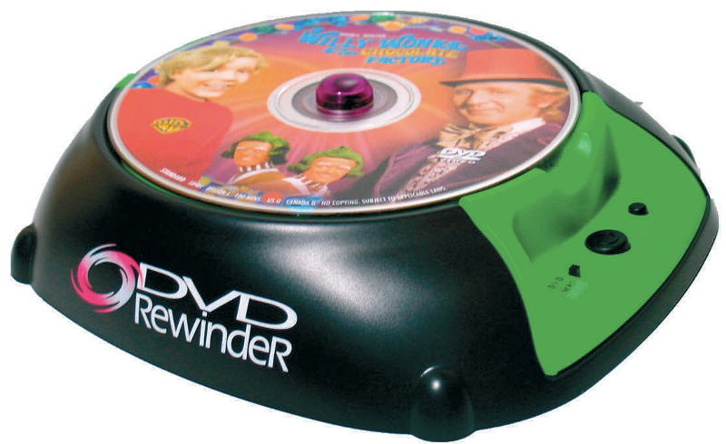
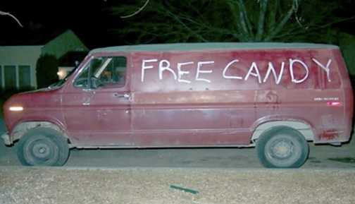

### You Aren’t Gonna Need It.

Another mistake people make is to overthink edge cases.

Unless you’re coding a rocket booster or a pacemaker, you can probably get away with addressing edge cases once they start to emerge.

Sometimes solutions become complex because people don’t have a clear understanding of what the end solution will look like.

Other times, they just add off-the-cuff feature ideas without thinking things through.

In Extreme Programming, we call this “You aren’t going to need it” or YAGNI for short.

YAGNI is one of the most common reasons why people reject existing solutions in favor of building custom ones.

### You can build it or you can buy it. But why not use someone else’s for free?

Back in 2009, the US Department of Defense [issued a memo](http://www.nextgov.com/defense/2009/11/defense-open-source-software-is-more-secure-than-commercial-code/45237/) encouraging departments to use open source software.

Then, a couple months ago, the White House [formally committed](https://www.whitehouse.gov/blog/2016/03/09/leveraging-american-ingenuity-through-reusable-and-open-source-software) to open source, calling out the problems of Not Invented Here:

> “We can save taxpayer dollars by avoiding duplicative custom software purchases and promote innovation and collaboration across Federal agencies.” — Tony Scott, Chief Information Officer of the US Government

You’ve probably heard the saying: when you need a solution, you can build it or buy it. But that’s not really true. These days, you can build it, buy it, or pick it right up off the ground, dust it off, and use it for free.

The same consultant in a suit who tells you “you can build or buy it” will also quote the adage “you get what you pay for.” But he’s wrong.

Wikipedia’s better than the those expensive encyclopedias. Craigslist works better than expensive classified ads. And googling something works a hell of a lot better than asking your neighbor.

Obvious exceptions aside, free is good. And slightly more expensive than free is good, too.

And I think we can all agree that pretty much anything is better than $1.7 billion tire fire HealthCare.gov.
