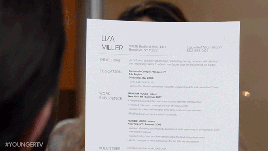
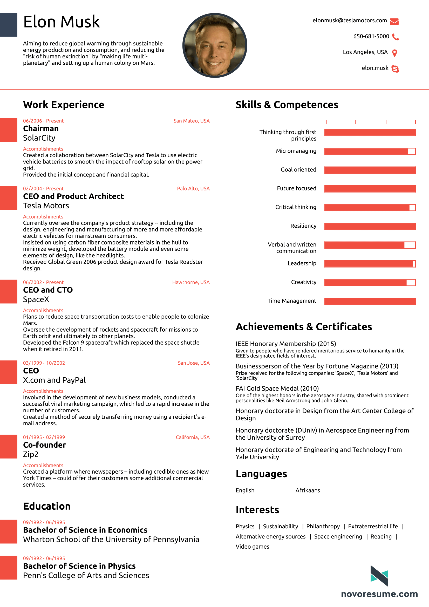
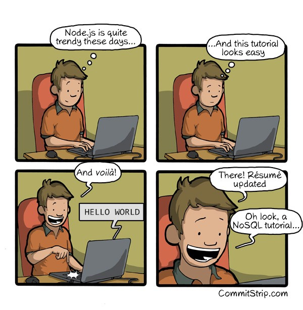

If your strategy for getting hired involves getting noticed in a stack of résumé, then you’ll need more than luck. You’ll need a résumé that sells you in 6 seconds. Because these days, that’s all the time an employer will spend reading it.

#### 6 seconds? How did it come to this?

You remember those friends from school who seemed to think that getting a job was just a numbers game? The ones who spammed out their résumé to as many companies as possible?

Well, they totally ruined job hunting for all of us.

Thanks to them, most job postings receive hundreds of applications. Most of these applications will be from people who aren’t even remotely qualified for the job.

The upshot is that no human being will end up looking at a majority of résumés submitted. And the résumés that recruiters do look at will receive a mere 6 seconds of attention.

#### “We’ll keep your résumé on file.”

Here’s what happens when you upload your résumé to a website and click the submit button:

1.  Your résumé gets saved to the employer’s Applicant Tracking System (ATS). You are now in the company’s “hiring funnel.”
2.  The ATS searches through your résumé for specific keywords that the recruiter in charge of filling the position has prioritized.
3.  If your résumé doesn’t have enough of the right keywords, the ATS archives your résumé, never to be read by humans. You are unlikely to receive any word of your résumé’s fate.
4.  If your résumé does have enough of the right keywords, the ATS will queue it up to be reviewed by a human.
5.  A recruiter will eventually fire up the ATS and start storming through their queue of résumés. And since this is tedious work, they usually put it off until the end of their workday, when they’re already exhausted from interviewing.
6.  This is where your résumé gets its 6 seconds to sell you. If your résumé strikes the recruiter as a likely fit for the position, they will reach out to you for an interview.

#### Your foot in the door

LinkedIn is not your résumé. GitHub is not your résumé. Your CodePen pens and Dribbble shots are not your résumé. Your résumé is your résumé.

Your résumé is the CliffsNotes to your working life. It’s an opportunity to pack your most important accomplishments into a single large-font document.

Your résumé has to convince recruiters that you’re worth investigating further. Only then they will they take the time to look at your portfolio links and reach out to your references.

### Make the most of your 6 seconds

How many words can a human even read in 6 seconds? Not many. So you’d better be brief.

#### Only use one page.

It goes without saying that your résumé should only be one page long. If Elon Musk’s résumé can fit onto one page, yours can.

#### Don’t include a photo.

Researchers have conducted experiments where they asked recruiters to wear special glasses that tracked their eyes while they reviewed résumés.

If you put a photo on your résumé — like the Elon Musk résumé above — recruiters will look at it, often for several seconds. And this makes sense. The human eye is drawn to faces.

But adding a photo to your résumé won’t increase the amount of time recruiters spend on your résumé. They’ll just spend more of that time staring at your face, and less of it reading about your qualifications.

#### Typos kill.

Make sure your résumé doesn’t have any typos. Not even one.

73% of [executives surveyed](http://ledgerlink.monster.com/benefits/articles/37-one-resume-error-can-ruin-employment-prospects-executive-survey-shows) said they would rule out someone who had more than one typo on their résumé — and 40% wouldn’t even consider a candidate whose résumé had a single typo.

The best way to definitively catch typos is to read your résumé backward.

#### Use keywords carefully.

It’s vital that you have the right keywords on your résumé — otherwise you will never make it past the ATS keyword filters.

Read the job description carefully and pattern your own use of keywords after the employer’s. This will maximize your résumé’s likelihood of actually getting reviewed by a human recruiter.

But unlike LinkedIn — where random strangers blithely endorse you for skills you didn’t even say you had — every skill you put on your résumé is game for scrutiny.

If you wouldn’t be comfortable walking up to a blank whiteboard and explaining a technology or using it to solve a problem, don’t mention it on your résumé.

#### Use a headline.

The headline is the most important part of your résumé. It should use as few words as necessary and its font should be 50% larger. It should say something meaningful about the most important part of your résumé: your experience.

If you already have years of relevant experience, say so explicitly in the headline. “3 years of experience as a \[job you’re applying for\].”

If you don’t have relevant experience, but you’ve worked at a prestigious company — in any capacity — this is a good place to highlight that. Nothing grabs a recruiter’s attention like the words “Google” “Facebook” “Netflix” “AirBnB” or “Uber”.

If you don’t have much job experience yet, but did attend a prestigious university, you can resort to something like “Harvey Mudd Computer Science Grad.”

For the rest of us — who are new to the field — will have to use whatever we have on hand. “Developer and open source contributor” isn’t too bad. If you’re changing jobs, and your previous skills seem relevant to this new job, you could say, “Front end developer with 3 years of design experience.”

Whatever you do, don’t waste this valuable space saying “résumé.” Recruiters are smart enough to figure out they’re looking at a résumé.

And don’t sell yourself short by using words like “junior” or “entry level,” even if you are new to the field.

#### Be brief.

For each relevant job, write the following:

-   The name of the company, and if they aren’t widely known, a basic description of what the company does
-   Your job title and dates of employment
-   A one line description of your responsibilities
-   One or two accomplishments

Most companies will weigh your work experience much more heavily than your education, so keep your education section as brief as possible. Put it at the bottom of the page, and only list your high school if you did not attend college.

If you attended college, but didn’t finish, list the schools you attended. If you had a GPA above 3.0, you can add that reassure recruiters that you didn’t flunk out.

For each post-secondary degree you’ve earned, include the university, your degree and major, and the year you graduated.

#### Explain your gaps honestly.

If you have respectable reasons for gaps in your résumé, be sure to point them out. A single sentence fragment with dates will do.

Most humans can empathize with leaving your job to start a business, raise kids, or care for a sick relative.

If you don’t explain your gaps, recruiters may assume the worst.

#### Don’t waste time customizing a cover letter.

Most recruiters see cover letters as unnecessary for technical positions. They are smart enough to realize that cover letters basically just restate your résumé bullet points — usually couched in frivolous adjectives and adverbs.

You should include a cover letter if the company asks for one. But since it’s unlikely to ever be read, you shouldn’t waste time customizing it to every company.

#### Don’t waste space stating the obvious.

If recruiters agree on one thing, it’s that objective statements are unnecessary.

What job did you apply for? Full stack developer? Then your objective is obviously to work for their company as a full stack developer.

If you’re applying for a modern knowledge worker job, recruiters will assume that you know how to type, use Microsoft Office, and have “references available upon request.”

#### Give your résumé a meaningful file name.

Since your résumé will live in an Applicant Tracking System (ATS), you’ll want to make sure your file name is meaningful.

You can imagine how many files there must be in these ATS systems (and on the recruiter’s desktop) named “resume.pdf”. Don’t be one of these generic, hard to find files.

Give your résumé a descriptive filename. For example: “Elle\_Woods\_resume\_July\_4\_2016.pdf”

#### You gotta do what you gotta do.

Résumés aren’t going away any time soon.

Writing an effective résumé — then customizing it for every single job you apply to — takes a lot of time and energy. But it is critical to the job search.

The best way to avoid dropping your résumé into an ATS abyss is to make a personal connection with a recruiter. Remember — these are trained professionals whose job it is to go out and find people worth hiring. They will be at job fairs, after-hours networking events, even random happy hours downtown. And they’re pretty easy to find on LinkedIn, too.

Regardless of how you reach recruiters, put in the time to make sure your résumé does a good job selling you. Be factual and respectful of recruiters’ time. This will set you up for success in the interviewing process to come.

**I only write about programming and technology. If you** [**follow me on Twitter**](https://twitter.com/ossia) **I won’t waste your time. 👍**
