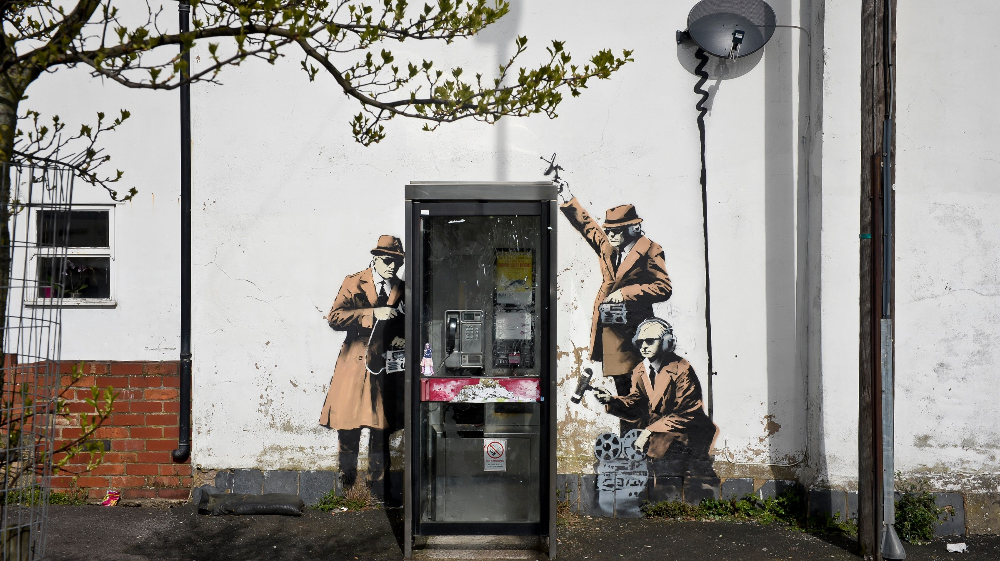

> “If privacy is outlawed, only outlaws will have privacy.” — Philip Zimmermann, creator of PGP

Last week the United Kingdom passed a new bill that allows for “extreme surveillance.” This [Investigatory Powers Bill](http://services.parliament.uk/bills/2015-16/investigatorypowers.html) — better known as the “snooper’s charter” — passed parliament with scarcely a whimper of opposition.

As a result, Britain’s surveillance laws will soon be more invasive than practically any other country on Earth — including many dictatorships.

But few people realize this. Most Britons I’ve talked to hadn’t even heard of the bill.

Last year, Canada’s government passed a bill that essentially established a “secret police” with little oversight.

Now the Canadian government wants to go even further and [force software developers to build back doors](http://www.tomshardware.com/news/canada-software-encryption-backdoors-feedback,33131.html) into their apps so they can spy without a warrant or any notification to users.

They also want to be able to legally force citizens to decrypt any of their own data.

And a few days ago, a draft of a new bill by Germany’s interior ministry surfaced. This bill will not only expand their government’s ability to snoop on Germans — it will also remove citizens’ right to know what data is being collected about them.

And we’re talking Germany here.

This is the same country where the Berlin Wall fell only 27 years ago. East Berlin was home to the Stasi, the [most repressive secret police ever](https://en.wikipedia.org/wiki/Stasi). Where parents would lean over to whisper into the ears of their own children, in their own homes, for fear of surveillance.

That Germany.

Even _they_ are taking steps toward outlawing privacy.

What does all this mean for you if you live outside of the UK, Canada, and Germany?

It means you’re next.

Because these bills — and their citizens’ inability to stop them — will only embolden other governments to push for similar laws.

### Our ancestors worked hard to make privacy possible.

For most of human history, the notion of privacy didn’t even exist. Most families were all crammed into one-room homes together.

Imagine sleeping in the same bed as your entire family every night. Throughout the night, people would wake you up when they rolled over or got up to pee. That’s pretty much what life was like.

But as a large middle class emerged, multi-room homes became more common. Even children often got their own bedrooms.

As technology improved, it brought additional privacy.

For example, most families’ first telephones weren’t independent lines. They were “party lines” that they shared with several other households. Anyone could pick up the phone at any time and eavesdrop on your call without you knowing.

And most outgoing calls required you to first talk to an operator, who would then connect you. Operators could also listen in on your call without you knowing.

But phones improved to the point that you could dial someone directly. You didn’t need party lines or operators anymore. And you could be relatively confident that no one else was listening in on your phone conversations.

Then came the radio. Families would sit around and listen to it together. Everyone had to listen to the same thing. If your dad wanted to listen to a football game, well, you had no choice. You had to listen to it, too.

But later, headphones became widely available.

For the first time, you could listen to whatever you wanted. You could shut out the noisy world and have a special space for yourself.

Computers started out the same way.

If you wanted to use a computer, you had to reserve time on a shared, room-sized mainframe, where technicians could monitor what you were doing.

But technology moved full speed ahead.

The personal computer revolution helped middle-class families own their own computers.

Now, you have your own private mainframe that you carry around with you in your pocket.

Over the past 100 years, technology and economic progress have given you more privacy, not less.

But, like the villain in [the latest James Bond movie](http://amzn.to/2gMu9AT), powerful people are always conspiring to take away your privacy. And as we’ve seen in Europe, they’ve been remarkably effective at this.

### How governments will outlaw privacy

The most common argument for “trading freedom for security” is public safety.

Every terrorist attack, every school shooting, every convenience store robbery — these are all excuses to install more surveillance and pass more laws curtailing your privacy.

Be on the lookout for governments and corporations who make arguments like these:

-   “If all medical records were public, pharmaceutical companies could research life-saving drugs more efficiently.”
-   “If all insurance companies understood everyone’s risk factors, they could give everyone a fair price on their insurance.”
-   “If advertisers knew more about you, they could show you more relevant and helpful advertisements instead of annoying irrelevant ones.”
-   “If the police knew more about everyone, they could [prevent crimes before they happened](http://amzn.to/2fHzGLD).”

These arguments all involve you giving up your right to privacy for some dubious benefit. But you’re probably smart enough to see through these ploys.

The problem is that most people aren’t. Most people don’t seem to think twice about trading their privacy for benefits, however fleeting.

A [performance artist](https://www.propublica.org/article/how-much-of-your-data-would-you-trade-for-a-free-cookie) demonstrated this phenomenon by approaching strangers and offering them social media-themed cookies in exchange for their passwords and social security numbers.

OK, so a lot of people don’t place much value their privacy. They’ll trade it for something as trivial as a cookie. How is this bad for you?

Well, if governments want to pass onerous surveillance laws like the one they just passed in the UK, they don’t need to convince you personally. They just need to convince the kinds of people who would trade their social security number for a cookie.

### What can you do about it?

Fortunately, there are a lot of things you can do to stop your government before it’s too late.

#### Method #1: Support the Electronic Frontier Foundation (EFF)

The EFF is a nonprofit that advocates for privacy through legislation, policy analysis, and privacy-enhancing technologies. It “ensures that rights and freedoms are enhanced and protected as our use of technology grows.”

When it comes to protecting our right to privacy, the EFF are the equivalent of an elite task force. Just look at all their [important legal victories](https://www.eff.org/legal-victories) over the past 26 years.

[Support the EFF](https://supporters.eff.org/donate/).

#### Method #2: Call your representatives in government

If you’re in the US, call your representatives. This is much more effective than sending them an email.

One of their interns will probably answer. But with persistence and a little luck, you may be able to talk directly to your rep.

Tell them your concerns about your privacy. Encourage them to fight to preserve it.

Keep in mind that these politicians mainly care about residents of their own districts (who are able to vote for them), so focus on your own reps first.

Here are the phone numbers for all reps in [the house](http://clerk.house.gov/member_info/mcapdir.aspx) and [the senate](http://www.senate.gov/senators/contact/).

#### Method #3: Understand the privacy landscape

Regardless of how you may feel about controversial figures like Julian Assange and Edward Snowden, I strongly recommend reading [No Place to Hide by Glenn Greenwald](http://amzn.to/2fNcACb). It covers most of the known tactics used by surveillance agencies like the NSA.

[**No Place to Hide: Edward Snowden, the NSA, and the U.S. Surveillance State**  
_Edit description_amzn.to](http://amzn.to/2fNcACb "http://amzn.to/2fNcACb")

#### Method #4: Encrypt your entire life

By encrypting your all your communication and data, you can prevent governments and corporations from spying on you. Doing this is 100% legal and free, and you can do it [in less than an hour](https://medium.freecodecamp.com/tor-signal-and-beyond-a-law-abiding-citizens-guide-to-privacy-1a593f2104c3).

[**How to encrypt your entire life in less than an hour**  
_“Only the paranoid survive.” — Andy Grove_medium.freecodecamp.com](https://medium.freecodecamp.com/tor-signal-and-beyond-a-law-abiding-citizens-guide-to-privacy-1a593f2104c3 "https://medium.freecodecamp.com/tor-signal-and-beyond-a-law-abiding-citizens-guide-to-privacy-1a593f2104c3")

#### Method #5: Talk with your friends and family about privacy

[George Orwell’s 1984](http://amzn.to/2gZ68cW) is required reading for school children here in the US. Everyone has read this book, or at least knows what it’s about.

Well, 1984 isn’t far from what’s happening today in the UK, and to some extent the US.

It may feel awkward. It may feel alarmist. But we need to open a public discourse about privacy, its importance, and forces working against it. We need to talk about the cost of the trade-offs. We need to acknowledge all the hard work that our grandparents did so that we could enjoy this privacy.

If we allow ourselves to be the generation that traded all of its privacy for convenience, it will be very hard — maybe impossible — for our children to ever win that privacy back.

> “To be left alone is the most precious thing one can ask of the modern world.”―**Anthony Burgess**

**I only write about programming and technology. If you** [**follow me on Twitter**](https://twitter.com/ossia) **I won’t waste your time. 👍**
